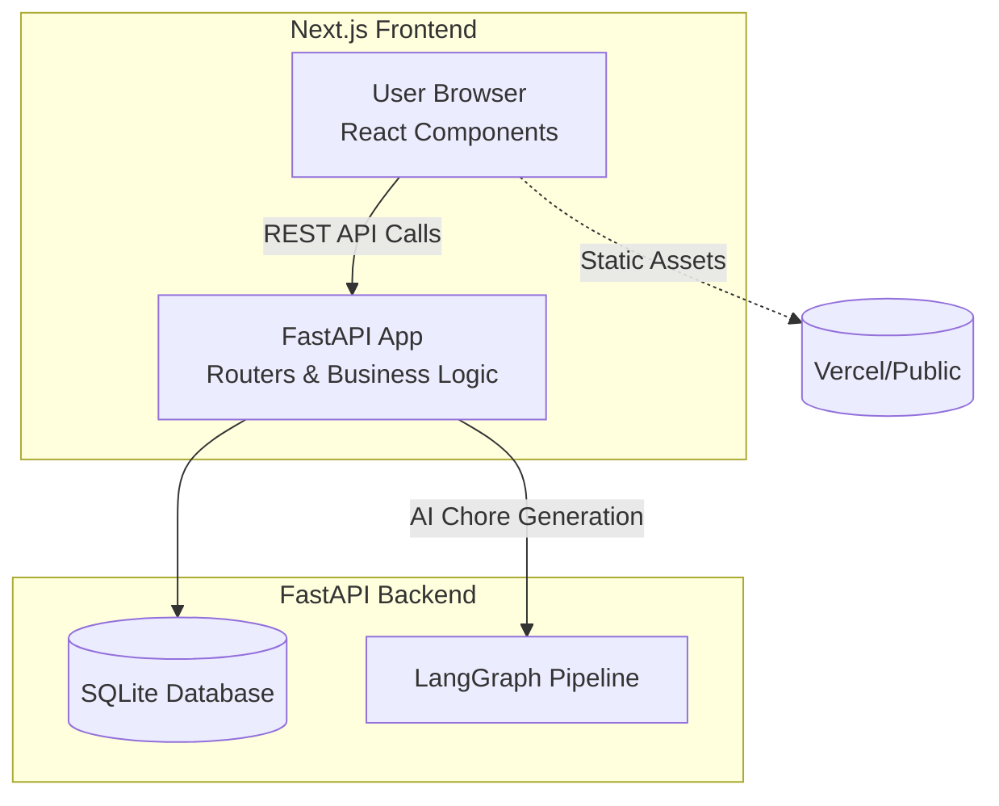

# Tapestry Architecture & Topology

| Repo     | Doc Type                | Date                | Branch |
|----------|------------------------|---------------------|--------|
| Tapestry | Architecture & Topology | 2025-08-04 19:08    | main   |

---

## Overview

Tapestry is a modern, touch-friendly multi-user calendar application designed for families. The architecture is a classic web application split into two main components:

- **Frontend:** Next.js (TypeScript, Tailwind CSS)
- **Backend:** FastAPI (Python, SQLAlchemy, SQLite, LangGraph)

This separation enables independent development, deployment, and scaling of the user interface and the business logic/API.

---

## High-Level Architecture

---

## Component Breakdown

### 1. Frontend (`/frontend`)

- **Framework:** Next.js (React, TypeScript)
- **UI:** Tailwind CSS, Radix UI
- **Features:**
  - Weekly calendar view
  - Event/chore/goal management
  - Points leaderboard
  - Auth flows
- **API Consumption:** Communicates with the backend via RESTful endpoints.
- **Static Assets:** Served from `/public` (e.g., icons, images).

**Key Files:**
- `frontend/src/app/page.tsx` — Main page (Last modified: 2025-08-04 19:08)
- `[frontend/package.json](https://github.com/sergiomasellis/Tapestry/blob/main/frontend/package.json)` — Dependencies/scripts (Last modified: 2025-08-04 19:08)
- `[frontend/tsconfig.json](https://github.com/sergiomasellis/Tapestry/blob/main/frontend/tsconfig.json)` — TypeScript config (Last modified: 2025-08-04 19:08)

### 2. Backend (`/backend`)

- **Framework:** FastAPI (Python)
- **ORM:** SQLAlchemy 2.0
- **Database:** SQLite (development)
- **AI Pipeline:** LangGraph (for chore generation and point assignment)
- **Features:**
  - User, family, and authentication management
  - Calendar, chore, point, and goal APIs
  - AI-powered chore suggestions
- **API:** Exposes RESTful endpoints consumed by the frontend.

**Key Files:**
- `[backend/app/main.py](https://github.com/sergiomasellis/Tapestry/blob/main/backend/app/main.py)` — FastAPI app entrypoint (Last modified: 2025-08-04 19:08)
- `backend/app/routers/` — API route handlers (Last modified: 2025-08-04 19:08)
- `[backend/app/models/models.py](https://github.com/sergiomasellis/Tapestry/blob/main/backend/app/models/models.py)` — SQLAlchemy models (Last modified: 2025-08-04 19:08)
- `[backend/app/schemas/schemas.py](https://github.com/sergiomasellis/Tapestry/blob/main/backend/app/schemas/schemas.py)` — Pydantic schemas (Last modified: 2025-08-04 19:08)
- `[backend/app/ai/chore_graph.py](https://github.com/sergiomasellis/Tapestry/blob/main/backend/app/ai/chore_graph.py)` — LangGraph pipeline (Last modified: 2025-08-04 19:08)

---

## Interaction Flow

1. **User Interaction:** Users interact with the Next.js frontend in their browser.
2. **API Requests:** The frontend makes HTTP requests to the FastAPI backend for data (users, events, chores, etc.).
3. **Business Logic:** The backend processes requests, interacts with the SQLite database, and (for some endpoints) invokes the LangGraph AI pipeline.
4. **Data Persistence:** All persistent data is stored in SQLite (development).
5. **Response:** The backend returns JSON responses to the frontend, which updates the UI accordingly.

---

## Deployment Topology

- **Frontend:** Typically deployed on Vercel or similar platforms, serving both static assets and SSR/ISR pages.
- **Backend:** Runs as a Python service (e.g., via Uvicorn), accessible via HTTP (default port 8000 in development).
- **Database:** SQLite file (`data.db`) stored locally in the backend directory (for development).
- **Environment Variables:** Managed via `.env` in the backend.

---

## Scalability & Extensibility

- **Frontend and backend are decoupled** and can be scaled or deployed independently.
- **Backend can be extended** to support other databases (e.g., PostgreSQL) or external integrations (Google Calendar, Alexa).
- **AI pipeline (LangGraph)** is modular and can be swapped or extended for more advanced automation.

---

## Primary Sources

- [[README.md](https://github.com/sergiomasellis/Tapestry/blob/main/README.md)](./[README.md](https://github.com/sergiomasellis/Tapestry/blob/main/README.md)) (Last modified: 2025-08-04 19:08)
- [[frontend/README.md](https://github.com/sergiomasellis/Tapestry/blob/main/frontend/README.md)](./[frontend/README.md](https://github.com/sergiomasellis/Tapestry/blob/main/frontend/README.md)) (Last modified: 2025-08-04 19:08)
- [[frontend/package.json](https://github.com/sergiomasellis/Tapestry/blob/main/frontend/package.json)](./[frontend/package.json](https://github.com/sergiomasellis/Tapestry/blob/main/frontend/package.json)) (Last modified: 2025-08-04 19:08)
- [[frontend/tsconfig.json](https://github.com/sergiomasellis/Tapestry/blob/main/frontend/tsconfig.json)](./[frontend/tsconfig.json](https://github.com/sergiomasellis/Tapestry/blob/main/frontend/tsconfig.json)) (Last modified: 2025-08-04 19:08)
- [[backend/README.md](https://github.com/sergiomasellis/Tapestry/blob/main/backend/README.md)](./[backend/README.md](https://github.com/sergiomasellis/Tapestry/blob/main/backend/README.md)) (Last modified: 2025-08-04 19:08)
- [backend/pyproject.toml](./backend/pyproject.toml) (Last modified: 2025-08-04 19:08)
- [[backend/app/main.py](https://github.com/sergiomasellis/Tapestry/blob/main/backend/app/main.py)](./[backend/app/main.py](https://github.com/sergiomasellis/Tapestry/blob/main/backend/app/main.py)) (Last modified: 2025-08-04 19:08)
- [backend/app/routers/](./backend/app/routers/) (Last modified: 2025-08-04 19:08)
- [[backend/app/models/models.py](https://github.com/sergiomasellis/Tapestry/blob/main/backend/app/models/models.py)](./[backend/app/models/models.py](https://github.com/sergiomasellis/Tapestry/blob/main/backend/app/models/models.py)) (Last modified: 2025-08-04 19:08)
- [[backend/app/schemas/schemas.py](https://github.com/sergiomasellis/Tapestry/blob/main/backend/app/schemas/schemas.py)](./[backend/app/schemas/schemas.py](https://github.com/sergiomasellis/Tapestry/blob/main/backend/app/schemas/schemas.py)) (Last modified: 2025-08-04 19:08)
- [[backend/app/ai/chore_graph.py](https://github.com/sergiomasellis/Tapestry/blob/main/backend/app/ai/chore_graph.py)](./[backend/app/ai/chore_graph.py](https://github.com/sergiomasellis/Tapestry/blob/main/backend/app/ai/chore_graph.py)) (Last modified: 2025-08-04 19:08)