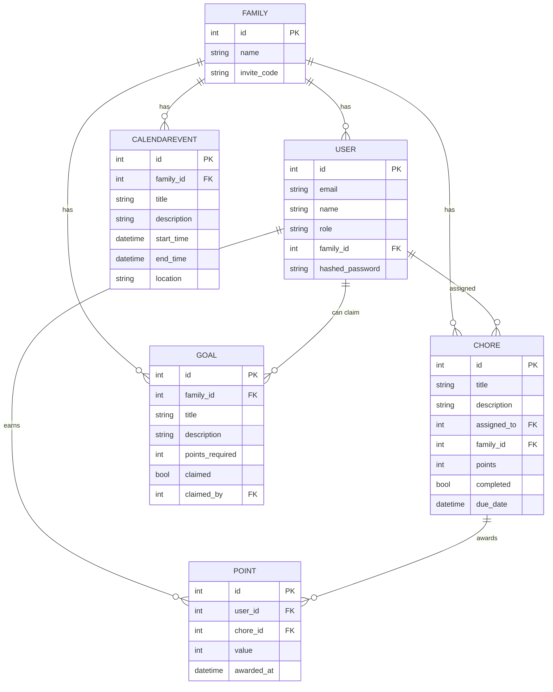

# Tapestry Main Entity Schema

| Repo      | Doc Type           | Date                | Branch |
|-----------|--------------------|---------------------|--------|
| Tapestry  | Main Entity Schema | 2025-08-04 19:08    | main   |

This document describes the main entity schema for the Tapestry application, as defined in the backend models and schemas. It covers the core entities, their relationships, and key fields that support features such as family groups, user management, chores, points, goals, and calendar events.

---

## Overview

Tapestry is a family-oriented calendar and chore management system. Its backend is built with FastAPI and SQLAlchemy, using Pydantic for schema validation. The main entities are:

- **User**: Represents an individual user (adult or child).
- **Family**: A group of users.
- **Chore**: A task assigned to a user, tracked with a point system.
- **Point**: Tracks points earned by users for completing chores.
- **Goal**: A reward or milestone users can work toward.
- **CalendarEvent**: An event on the family calendar.

These entities are defined in:

- `[backend/app/models/models.py](https://github.com/sergiomasellis/Tapestry/blob/main/backend/app/models/models.py)` (SQLAlchemy models, Last modified: 2025-08-04 19:08)
- `[backend/app/schemas/schemas.py](https://github.com/sergiomasellis/Tapestry/blob/main/backend/app/schemas/schemas.py)` (Pydantic schemas, Last modified: 2025-08-04 19:08)

---

## Entity-Relationship Diagram

---

## Entity Details

### Family

- **id**: Primary key
- **name**: Family group name
- **invite_code**: Used for inviting users

### User

- **id**: Primary key
- **email**: Unique email address
- **name**: Display name
- **role**: 'parent' or 'child'
- **family_id**: Foreign key to Family
- **hashed_password**: Authentication

### Chore

- **id**: Primary key
- **title**: Chore name
- **description**: Details
- **assigned_to**: Foreign key to User
- **family_id**: Foreign key to Family
- **points**: Points awarded on completion
- **completed**: Boolean
- **due_date**: Deadline

### Point

- **id**: Primary key
- **user_id**: Foreign key to User
- **chore_id**: Foreign key to Chore
- **value**: Number of points
- **awarded_at**: Timestamp

### Goal

- **id**: Primary key
- **family_id**: Foreign key to Family
- **title**: Goal name
- **description**: Details
- **points_required**: Points needed to claim
- **claimed**: Boolean
- **claimed_by**: Foreign key to User

### CalendarEvent

- **id**: Primary key
- **family_id**: Foreign key to Family
- **title**: Event name
- **description**: Details
- **start_time**: Start datetime
- **end_time**: End datetime
- **location**: Event location

---

## Relationships

- **Family** is the central grouping for all other entities.
- **User** belongs to a Family; can be assigned Chores, earn Points, and claim Goals.
- **Chore** is assigned to a User and belongs to a Family.
- **Point** is awarded to a User for completing a Chore.
- **Goal** is set by a Family and can be claimed by Users.
- **CalendarEvent** is associated with a Family.

---

## Primary Sources

- [`[backend/app/models/models.py](https://github.com/sergiomasellis/Tapestry/blob/main/backend/app/models/models.py)`]([backend/app/models/models.py](https://github.com/sergiomasellis/Tapestry/blob/main/backend/app/models/models.py)) (Last modified: 2025-08-04 19:08)
- [`[backend/app/schemas/schemas.py](https://github.com/sergiomasellis/Tapestry/blob/main/backend/app/schemas/schemas.py)`]([backend/app/schemas/schemas.py](https://github.com/sergiomasellis/Tapestry/blob/main/backend/app/schemas/schemas.py)) (Last modified: 2025-08-04 19:08)
- [`[backend/README.md](https://github.com/sergiomasellis/Tapestry/blob/main/backend/README.md)`]([backend/README.md](https://github.com/sergiomasellis/Tapestry/blob/main/backend/README.md)) (Last modified: 2025-08-04 19:08)
- [`[README.md](https://github.com/sergiomasellis/Tapestry/blob/main/README.md)`]([README.md](https://github.com/sergiomasellis/Tapestry/blob/main/README.md)) (Last modified: 2025-08-04 19:08)