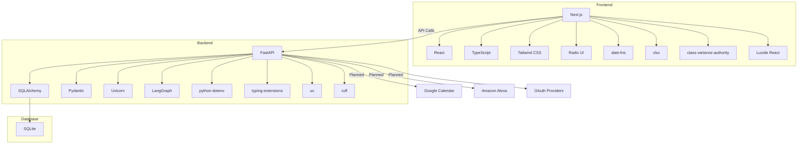

# Tapestry: Key Dependencies

| Repo      | Doc Type         | Date                | Branch |
|-----------|------------------|---------------------|--------|
| Tapestry  | Key Dependencies | 2025-08-04 19:08    | main   |

---

This document outlines the key internal and third-party dependencies for the Tapestry project, as defined in the project’s `[README.md](https://github.com/sergiomasellis/Tapestry/blob/main/README.md)`, `[frontend/package.json](https://github.com/sergiomasellis/Tapestry/blob/main/frontend/package.json)`, and `backend/pyproject.toml` (all last modified: 2025-08-04 19:08). It covers both the frontend and backend stacks, highlighting the frameworks, libraries, and services that underpin the system.

---

## Overview

Tapestry is a full-stack family calendar and chore management application. Its architecture is split into two main components:

- **Frontend**: Built with Next.js (React, TypeScript, Tailwind CSS), providing a modern, interactive UI.
- **Backend**: Powered by FastAPI (Python), using SQLAlchemy ORM, Pydantic for schema validation, and LangGraph for AI-driven features.

Both components rely on a set of internal modules and third-party packages, as detailed below.

---

## Frontend Dependencies

Located in `/[frontend/package.json](https://github.com/sergiomasellis/Tapestry/blob/main/frontend/package.json)` and `/[frontend/tsconfig.json](https://github.com/sergiomasellis/Tapestry/blob/main/frontend/tsconfig.json)`.

### Core Frameworks & Libraries

- **Next.js** (`next`): React-based framework for SSR, routing, and API routes.
- **React** (`react`, `react-dom`): UI library.
- **TypeScript**: Static typing for JavaScript.
- **Tailwind CSS** (`tailwindcss`, `tailwind-merge`): Utility-first CSS framework.
- **PostCSS**: CSS processing (via `postcss.config.mjs`).

### UI & Component Libraries

- **Radix UI**: Accessible, unstyled UI primitives.
  - `@radix-ui/react-avatar`
  - `@radix-ui/react-dialog`
  - `@radix-ui/react-dropdown-menu`
  - `@radix-ui/react-navigation-menu`
  - `@radix-ui/react-popover`
  - `@radix-ui/react-select`
  - `@radix-ui/react-separator`
  - `@radix-ui/react-slot`
  - `@radix-ui/react-tabs`
  - `@radix-ui/react-tooltip`
- **Lucide React** (`lucide-react`): Icon library.

### Utilities

- **date-fns**: Date manipulation.
- **clsx**: Conditional classNames.
- **class-variance-authority**: Utility for managing class variants.

### Tooling & Linting

- **ESLint** (`eslint`, `eslint-config-next`)
- **TypeScript types** (`@types/node`, `@types/react`, `@types/react-dom`)
- **tw-animate-css**: Tailwind animation helpers.

---

## Backend Dependencies

Located in `/backend/pyproject.toml` and `/[backend/README.md](https://github.com/sergiomasellis/Tapestry/blob/main/backend/README.md)`.

### Core Frameworks & Libraries

- **FastAPI**: High-performance Python web framework for APIs.
- **SQLAlchemy**: Database ORM (Object Relational Mapper).
- **Pydantic**: Data validation and settings management.
- **Uvicorn**: ASGI server for running FastAPI apps.
- **python-dotenv**: Loads environment variables from `.env` files.
- **typing-extensions**: Backport of Python typing features.

### AI & Automation

- **LangGraph**: Framework for building AI-powered pipelines (used for chore generation and point assignment).

### Development & Tooling

- **uv**: Python project/environment manager.
- **ruff**: Python linter.

---

## Internal Modules

- **Backend Internal Structure** (`/backend/app/`)
  - `main.py`: FastAPI app entrypoint.
  - `db/session.py`: Database session/engine setup.
  - `models/models.py`: SQLAlchemy models.
  - `schemas/schemas.py`: Pydantic schemas.
  - `routers/`: API route handlers (users, families, chores, calendars, points, goals, auth).
  - `ai/chore_graph.py`: LangGraph-based AI pipeline for chores.

- **Frontend Internal Structure** (`/frontend/src/`)
  - `lib/utils.ts`: Utility functions.
  - `features/`, `components/`, `app/`: Feature modules, UI components, and application entrypoints.

---

## Database

- **SQLite**: Used for development (see `/backend/data.db`).

---

## External Integrations (Planned/Future)

- **Google Calendar**: For calendar sync (integration points scaffolded, not yet implemented).
- **Amazon Alexa Reminders**: For voice assistant integration (planned).
- **OAuth**: For secure authentication with third-party services (planned).

---

## Dependency Diagram

---

## Primary Sources

- [`/[README.md](https://github.com/sergiomasellis/Tapestry/blob/main/README.md)`](./[README.md](https://github.com/sergiomasellis/Tapestry/blob/main/README.md)) (Last modified: 2025-08-04 19:08)
- [`/[frontend/package.json](https://github.com/sergiomasellis/Tapestry/blob/main/frontend/package.json)`](./[frontend/package.json](https://github.com/sergiomasellis/Tapestry/blob/main/frontend/package.json)) (Last modified: 2025-08-04 19:08)
- [`/[frontend/tsconfig.json](https://github.com/sergiomasellis/Tapestry/blob/main/frontend/tsconfig.json)`](./[frontend/tsconfig.json](https://github.com/sergiomasellis/Tapestry/blob/main/frontend/tsconfig.json)) (Last modified: 2025-08-04 19:08)
- [`/[frontend/README.md](https://github.com/sergiomasellis/Tapestry/blob/main/frontend/README.md)`](./[frontend/README.md](https://github.com/sergiomasellis/Tapestry/blob/main/frontend/README.md)) (Last modified: 2025-08-04 19:08)
- [`/backend/pyproject.toml`](./backend/pyproject.toml) (Last modified: 2025-08-04 19:08)
- [`/[backend/README.md](https://github.com/sergiomasellis/Tapestry/blob/main/backend/README.md)`](./[backend/README.md](https://github.com/sergiomasellis/Tapestry/blob/main/backend/README.md)) (Last modified: 2025-08-04 19:08)