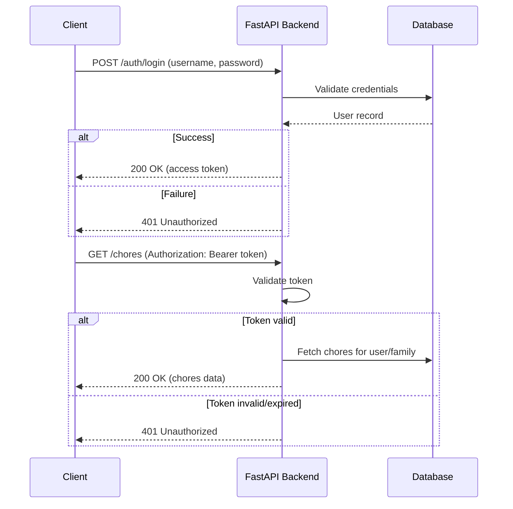

# Authentication Model – Tapestry

| Repo     | Doc Type             | Date                | Branch |
|----------|----------------------|---------------------|--------|
| Tapestry | Authentication Model | 2025-08-04 19:08    | main   |

---

## Overview

Tapestry implements a token-based authentication model for its backend API, using FastAPI as the web framework and SQLAlchemy for ORM. Authentication is primarily handled in `[backend/app/routers/auth.py](https://github.com/sergiomasellis/Tapestry/blob/main/backend/app/routers/auth.py)` (Last modified: 2025-08-04 19:08), with user and family management in related routers. The system supports both standard user login and an admin login (via a master password), as described in the backend documentation.

Authentication is required for all endpoints that manage user, family, calendar, chore, point, and goal data. The authentication model ensures that only authorized users can access or modify resources associated with their family group.

---

## Mechanisms

### 1. Token-Based Authentication

- **Login Flow**:  
  Users authenticate by submitting credentials (username/email and password) to the `/auth/login` endpoint.
- **Token Issuance**:  
  Upon successful authentication, the backend issues a signed access token (likely a JWT or similar), which the client must include in the `Authorization` header for subsequent requests.
- **Token Expiry**:  
  The token has a configurable expiry (default: 60 minutes, see `ACCESS_TOKEN_EXPIRE_MINUTES` in `.env`).
- **Token Validation**:  
  All protected endpoints validate the token and extract the user identity for authorization checks.

### 2. Admin/Master Password

- **Admin Login**:  
  There is a special admin login endpoint (`/auth/admin-login`) that accepts a master password (see [backend/README.md](https://github.com/sergiomasellis/Tapestry/blob/main/backend/README.md), Last modified: 2025-08-04 19:08). This allows for privileged access, likely for support or initial setup.

### 3. Permissions & Authorization

- **User-Scoped Access**:  
  Most resources are scoped to the authenticated user and their associated family group. Users can only access or modify data for their own family.
- **Role-Based Actions**:  
  The system may distinguish between parent and child roles (implied by the family/leaderboard/chore features), with parents having elevated permissions (e.g., assigning chores, managing goals).
- **Admin Privileges**:  
  Admin users (authenticated via master password) may have access to all families and users for support or debugging.

### 4. Password Management

- **Password Storage**:  
  User passwords are stored securely (implementation details in `[backend/app/models/models.py](https://github.com/sergiomasellis/Tapestry/blob/main/backend/app/models/models.py)` and `[backend/app/routers/auth.py](https://github.com/sergiomasellis/Tapestry/blob/main/backend/app/routers/auth.py)`).
- **Password Reset**:  
  Not explicitly described, but standard practice would include endpoints for password reset or change.

### 5. Environment & Secrets

- **Secret Key**:  
  Token signing uses a secret key defined in `.env` (`SECRET_KEY`).
- **Configuration**:  
  Authentication settings (token expiry, secret) are managed via environment variables.

---

## Authentication Flow

---

## Permissions Matrix

| Endpoint Category | Auth Required | User Role | Admin Access | Notes                       |
|-------------------|--------------|-----------|--------------|-----------------------------|
| /auth/login       | No           | Any       | Yes          | Issues token                |
| /auth/admin-login | No           | -         | Yes          | Master password             |
| /users/*          | Yes          | User      | Yes          | CRUD for own user           |
| /families/*       | Yes          | User      | Yes          | Only own family             |
| /chores/*         | Yes          | User      | Yes          | Only own family             |
| /points/*         | Yes          | User      | Yes          | Only own family             |
| /goals/*          | Yes          | User      | Yes          | Only own family             |
| /calendars/*      | Yes          | User      | Yes          | Only own family             |

---

## Implementation Notes

- **FastAPI Dependency Injection**:  
  Authentication is enforced using FastAPI dependencies (e.g., `Depends(get_current_user)`), which validate the token and inject the user context into route handlers.
- **Token Format**:  
  Likely JWT, but could be any signed token. The secret key is loaded from environment.
- **Frontend Integration**:  
  The Next.js frontend stores the token (e.g., in localStorage or cookies) and attaches it to API requests.
- **Session Expiry**:  
  Clients must handle token expiry and prompt users to re-authenticate as needed.

---

## Security Considerations

- **Transport Security**:  
  All authentication flows should be performed over HTTPS.
- **Token Storage**:  
  Tokens should be stored securely on the client to prevent XSS attacks.
- **Brute Force Protection**:  
  Rate limiting and account lockout mechanisms are recommended for login endpoints.
- **Master Password**:  
  The admin/master password should be rotated and stored securely.

---

## Primary Sources

- [[backend/app/routers/auth.py](https://github.com/sergiomasellis/Tapestry/blob/main/backend/app/routers/auth.py)]([backend/app/routers/auth.py](https://github.com/sergiomasellis/Tapestry/blob/main/backend/app/routers/auth.py)) (Last modified: 2025-08-04 19:08)
- [[backend/README.md](https://github.com/sergiomasellis/Tapestry/blob/main/backend/README.md)]([backend/README.md](https://github.com/sergiomasellis/Tapestry/blob/main/backend/README.md)) (Last modified: 2025-08-04 19:08)
- [[backend/app/models/models.py](https://github.com/sergiomasellis/Tapestry/blob/main/backend/app/models/models.py)]([backend/app/models/models.py](https://github.com/sergiomasellis/Tapestry/blob/main/backend/app/models/models.py)) (Last modified: 2025-08-04 19:08)
- [[backend/app/schemas/schemas.py](https://github.com/sergiomasellis/Tapestry/blob/main/backend/app/schemas/schemas.py)]([backend/app/schemas/schemas.py](https://github.com/sergiomasellis/Tapestry/blob/main/backend/app/schemas/schemas.py)) (Last modified: 2025-08-04 19:08)
- [backend/pyproject.toml](backend/pyproject.toml) (Last modified: 2025-08-04 19:08)
- [.env.example] (not shown; referenced in [backend/README.md](https://github.com/sergiomasellis/Tapestry/blob/main/backend/README.md))
- [[README.md](https://github.com/sergiomasellis/Tapestry/blob/main/README.md)]([README.md](https://github.com/sergiomasellis/Tapestry/blob/main/README.md)) (Last modified: 2025-08-04 19:08)