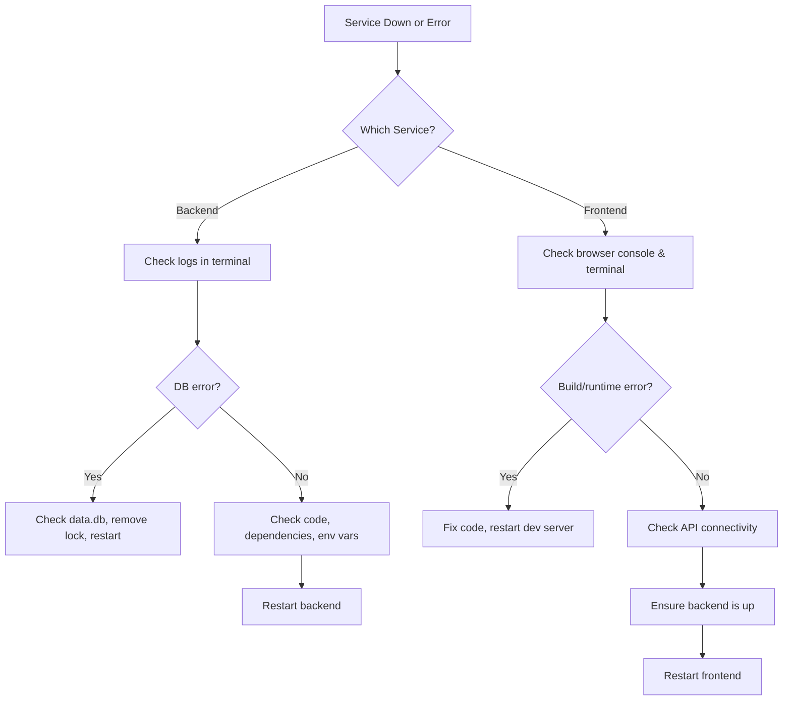

# Tapestry Runbook Operations

| Repo     | Doc Type         | Date                | Branch |
|----------|------------------|---------------------|--------|
| Tapestry | Runbook (850)    | 2025-08-04 19:08    | main   |

---

This runbook provides operational guidance for running, debugging, and recovering both the backend and frontend components of the Tapestry family calendar application. It covers common failure modes, restart procedures, and debugging tips for developers and operators.

---

## 1. System Overview

Tapestry consists of two main services:

- **Backend**: FastAPI application (Python), using SQLite for development, with AI-powered chore generation.
- **Frontend**: Next.js application (TypeScript), served via Node.js.

Both services are typically run locally for development, but can be deployed independently.

---

## 2. Service Startup & Restart Procedures

### 2.1 Backend

**Startup Steps** (see [`[backend/README.md](https://github.com/sergiomasellis/Tapestry/blob/main/backend/README.md)`]([backend/README.md](https://github.com/sergiomasellis/Tapestry/blob/main/backend/README.md)), Last modified: 2025-08-04 19:08):

1. **Install dependencies**:
   ```sh
   uv sync
   ```
2. **Configure environment**:
   - Copy and edit `.env`:
     ```sh
     cp .env.example .env
     # Edit DATABASE_URL, SECRET_KEY, etc.
     ```
3. **Start server**:
   ```sh
   uv run uvicorn app.main:app --reload --host 0.0.0.0 --port 8000
   ```

**Restart Procedure**:
- Stop the running process (Ctrl+C).
- Re-run the startup command above.
- If using a process manager (e.g., systemd, pm2), use its restart command.

**Database Initialization**:
- On first run, SQLite DB (`data.db`) is auto-created.
- If DB corruption is suspected, stop the backend, move or delete `data.db`, and restart (data loss warning).

### 2.2 Frontend

**Startup Steps** (see [`[frontend/README.md](https://github.com/sergiomasellis/Tapestry/blob/main/frontend/README.md)`]([frontend/README.md](https://github.com/sergiomasellis/Tapestry/blob/main/frontend/README.md)), Last modified: 2025-08-04 19:08):

1. **Install dependencies**:
   ```sh
   npm install
   ```
2. **Start development server**:
   ```sh
   npm run dev
   ```
   - Access at [http://localhost:3000](http://localhost:3000).

**Restart Procedure**:
- Stop the running process (Ctrl+C).
- Re-run `npm run dev`.
- For production, use `npm run build` then `npm start`.

---

## 3. Failure Modes & Recovery

### 3.1 Backend

| Failure Symptom                  | Likely Cause                        | Recovery Steps                                   |
|----------------------------------|-------------------------------------|--------------------------------------------------|
| Server won't start (port in use) | Zombie process, port conflict       | Kill process on port 8000, retry                 |
| 500 errors on API                | Code error, DB schema mismatch      | Check logs, run DB migrations, restart           |
| DB locked / corruption           | SQLite concurrency, abrupt stop     | Stop server, remove lock file, restart           |
| Env vars not loaded              | Missing/incorrect `.env`            | Check `.env`, restart after fix                  |
| AI chores not generated          | LangGraph misconfig, dependency     | Check `chore_graph.py` logs, reinstall deps      |

**Debugging Tips**:
- Use `uvicorn`'s `--reload` for live reload and better error output.
- Check logs in console for stack traces.
- Use `sqlite3 data.db` to inspect DB state.

### 3.2 Frontend

| Failure Symptom                  | Likely Cause                        | Recovery Steps                                   |
|----------------------------------|-------------------------------------|--------------------------------------------------|
| App won't start                  | Dependency error, port in use       | Run `npm install`, kill process on 3000, retry   |
| Blank page / 500 error           | Code error, API not reachable       | Check browser console, verify backend is up      |
| Hot reload not working           | Next.js cache issue                 | Stop server, delete `.next/`, restart            |
| Styling broken                   | Tailwind/PostCSS config issue       | Check config files, restart dev server           |

**Debugging Tips**:
- Use browser DevTools for JS errors and network requests.
- Check terminal output for build errors.
- Edit `frontend/src/app/page.tsx` for live updates.

---

## 4. Logs & Observability

- **Backend**: Logs to stdout (console). For detailed errors, run with `--reload`.
- **Frontend**: Build and runtime logs in terminal; browser console for client-side errors.

**Health Checks**:
- Backend: Visit [http://localhost:8000/docs](http://localhost:8000/docs) for API docs.
- Frontend: Visit [http://localhost:3000](http://localhost:3000).

---

## 5. Common Debugging Commands

### Backend

- **Check DB schema**:
  ```sh
  sqlite3 data.db ".schema"
  ```
- **Check running processes**:
  ```sh
  lsof -i :8000
  kill <PID>
  ```

### Frontend

- **Clean install**:
  ```sh
  rm -rf node_modules package-lock.json
  npm install
  ```
- **Clear Next.js cache**:
  ```sh
  rm -rf .next
  npm run dev
  ```

---

## 6. Troubleshooting Flow



---

## 7. Escalation & Support

- If issues persist after above steps:
  - Check for recent code changes (git log).
  - Revert to last known good commit.
  - Ask for help in project channels or file an issue.

---

## 8. Maintenance Tasks

- Regularly update dependencies:
  - Backend: `uv pip install -U -r requirements.txt`
  - Frontend: `npm update`
- Backup `data.db` before major changes.
- Review `.env` and config files after pull/merge.

---

## Primary Sources

- [`[README.md](https://github.com/sergiomasellis/Tapestry/blob/main/README.md)`]([README.md](https://github.com/sergiomasellis/Tapestry/blob/main/README.md)) (Last modified: 2025-08-04 19:08)
- [`[frontend/README.md](https://github.com/sergiomasellis/Tapestry/blob/main/frontend/README.md)`]([frontend/README.md](https://github.com/sergiomasellis/Tapestry/blob/main/frontend/README.md)) (Last modified: 2025-08-04 19:08)
- [`[backend/README.md](https://github.com/sergiomasellis/Tapestry/blob/main/backend/README.md)`]([backend/README.md](https://github.com/sergiomasellis/Tapestry/blob/main/backend/README.md)) (Last modified: 2025-08-04 19:08)
- [`[frontend/package.json](https://github.com/sergiomasellis/Tapestry/blob/main/frontend/package.json)`]([frontend/package.json](https://github.com/sergiomasellis/Tapestry/blob/main/frontend/package.json)) (Last modified: 2025-08-04 19:08)
- [`[frontend/tsconfig.json](https://github.com/sergiomasellis/Tapestry/blob/main/frontend/tsconfig.json)`]([frontend/tsconfig.json](https://github.com/sergiomasellis/Tapestry/blob/main/frontend/tsconfig.json)) (Last modified: 2025-08-04 19:08)
- [`backend/pyproject.toml`](backend/pyproject.toml) (Last modified: 2025-08-04 19:08)
