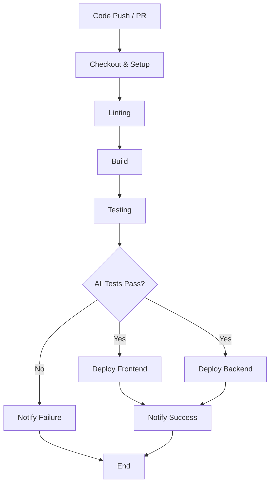

# Tapestry CI/CD Pipeline

| Repo     | Doc Type      | Date       | Branch |
|----------|---------------|------------|--------|
| Tapestry | CI/CD Pipeline | 2025-08-04 | main   |

---

This document describes the Continuous Integration and Continuous Deployment (CI/CD) pipeline for the Tapestry project. It covers the build, test, and deployment processes for both the frontend (Next.js/TypeScript) and backend (FastAPI/Python) components, ensuring a robust and automated workflow for development and production releases.

## Overview

Tapestry is a full-stack application with a modern frontend and a Python backend. The CI/CD pipeline is designed to:

- Automatically lint, build, and test both frontend and backend code on every push and pull request.
- Ensure code quality and prevent regressions.
- Deploy the frontend to Vercel (or similar) and the backend to a cloud service (e.g., Azure, AWS, or managed container platform).
- Manage environment variables and secrets securely.
- Provide fast feedback to contributors.

## Pipeline Stages

The pipeline consists of the following stages:

1. **Checkout & Setup**
2. **Linting**
3. **Build**
4. **Testing**
5. **Deployment**
6. **Notifications**

### 1. Checkout & Setup

- **Action:** Clone the repository and set up the environment for both frontend and backend.
- **Frontend:** Install Node.js (v18+), pnpm/npm, and dependencies.
- **Backend:** Install Python (3.12+), uv/venv, and dependencies.

**Example (GitHub Actions):**
```yaml
jobs:
  setup:
    runs-on: ubuntu-latest
    steps:
      - uses: actions/checkout@v4
      - name: Set up Node.js
        uses: actions/setup-node@v4
        with:
          node-version: '18'
      - name: Set up Python
        uses: actions/setup-python@v5
        with:
          python-version: '3.12'
```

### 2. Linting

- **Frontend:** Run ESLint (`npm run lint`) to check for code quality and style issues.
- **Backend:** Run Ruff or Flake8 for Python linting.

**Example:**
```yaml
- name: Lint Frontend
  run: cd frontend && npm ci && npm run lint
- name: Lint Backend
  run: cd backend && uv pip install ruff && ruff app/
```

### 3. Build

- **Frontend:** Build the Next.js app (`npm run build`). Ensures all TypeScript and config files are valid.
- **Backend:** Ensure all Python modules import correctly; optionally build Docker image.

**Example:**
```yaml
- name: Build Frontend
  run: cd frontend && npm run build
- name: Check Backend Imports
  run: cd backend && python -m compileall app/
```

### 4. Testing

- **Frontend:** Run unit/integration tests (if present, e.g., Jest/React Testing Library).
- **Backend:** Run pytest or equivalent for API and logic tests.

**Example:**
```yaml
- name: Test Frontend
  run: cd frontend && npm test
- name: Test Backend
  run: cd backend && pytest
```

### 5. Deployment

- **Frontend:** Deploy to Vercel (automatic on push to `main`), or use GitHub Actions to deploy to another platform.
- **Backend:** Deploy to a cloud provider (e.g., Azure Web Apps, AWS ECS, or DigitalOcean App Platform) via Docker or direct push.

**Frontend Deployment Example (Vercel):**
- Vercel auto-deploys on push to `main` if connected.

**Backend Deployment Example (Docker):**
```yaml
- name: Build and Push Docker Image
  run: |
    cd backend
    docker build -t ghcr.io/your-org/tapestry-backend:${{ github.sha }} .
    echo ${{ secrets.GITHUB_TOKEN }} | docker login ghcr.io -u ${{ github.actor }} --password-stdin
    docker push ghcr.io/your-org/tapestry-backend:${{ github.sha }}
- name: Deploy to Cloud
  run: |
    # e.g., trigger deployment via cloud CLI or API
```

### 6. Notifications

- Notify contributors of build/test/deploy status via GitHub Checks, Slack, or email.

---

## Pipeline Flow Diagram



---

## Environment & Secrets Management

- **Frontend:** Environment variables managed via Vercel dashboard or `.env.local` (never committed).
- **Backend:** Use `.env` file (see `[backend/README.md](https://github.com/sergiomasellis/Tapestry/blob/main/backend/README.md)`, Last modified: 2025-08-04 19:08) and cloud provider secret stores.
- **CI/CD:** Secrets (API keys, tokens) injected via GitHub Actions or deployment platform.

---

## Example Directory Structure

```
.
├── frontend/
│   ├── package.json
│   ├── tsconfig.json
│   └── ...
└── backend/
    ├── pyproject.toml
    ├── app/
    └── ...
```

---

## Best Practices

- All code changes must pass lint, build, and test stages before merging to `main`.
- Production deployments are triggered only from the `main` branch.
- Use feature branches and pull requests for all changes.
- Keep secrets out of source control.
- Monitor deployments and roll back on failure.

---

## Primary Sources

- [[README.md](https://github.com/sergiomasellis/Tapestry/blob/main/README.md)](./[README.md](https://github.com/sergiomasellis/Tapestry/blob/main/README.md)) (Last modified: 2025-08-04 19:08)
- [[frontend/package.json](https://github.com/sergiomasellis/Tapestry/blob/main/frontend/package.json)](./[frontend/package.json](https://github.com/sergiomasellis/Tapestry/blob/main/frontend/package.json)) (Last modified: 2025-08-04 19:08)
- [[frontend/tsconfig.json](https://github.com/sergiomasellis/Tapestry/blob/main/frontend/tsconfig.json)](./[frontend/tsconfig.json](https://github.com/sergiomasellis/Tapestry/blob/main/frontend/tsconfig.json)) (Last modified: 2025-08-04 19:08)
- [[frontend/README.md](https://github.com/sergiomasellis/Tapestry/blob/main/frontend/README.md)](./[frontend/README.md](https://github.com/sergiomasellis/Tapestry/blob/main/frontend/README.md)) (Last modified: 2025-08-04 19:08)
- [backend/pyproject.toml](./backend/pyproject.toml) (Last modified: 2025-08-04 19:08)
- [[backend/README.md](https://github.com/sergiomasellis/Tapestry/blob/main/backend/README.md)](./[backend/README.md](https://github.com/sergiomasellis/Tapestry/blob/main/backend/README.md)) (Last modified: 2025-08-04 19:08)
