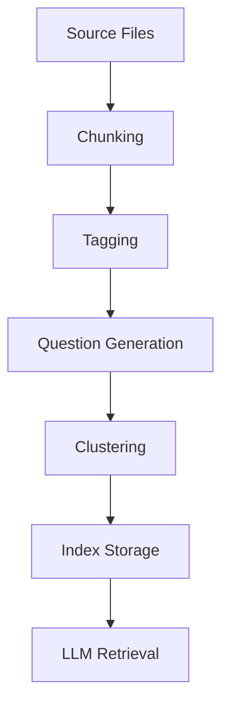

# RAG Indexing Guidelines for Tapestry

| Repo      | Doc Type           | Date         | Branch |
|-----------|--------------------|--------------|--------|
| Tapestry  | RAG Indexing Guide | 2025-08-04   | main   |

---

## Purpose

This document provides guidelines for indexing the Tapestry repository for Retrieval-Augmented Generation (RAG) systems. It covers best practices for tagging, question formulation, and clustering to ensure high-quality, contextually relevant retrieval for downstream LLM applications.

---

## 1. Tagging Guidelines

### 1.1. Tag Types

- **Domain Tags**: `calendar`, `chore`, `points`, `leaderboard`, `goal`, `family`, `user`, `event`
- **Layer Tags**: `frontend`, `backend`, `api`, `database`, `ai`, `config`
- **Functionality Tags**: `authentication`, `authorization`, `integration`, `sync`, `generation`, `tracking`
- **Entity Tags**: `User`, `Family`, `Chore`, `Goal`, `Event`, `Calendar`, `Points`
- **Tech Stack Tags**: `nextjs`, `typescript`, `fastapi`, `sqlalchemy`, `sqlite`, `langgraph`, `tailwindcss`

### 1.2. Tagging Best Practices

- Assign **at least one domain tag** and one **layer tag** to every indexed chunk.
- Use **entity tags** when a file or section defines or manipulates a core model (see [backend/app/models/models.py](https://github.com/sergiomasellis/Tapestry/blob/main/backend/app/models/models.py), Last modified: 2025-08-04 19:08).
- For API endpoints, use both the **functionality** and **entity** tags (e.g., `api`, `user`, `authentication`).
- Tag configuration files with `config` and the relevant environment or tool (e.g., `config`, `frontend`, `typescript` for [frontend/tsconfig.json](https://github.com/sergiomasellis/Tapestry/blob/main/frontend/tsconfig.json), Last modified: 2025-08-04 19:08).

---

## 2. Question Formulation

### 2.1. General Principles

- **Be specific**: Questions should target a single concept, entity, or workflow.
- **Contextualize**: Reference the relevant domain (e.g., "How are points awarded for chores?").
- **Avoid ambiguity**: Use precise language and entity names as defined in the codebase.

### 2.2. Example Questions

- What is the schema for a Chore entity?
- How does the backend authenticate users?
- Which API endpoint allows a family member to complete a chore?
- How are Google Calendar integrations handled?
- What is the structure of the weekly calendar view in the frontend?
- How are points tracked and updated in the database?

---

## 3. Clustering Strategies

### 3.1. Cluster by Domain

- Group chunks by primary domain: `calendar`, `chore`, `goal`, `user`, etc.

### 3.2. Cluster by Layer

- Separate clusters for `frontend`, `backend`, and `ai` (see [backend/app/ai/chore_graph.py](https://github.com/sergiomasellis/Tapestry/blob/main/backend/app/ai/chore_graph.py), Last modified: 2025-08-04 19:08).

### 3.3. Cluster by Functionality

- Group by use-case: authentication, event sync, chore generation, leaderboard calculation, etc.

### 3.4. Cluster by Entity

- For large entities (e.g., `User`, `Family`, `Chore`), cluster all related CRUD, schema, and business logic together.

---

## 4. File-Specific Guidance

- **API Routers**: backend/app/routers/*.py (Last modified: 2025-08-04 19:08) — Tag by entity and functionality (e.g., `api`, `user`, `chore`, `goal`).
- **Schemas**: [backend/app/schemas/schemas.py](https://github.com/sergiomasellis/Tapestry/blob/main/backend/app/schemas/schemas.py) (Last modified: 2025-08-04 19:08) — Tag by entity and `schema`.
- **Models**: [backend/app/models/models.py](https://github.com/sergiomasellis/Tapestry/blob/main/backend/app/models/models.py) (Last modified: 2025-08-04 19:08) — Tag by entity and `database`.
- **Frontend Components**: frontend/src/components/ — Tag by UI element and domain (e.g., `calendar`, `chore`).
- **Configuration**: All `*.config.*` and `*.json` files — Tag by `config` and relevant tool/environment.

---

## 5. Example Indexing Table

| File Path                                 | Example Tags                           | Example Questions                                      | Cluster         |
|--------------------------------------------|----------------------------------------|--------------------------------------------------------|-----------------|
| [backend/app/routers/chores.py](https://github.com/sergiomasellis/Tapestry/blob/main/backend/app/routers/chores.py)              | api, backend, chore, points            | How are chores created via the API?                    | Chore API       |
| [backend/app/models/models.py](https://github.com/sergiomasellis/Tapestry/blob/main/backend/app/models/models.py)               | database, backend, user, family, chore | What fields are in the Family model?                   | Entity: Family  |
| frontend/src/components/CalendarView.tsx   | frontend, calendar, event, ui          | How is the weekly calendar rendered in the frontend?   | Calendar UI     |
| [frontend/tsconfig.json](https://github.com/sergiomasellis/Tapestry/blob/main/frontend/tsconfig.json)                     | config, frontend, typescript           | What are the TypeScript compiler options?              | Frontend Config |
| [backend/app/ai/chore_graph.py](https://github.com/sergiomasellis/Tapestry/blob/main/backend/app/ai/chore_graph.py)              | ai, backend, chore, generation         | How does AI generate new chores?                       | AI Pipeline     |

---

## 6. RAG Indexing Workflow

---

## 7. Additional Recommendations

- **Update tags** as new entities or features are added.
- **Review clusters** periodically to ensure optimal retrieval performance.
- **Document ambiguous or overloaded terms** in a glossary for consistent tagging.

---

## Primary Sources

- [[README.md](https://github.com/sergiomasellis/Tapestry/blob/main/README.md)](./[README.md](https://github.com/sergiomasellis/Tapestry/blob/main/README.md)) (Last modified: 2025-08-04 19:08)
- [[backend/README.md](https://github.com/sergiomasellis/Tapestry/blob/main/backend/README.md)](./[backend/README.md](https://github.com/sergiomasellis/Tapestry/blob/main/backend/README.md)) (Last modified: 2025-08-04 19:08)
- [[backend/app/models/models.py](https://github.com/sergiomasellis/Tapestry/blob/main/backend/app/models/models.py)](./[backend/app/models/models.py](https://github.com/sergiomasellis/Tapestry/blob/main/backend/app/models/models.py)) (Last modified: 2025-08-04 19:08)
- [[backend/app/schemas/schemas.py](https://github.com/sergiomasellis/Tapestry/blob/main/backend/app/schemas/schemas.py)](./[backend/app/schemas/schemas.py](https://github.com/sergiomasellis/Tapestry/blob/main/backend/app/schemas/schemas.py)) (Last modified: 2025-08-04 19:08)
- [[backend/app/routers/chores.py](https://github.com/sergiomasellis/Tapestry/blob/main/backend/app/routers/chores.py)](./[backend/app/routers/chores.py](https://github.com/sergiomasellis/Tapestry/blob/main/backend/app/routers/chores.py)) (Last modified: 2025-08-04 19:08)
- [[frontend/tsconfig.json](https://github.com/sergiomasellis/Tapestry/blob/main/frontend/tsconfig.json)](./[frontend/tsconfig.json](https://github.com/sergiomasellis/Tapestry/blob/main/frontend/tsconfig.json)) (Last modified: 2025-08-04 19:08)
- [[frontend/package.json](https://github.com/sergiomasellis/Tapestry/blob/main/frontend/package.json)](./[frontend/package.json](https://github.com/sergiomasellis/Tapestry/blob/main/frontend/package.json)) (Last modified: 2025-08-04 19:08)
- [[frontend/README.md](https://github.com/sergiomasellis/Tapestry/blob/main/frontend/README.md)](./[frontend/README.md](https://github.com/sergiomasellis/Tapestry/blob/main/frontend/README.md)) (Last modified: 2025-08-04 19:08)
- [[backend/app/ai/chore_graph.py](https://github.com/sergiomasellis/Tapestry/blob/main/backend/app/ai/chore_graph.py)](./[backend/app/ai/chore_graph.py](https://github.com/sergiomasellis/Tapestry/blob/main/backend/app/ai/chore_graph.py)) (Last modified: 2025-08-04 19:08)