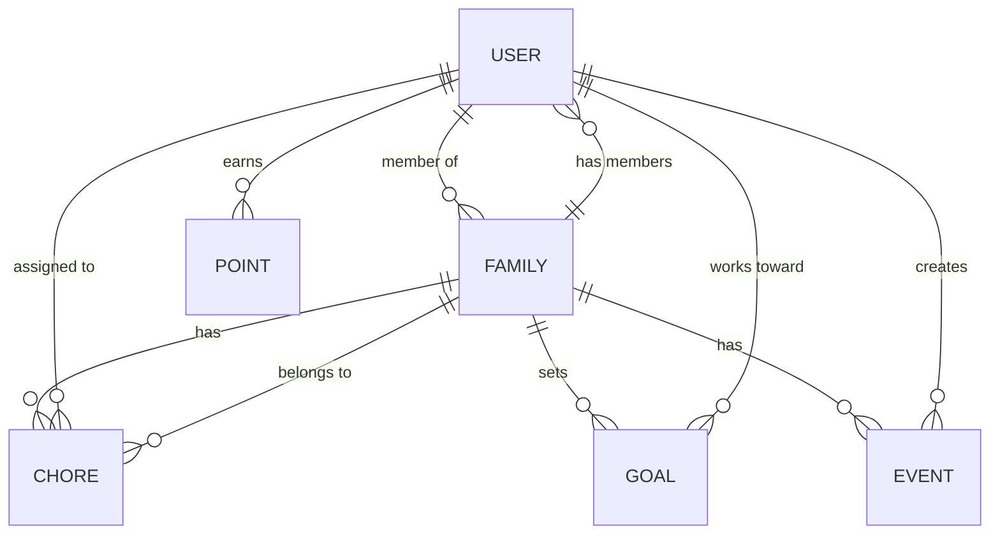

# Domain & Business Rules

| Repo    | Doc Type                | Date                | Branch |
|---------|-------------------------|---------------------|--------|
| Tapestry | Domain & Business Rules | 2025-08-04 19:08    | main   |

---

## Overview

Tapestry is a family-focused calendar and task management application. Its business logic centers on five primary domains:

- **Users**: Individual accounts, often grouped into families.
- **Families**: Groups of users, sharing calendars, chores, points, and goals.
- **Chores**: Tasks assigned to users, tracked for completion and points.
- **Points**: Gamified rewards for completing chores.
- **Goals**: Achievements or prizes users can work toward by earning points.
- **Events**: Calendar items, shared within families.

This document outlines the core business rules, entity relationships, and domain flows that govern Tapestry's operation.

---

## 1. Users

- **Registration**: Users can sign up individually or via family invitation.
- **Roles**: Users may have roles (e.g., parent, child) within a family, affecting permissions (e.g., chore assignment).
- **Authentication**: Required for all actions except registration and login.
- **Profile**: Each user has a profile (name, avatar, email).

**Key Rules:**
- A user must belong to at least one family.
- A user can belong to multiple families (e.g., blended families).
- Only users with "parent" role can manage family membership and assign chores.

---

## 2. Families

- **Creation**: Any user can create a family and becomes its initial admin.
- **Membership**: Users join via invitation or admin approval.
- **Settings**: Family settings include name, avatar, and notification preferences.

**Key Rules:**
- Each family has at least one admin.
- Family data (chores, events, points, goals) is visible to all members.
- Only admins can invite/remove members or change family settings.

---

## 3. Chores

- **Assignment**: Chores are assigned to one or more users.
- **Scheduling**: Chores can be one-time or recurring (daily, weekly, etc.).
- **Completion**: Users mark chores as complete; parents can verify completion.
- **AI Assistance**: Optionally, chores can be generated or suggested via AI (LangGraph).

**Key Rules:**
- Only assigned users (or parents) can mark a chore as complete.
- Completing a chore awards points to the assigned user(s).
- Chores can be edited or deleted by parents/admins only.
- Chores must have a due date/time and point value.

---

## 4. Points

- **Earning**: Points are awarded for completing chores.
- **Leaderboard**: Points are tallied per user within a family, shown on a leaderboard.
- **Redemption**: Points can be redeemed for goals/prizes.

**Key Rules:**
- Points are non-transferable between users.
- Only verified completions (by parent or self, depending on settings) award points.
- Points reset can be scheduled (e.g., weekly) or manual (by admin).

---

## 5. Goals

- **Definition**: Goals are rewards or achievements set by parents/admins.
- **Tracking**: Users can select goals to work toward; progress is tracked via points.
- **Redemption**: When a user has enough points, they can redeem a goal.

**Key Rules:**
- Only parents/admins can create, edit, or delete goals.
- Redeeming a goal deducts the required points from the user.
- Goals can be family-wide or user-specific.

---

## 6. Events

- **Creation**: Any family member can create events (calendar items).
- **Visibility**: Events are visible to all family members.
- **Integration**: Optionally, events can be synced with external calendars (Google, iCal, Alexa).

**Key Rules:**
- Only event creators or parents can edit/delete events.
- Events can be one-time or recurring.
- Events must have a title, start/end time, and optional description.

---

## 7. Domain Flows

### Chore Completion and Point Awarding

1. Parent assigns a chore to a user (child).
2. Chore appears on the user's dashboard.
3. User marks the chore as complete.
4. (Optional) Parent verifies completion.
5. Points are awarded to the user.
6. Leaderboard updates in real-time.

### Goal Redemption

1. User selects a goal to work toward.
2. As points accumulate, progress is tracked.
3. Once enough points are earned, user redeems the goal.
4. Points are deducted; goal is marked as achieved.

### Family Membership

1. Parent creates a family and invites members.
2. Invited users accept and join.
3. Family settings, chores, events, and goals become accessible to all members.

---

## 8. Entity Relationship Overview

The following diagram illustrates the relationships between the main entities:

---

## 9. Business Rule Enforcement

- All business rules are enforced at the API layer (backend/app/routers/).
- Data validation and serialization are handled via Pydantic schemas ([backend/app/schemas/schemas.py](https://github.com/sergiomasellis/Tapestry/blob/main/backend/app/schemas/schemas.py)).
- Permissions are checked based on user roles and family membership.
- AI-powered features (e.g., chore suggestion) are orchestrated via LangGraph ([backend/app/ai/chore_graph.py](https://github.com/sergiomasellis/Tapestry/blob/main/backend/app/ai/chore_graph.py)).

---

## Primary Sources

- [README.md](https://github.com/sergiomasellis/Tapestry/blob/main/README.md) (Last modified: 2025-08-04 19:08)
- [backend/README.md](https://github.com/sergiomasellis/Tapestry/blob/main/backend/README.md) (Last modified: 2025-08-04 19:08)
- [backend/app/models/models.py](https://github.com/sergiomasellis/Tapestry/blob/main/backend/app/models/models.py) (see file for entity definitions)
- [backend/app/schemas/schemas.py](https://github.com/sergiomasellis/Tapestry/blob/main/backend/app/schemas/schemas.py) (see file for data validation)
- backend/app/routers/ (users.py, families.py, chores.py, points.py, goals.py, calendars.py; see files for business logic and API enforcement)
- [backend/app/ai/chore_graph.py](https://github.com/sergiomasellis/Tapestry/blob/main/backend/app/ai/chore_graph.py) (AI-powered chore logic)