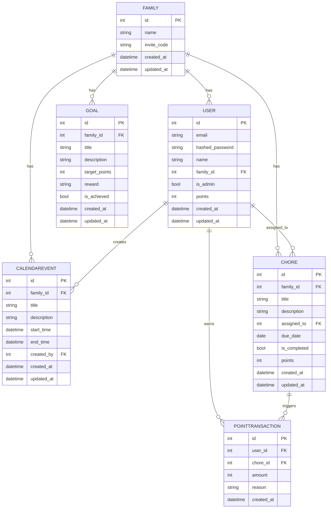

# Tapestry Main Entity Schema

| Repo     | Doc Type         | Date                | Branch |
|----------|------------------|---------------------|--------|
| Tapestry | Main Entity Schema (421) | 2025-08-04  | main   |

## Overview

Tapestry is a family-oriented calendar and chore management application. The backend, implemented in FastAPI with SQLAlchemy and Pydantic, defines several core entities to support user management, family grouping, events, chores, points, and goals. This document describes the main data models, their relationships, and key attributes as defined in:

- [backend/app/models/models.py](https://github.com/sergiomasellis/Tapestry/blob/main/backend/app/models/models.py) (Last modified: 2025-08-04 19:08)
- [backend/app/schemas/schemas.py](https://github.com/sergiomasellis/Tapestry/blob/main/backend/app/schemas/schemas.py) (Last modified: 2025-08-04 19:08)

## Key Entities

### 1. User

- **id** (PK)
- **email** (unique)
- **hashed_password**
- **name**
- **family_id** (FK → Family.id)
- **is_admin** (bool)
- **points** (int, default: 0)
- **created_at**
- **updated_at**

### 2. Family

- **id** (PK)
- **name**
- **invite_code** (unique)
- **created_at**
- **updated_at**

### 3. CalendarEvent

- **id** (PK)
- **family_id** (FK → Family.id)
- **title**
- **description**
- **start_time**
- **end_time**
- **created_by** (FK → User.id)
- **created_at**
- **updated_at**

### 4. Chore

- **id** (PK)
- **family_id** (FK → Family.id)
- **title**
- **description**
- **assigned_to** (FK → User.id)
- **due_date**
- **is_completed** (bool)
- **points** (int)
- **created_at**
- **updated_at**

### 5. PointTransaction

- **id** (PK)
- **user_id** (FK → User.id)
- **chore_id** (FK → Chore.id, nullable)
- **amount** (int)
- **reason**
- **created_at**

### 6. Goal

- **id** (PK)
- **family_id** (FK → Family.id)
- **title**
- **description**
- **target_points** (int)
- **reward**
- **is_achieved** (bool)
- **created_at**
- **updated_at**

## Relationships

- **User** belongs to one **Family**; a **Family** has many **Users**.
- **CalendarEvent** and **Chore** are both scoped to a **Family**.
- **Chore** is assigned to a **User**.
- **PointTransaction** records point changes for a **User**, optionally linked to a **Chore**.
- **Goal** is set at the **Family** level.

## Entity-Relationship Diagram

## Notes

- All entities include `created_at` and `updated_at` timestamps for auditability.
- Foreign key constraints enforce data integrity between users, families, chores, and events.
- The point system is tracked both as a running total on the User and as a transaction log in PointTransaction.
- Chores and goals are designed to gamify family participation and incentivize engagement.

---

## Primary Sources

- [backend/app/models/models.py](https://github.com/sergiomasellis/Tapestry/blob/main/backend/app/models/models.py) (Last modified: 2025-08-04 19:08)
- [backend/app/schemas/schemas.py](https://github.com/sergiomasellis/Tapestry/blob/main/backend/app/schemas/schemas.py) (Last modified: 2025-08-04 19:08)
- [backend/README.md](https://github.com/sergiomasellis/Tapestry/blob/main/backend/README.md) (Last modified: 2025-08-04 19:08)
- [README.md](https://github.com/sergiomasellis/Tapestry/blob/main/README.md) (Last modified: 2025-08-04 19:08)