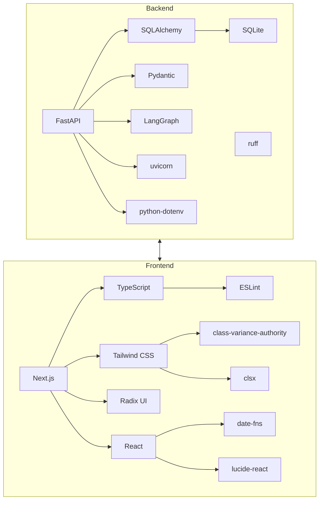

# Tapestry – Key Dependencies

| Repo     | Doc Type         | Date                | Branch |
|----------|------------------|---------------------|--------|
| Tapestry | Key Dependencies | 2025-08-04 19:08    | main   |

---

This document catalogs the key dependencies for the Tapestry project, covering both backend and frontend stacks. It highlights the frameworks, libraries, and tools that underpin the system’s core functionality, as well as notable development and runtime dependencies. File references and dependency versions are based on the most recent project state as of 2025-08-04.

## Overview

Tapestry is a modern, multi-user family calendar and chore management application. Its architecture is split into a FastAPI-based backend and a Next.js/TypeScript frontend. The backend leverages SQLAlchemy for ORM/database access and integrates AI-powered features via LangGraph. The frontend uses the latest React and Next.js ecosystem tools.

---

## Backend Dependencies

**Source:** backend/pyproject.toml (Last modified: 2025-08-04 19:08)

### Core Runtime Dependencies

- **FastAPI** (`fastapi>=0.116.1`)
  - High-performance Python web framework for building APIs.
  - Used for all HTTP API endpoints and routing.
- **SQLAlchemy** (`sqlalchemy>=2.0.42`)
  - ORM for database access and schema management.
  - Used for all models and DB operations.
- **Pydantic** (`pydantic[email]>=2.11.7`)
  - Data validation and settings management.
  - Used for request/response schemas and config parsing.
- **LangGraph** (`langgraph>=0.6.3`)
  - AI workflow orchestration.
  - Powers AI-based chore generation and point assignment (see app/ai/chore_graph.py).
- **python-dotenv** (`python-dotenv>=1.1.1`)
  - Loads environment variables from `.env` files for configuration.
- **typing-extensions** (`typing-extensions>=4.14.1`)
  - Provides forward compatibility for Python typing features.
- **uvicorn** (`uvicorn>=0.35.0`)
  - ASGI server for running FastAPI applications.

### Development Dependencies

- **ruff** (`ruff>=0.12.7`)
  - Fast Python linter for code quality enforcement.

### Database

- **SQLite**
  - Default development database (see [backend/README.md](https://github.com/sergiomasellis/Tapestry/blob/main/backend/README.md) and backend/data.db).
  - Connection string managed via environment variable (`DATABASE_URL`).

### Notable Internal Modules

- **app/db/session.py**
  - SQLAlchemy engine/session setup.
- **app/models/models.py**
  - SQLAlchemy ORM models.
- **app/ai/chore_graph.py**
  - LangGraph-powered AI pipeline for chore management.

---

## Frontend Dependencies

**Source:** [frontend/package.json](https://github.com/sergiomasellis/Tapestry/blob/main/frontend/package.json) (Last modified: 2025-08-04 19:08)

### Core Runtime Dependencies

- **Next.js** (`next@15.4.5`)
  - React-based framework for SSR/SSG and routing.
- **React** (`react@19.1.0`, `react-dom@19.1.0`)
  - UI library and DOM rendering.
- **Tailwind CSS** (via `tailwindcss@^4`, `tailwind-merge@^3.3.1`)
  - Utility-first CSS framework for styling.
- **Radix UI** (multiple packages, e.g., `@radix-ui/react-avatar`, `@radix-ui/react-dialog`, etc.)
  - Accessible, composable UI primitives.
- **date-fns** (`date-fns@^4.1.0`)
  - Modern date utility library.
- **lucide-react** (`lucide-react@^0.536.0`)
  - Icon library for React.
- **class-variance-authority**, **clsx**
  - Utilities for conditional class names and styling.

### Development Dependencies

- **TypeScript** (`typescript@^5`)
  - Static typing for JavaScript.
- **ESLint** (`eslint@^9`, `eslint-config-next@15.4.5`)
  - Linting and code quality.
- **@types/** packages
  - TypeScript type definitions for Node, React, etc.
- **@tailwindcss/postcss**, **postcss**
  - CSS post-processing.

### Tooling

- **pnpm**, **npm**, **yarn**, **bun**
  - Supported package managers for dependency installation and scripts.

---

## Dependency Topology

---

## Key Integration Points

- **API Communication:** Frontend (Next.js/React) communicates with the backend (FastAPI) via RESTful endpoints.
- **Database:** SQLAlchemy ORM models map to SQLite tables for development.
- **AI Pipeline:** LangGraph is used for AI-driven features (e.g., chore suggestion, point assignment).
- **Environment Management:** python-dotenv and .env files manage secrets and configuration.
- **Styling/UI:** Tailwind CSS and Radix UI provide a modern, accessible frontend.

---

## Primary Sources

- backend/pyproject.toml (Last modified: 2025-08-04 19:08)
- [backend/README.md](https://github.com/sergiomasellis/Tapestry/blob/main/backend/README.md) (Last modified: 2025-08-04 19:08)
- [frontend/package.json](https://github.com/sergiomasellis/Tapestry/blob/main/frontend/package.json) (Last modified: 2025-08-04 19:08)
- [frontend/tsconfig.json](https://github.com/sergiomasellis/Tapestry/blob/main/frontend/tsconfig.json) (Last modified: 2025-08-04 19:08)
- [frontend/README.md](https://github.com/sergiomasellis/Tapestry/blob/main/frontend/README.md) (Last modified: 2025-08-04 19:08)
- [README.md](https://github.com/sergiomasellis/Tapestry/blob/main/README.md) (Last modified: 2025-08-04 19:08)