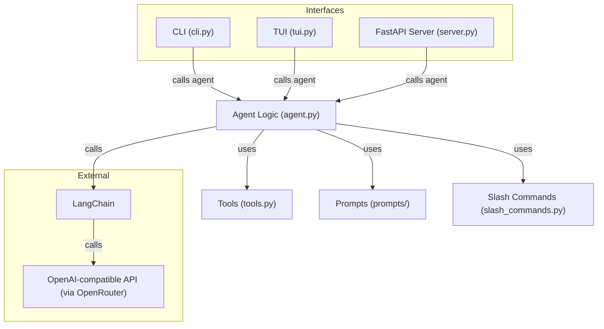

# Gambit Architecture & Topology

| Repo        | Doc Type             | Date       |
|-------------|---------------------|------------|
| gambit      | Architecture (100)  | 2024-06-13 |

---

## Overview

Gambit is a modular coding agent system designed to provide code explanations, answer coding questions, and perform controlled file and shell operations. It supports multiple user interfaces and exposes its capabilities via both a command-line interface (CLI), a Textual-based terminal UI (TUI), and a FastAPI-powered HTTP server. The core agent logic is shared across these interfaces and leverages LangChain, OpenAI-compatible APIs, and a set of secure tools for file and command operations.

---

## High-Level Components

- **CLI Entrypoint** (`gambit_coding_agent/cli.py`):  
  Provides a command-line interface for sending messages or code to the agent and receiving responses.

- **Textual TUI** (`gambit_coding_agent/tui.py`):  
  Offers an interactive terminal UI for chatting with the agent.

- **FastAPI Server** (`gambit_coding_agent/server.py`):  
  Exposes REST API endpoints for agent interaction, code explanation, and diagnostics.

- **Agent Logic** (`gambit_coding_agent/agent.py`):  
  Central logic for message handling, code explanation, and tool orchestration.

- **Tools** (`gambit_coding_agent/tools.py`):  
  Implements controlled file and shell operations (read, write, execute, search, list).

- **Slash Commands** (`gambit_coding_agent/slash_commands.py`):  
  Handles special commands or agent instructions.

- **Prompts** (`gambit_coding_agent/prompts/`):  
  Contains prompt templates for agent initialization and task-specific instructions.

---

## Component Interaction

---

## Architectural Style

- **Modular, Layered Design:**  
  Each interface (CLI, TUI, API) is a thin layer over the shared agent logic, ensuring consistent behavior and easy extensibility.

- **Agent-Centric:**  
  All user interactions are funneled through the agent, which interprets, routes, and processes requests, optionally invoking tools for file or shell operations.

- **Secure Tooling:**  
  Tools are explicitly defined and only accessible through agent-mediated requests, reducing risk of arbitrary code execution.

- **Prompt-Driven:**  
  Prompts are externalized for flexibility and easy updates to agent behavior.

---

## Key Flows

1. **User Input** (via CLI, TUI, or API)
2. **Agent Processing**  
   - Interprets message or code
   - Selects appropriate prompt and tools
   - May invoke file or shell tools as needed
   - Calls out to LangChain/OpenAI for LLM-based reasoning
3. **Response Delivery**  
   - Returns explanation, answer, or tool result to the user via the originating interface

---

## Extensibility

- **Adding Interfaces:**  
  New UIs or integrations can be added by connecting to the agent logic.
- **Expanding Tools:**  
  New tools can be implemented in `tools.py` and registered with the agent.
- **Prompt Customization:**  
  Prompts can be updated or extended in the `prompts/` directory.

---

## Primary Sources

- [README.md](README.md)
- [setup.py](setup.py)
- [pyproject.toml](pyproject.toml)
- [gambit_coding_agent/cli.py](gambit_coding_agent/cli.py)
- [gambit_coding_agent/tui.py](gambit_coding_agent/tui.py)
- [gambit_coding_agent/server.py](gambit_coding_agent/server.py)
- [gambit_coding_agent/agent.py](gambit_coding_agent/agent.py)
- [gambit_coding_agent/tools.py](gambit_coding_agent/tools.py)
- [gambit_coding_agent/slash_commands.py](gambit_coding_agent/slash_commands.py)
- [gambit_coding_agent/prompts/](gambit_coding_agent/prompts/)
- [.github/workflows/python-app.yml](.github/workflows/python-app.yml)
