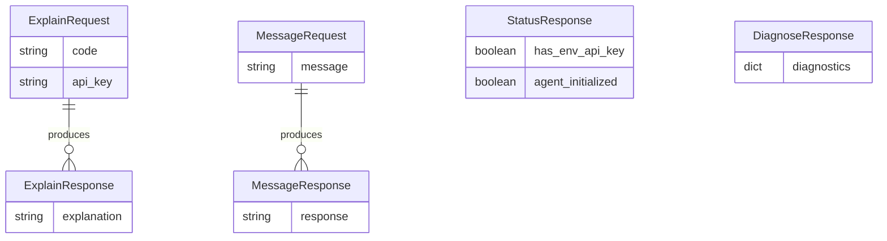

# Main Entity Schema (Gambit Coding Agent)

| Repo   | Doc Type         | Date       |
|--------|------------------|------------|
| gambit | Main Entity Schema (421) | 2024-06-13 |

This document describes the primary data entities and schemas used by the Gambit Coding Agent, focusing on the request and response models for its API endpoints. These schemas define the contract between clients and the agent, ensuring consistent communication for code explanation, messaging, and status checks.

---

## Overview

The Gambit Coding Agent exposes a minimal REST API with the following main entities:

- **ExplainRequest / ExplainResponse**: For code explanation.
- **MessageRequest / MessageResponse**: For general agent interaction.
- **StatusResponse**: For server and agent status.
- **DiagnoseResponse**: For diagnostics (structure inferred).

All schemas are implemented using [Pydantic](https://docs.pydantic.dev/) models, ensuring type safety and validation.

---

## Entity Schemas

### 1. ExplainRequest

**Purpose:** Request an explanation for a code snippet.

```json
{
  "code": "def hello(): print('Hello, World!')",
  "api_key": "optional_override_key"
}
```

| Field    | Type   | Required | Description                              |
|----------|--------|----------|------------------------------------------|
| code     | str    | Yes      | The code snippet to be explained.        |
| api_key  | str    | No       | Optional API key to override environment.|

---

### 2. ExplainResponse

**Purpose:** Returns the explanation for the provided code.

```json
{
  "explanation": "This function defines a simple procedure that prints 'Hello, World!' to the console."
}
```

| Field        | Type   | Required | Description                        |
|--------------|--------|----------|------------------------------------|
| explanation  | str    | Yes      | The explanation of the code.       |

---

### 3. MessageRequest

**Purpose:** Send a free-form message or question to the agent.

```json
{
  "message": "What is a Python decorator?"
}
```

| Field    | Type   | Required | Description                              |
|----------|--------|----------|------------------------------------------|
| message  | str    | Yes      | The message or question for the agent.   |

---

### 4. MessageResponse

**Purpose:** Returns the agent's response to a message.

```json
{
  "response": "A Python decorator is a design pattern..."
}
```

| Field     | Type   | Required | Description                        |
|-----------|--------|----------|------------------------------------|
| response  | str    | Yes      | The agent's response.              |

---

### 5. StatusResponse

**Purpose:** Provides server and agent status.

```json
{
  "has_env_api_key": true,
  "agent_initialized": true
}
```

| Field              | Type    | Required | Description                                      |
|--------------------|---------|----------|--------------------------------------------------|
| has_env_api_key    | bool    | Yes      | Whether an API key is set in the environment.    |
| agent_initialized  | bool    | Yes      | Whether the agent is initialized and ready.      |

---

### 6. DiagnoseResponse

**Purpose:** Returns diagnostic information for troubleshooting.

*Structure inferred; actual fields may vary.*

```json
{
  "diagnostics": {
    "openai_status": "ok",
    "tools_loaded": true,
    "env_vars": ["OPENROUTER_API_KEY"]
  }
}
```

| Field        | Type   | Required | Description                        |
|--------------|--------|----------|------------------------------------|
| diagnostics  | dict   | Yes      | Diagnostic details (implementation-defined). |

---

## ER Diagram



---

## Notes

- All request/response entities are flat, with no nested objects except for `diagnostics` in `DiagnoseResponse`.
- All fields are required unless marked optional.
- The agent's tool usage (e.g., file operations) is not directly exposed in the API schemas but is handled internally.

---

## Primary Sources

- README.md
- pyproject.toml
- setup.py
- gambit_coding_agent/server.py *(inferred, not shown but implied by API endpoints)*
