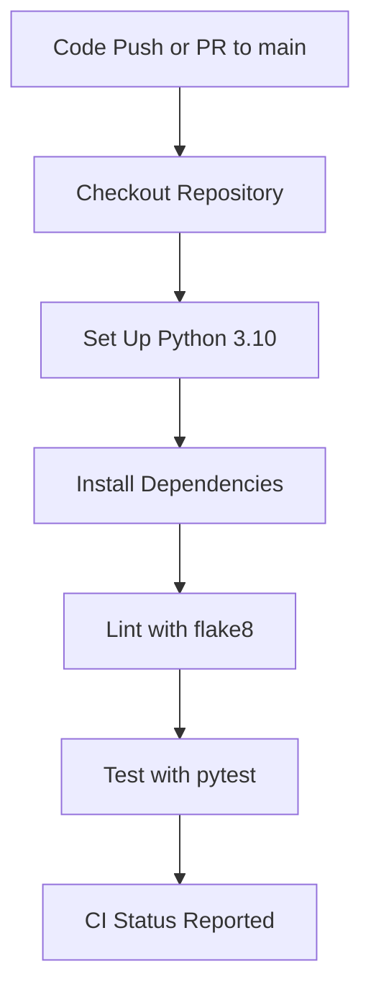

# CI/CD Pipeline

| Repo      | Doc Type         | Date       |
|-----------|------------------|------------|
| gambit    | CI/CD Pipeline   | 2024-06-12 |

---

This document describes the Continuous Integration (CI) pipeline for the **gambit** coding agent project. The pipeline is implemented using GitHub Actions and is defined in [.github/workflows/python-app.yml](.github/workflows/python-app.yml). It ensures code quality and reliability by automatically building, linting, and testing the codebase on every push and pull request to the `main` branch.

## Pipeline Overview

The CI pipeline is triggered on:

- Pushes to the `main` branch
- Pull requests targeting the `main` branch

The workflow runs on the latest Ubuntu environment and uses Python 3.10 for all steps.

### Pipeline Stages

1. **Checkout Source**
   - Uses the official `actions/checkout` action to pull the repository code.

2. **Set Up Python**
   - Installs Python 3.10 using `actions/setup-python`.

3. **Install Dependencies**
   - Upgrades `pip`.
   - Installs `flake8` (linter) and `pytest` (test runner).
   - If a `requirements.txt` file is present, installs dependencies from it. (Note: The project uses `pyproject.toml` and `setup.py` for dependencies, so this step is a fallback.)

4. **Linting**
   - Runs `flake8` to check for syntax errors, undefined names, and code style issues.
   - The first `flake8` command fails the build on critical errors.
   - The second `flake8` command reports all issues as warnings for developer visibility.

5. **Testing**
   - Runs the test suite using `pytest`.
   - All tests in the `tests/` directory (e.g., `tests/test_todos.py`, `tests/test_agent.py`) are executed.

### Pipeline Flow Diagram



## Local Build & Test

For local development, you can replicate the CI steps:

1. **Install dependencies**  
   Using [uv](https://github.com/astral-sh/uv) (recommended):
   ```bash
   uv sync
   ```
   Or with pip:
   ```bash
   pip install -e .
   ```

2. **Lint**
   ```bash
   flake8 .
   ```

3. **Test**
   ```bash
   pytest
   ```

## Deployment

**Note:**  
There is currently **no automated deployment** step in the pipeline. Deployment (e.g., to a server or PyPI) must be performed manually.

## Pipeline File Reference

- Workflow definition: [.github/workflows/python-app.yml](.github/workflows/python-app.yml)
- Dependency management: [pyproject.toml](pyproject.toml), [setup.py](setup.py)
- Tests: [tests/](tests/)

## Best Practices

- Ensure all code passes linting and tests locally before pushing.
- Keep dependencies up to date in `pyproject.toml`.
- Use feature branches and submit pull requests for review.

---

## Primary Sources

- .github/workflows/python-app.yml
- README.md
- pyproject.toml
- setup.py
- tests/test_todos.py
- tests/test_agent.py