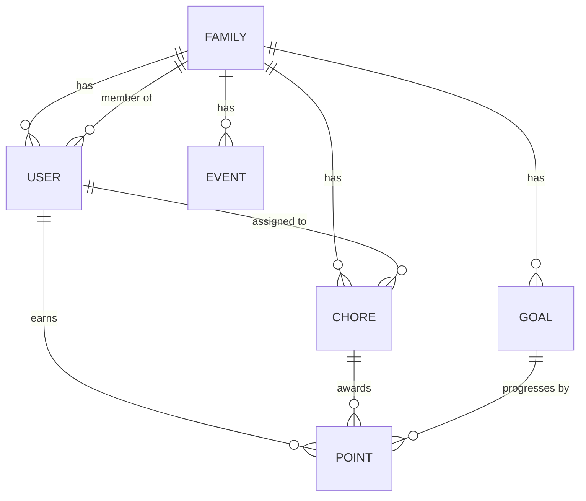

# Domain & Business Rules

| Repo     | Doc Type                | Date                | Branch |
|----------|------------------------|---------------------|--------|
| Tapestry | Domain & Business Rules | 2025-08-04 19:08    | main   |

## Overview

Tapestry is a family-oriented calendar and task management application. The domain logic centers around five primary concepts: **Families**, **Chores**, **Points**, **Goals**, and **Events**. These entities interact to support collaborative scheduling, incentivized chore completion, and progress tracking within family groups.

This document outlines the core business rules, entity relationships, and domain flows that govern the application's behavior.

---

## 1. Families

- **Definition:** A Family is a group of users (adults and children) who share a calendar, chores, and point/goal tracking.
- **Membership:** Users can belong to one or more families. Each family has at least one adult (admin).
- **Invitations:** Family admins can invite users to join via email or code.
- **Permissions:** Only admins can manage family membership and settings.

**Key Rules:**
- A user must belong to a family to access shared features (chores, events, points, goals).
- Family membership determines data visibility and access.

---

## 2. Users

- **Types:** Adult (admin) and Child.
- **Roles:** Adults can manage chores, goals, and family settings; children can view and complete chores, view points/goals.

**Key Rules:**
- Each user has a unique identity and authentication credentials.
- User roles determine permissions within the family context.

---

## 3. Chores

- **Definition:** Tasks assigned to family members, typically recurring (e.g., "Take out trash").
- **Assignment:** Chores can be assigned to one or more users.
- **Recurrence:** Chores may repeat on a schedule (daily, weekly, etc.).
- **Completion:** Users mark chores as complete; completion awards points.

**Key Rules:**
- Only assigned users can mark a chore as complete.
- Chores may have deadlines; overdue chores may affect point awards.
- Chores can be created manually or generated via AI (LangGraph pipeline).

---

## 4. Points

- **Definition:** A gamified system to incentivize chore completion.
- **Earning:** Completing chores awards points to the assigned user(s).
- **Leaderboard:** Points are aggregated per user and displayed in a family leaderboard.

**Key Rules:**
- Points are only awarded for valid, on-time chore completions.
- Admins may adjust points in case of disputes or errors.
- Points are tracked per user, per family.

---

## 5. Goals

- **Definition:** Rewards or milestones set by the family (e.g., "Earn 100 points for a movie night").
- **Tracking:** Goals have a target point value and may have a deadline.
- **Redemption:** When a user reaches a goal, the family can mark it as achieved and optionally reset or create new goals.

**Key Rules:**
- Goals are visible to all family members.
- Only admins can create, edit, or delete goals.
- Progress toward goals is updated in real time as points are earned.

---

## 6. Events

- **Definition:** Calendar entries for family activities (e.g., appointments, birthdays, outings).
- **Visibility:** All family members can view events; adults can create/edit/delete.
- **Integration:** Events may be imported from external calendars (Google, iCal, Alexa).

**Key Rules:**
- Events are scoped to the family.
- Event conflicts (overlapping times) may be flagged for review.

---

## 7. Domain Flows

### Chore Completion and Point Awarding

1. Chore is assigned to user(s) with a due date.
2. User marks chore as complete.
3. System verifies assignment and timeliness.
4. Points are awarded to the user(s).
5. Family leaderboard and goal progress are updated.

### Goal Achievement

1. Family admin creates a goal (target points, description, optional deadline).
2. Users earn points by completing chores.
3. When a user reaches the goal, the system notifies the family.
4. Admin can mark the goal as redeemed and optionally reset or archive it.

### Family Membership

1. Admin invites user to family.
2. User accepts invitation and is added to the family group.
3. User gains access to shared chores, events, points, and goals.

---

## 8. Entity Relationship Overview

The following diagram summarizes the relationships between the main domain entities:

---

## 9. Business Invariants

- A user cannot earn points for chores not assigned to them.
- Points cannot be transferred between users.
- Only family admins can modify family structure, goals, and point adjustments.
- Chores and events are always scoped to a single family.

---

## Primary Sources

- [README.md](https://github.com/sergiomasellis/Tapestry/blob/main/README.md) (Last modified: 2025-08-04 19:08)
- [backend/README.md](https://github.com/sergiomasellis/Tapestry/blob/main/backend/README.md) (Last modified: 2025-08-04 19:08)
- [backend/app/models/models.py](https://github.com/sergiomasellis/Tapestry/blob/main/backend/app/models/models.py) (see file for schema details)
- [backend/app/schemas/schemas.py](https://github.com/sergiomasellis/Tapestry/blob/main/backend/app/schemas/schemas.py) (see file for Pydantic models)
- [backend/app/routers/chores.py](https://github.com/sergiomasellis/Tapestry/blob/main/backend/app/routers/chores.py), points.py, goals.py, families.py, events.py (see files for endpoint logic)
