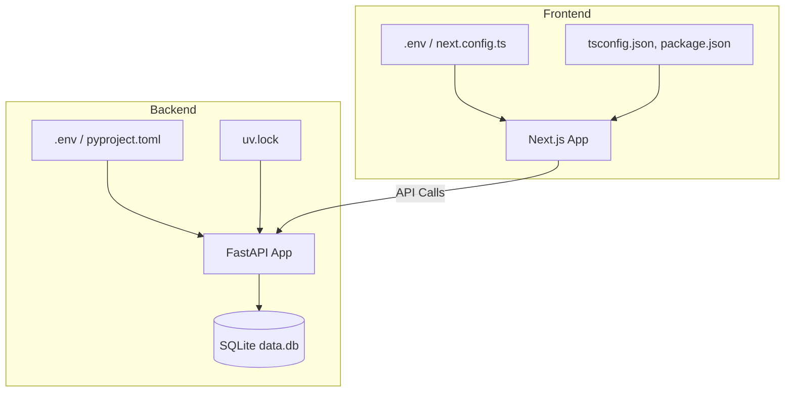

# Tapestry Configuration & Environments

| Repo     | Doc Type               | Date                | Branch |
|----------|------------------------|---------------------|--------|
| Tapestry | Config & Environments  | 2025-08-04 19:08    | main   |

---

This document describes the configuration files, environment variables, and environment-specific setup for the Tapestry project. It covers both the frontend (Next.js) and backend (FastAPI) components, including how configuration is managed, what files are involved, and how to set up local development environments.

---

## Overview

Tapestry is a full-stack application with a Next.js frontend and a FastAPI backend. Each component has its own configuration files and environment management practices, designed to support local development and future production deployments.

---

## 1. Frontend Configuration

**Directory:** `frontend/`

### Key Configuration Files

- `[frontend/tsconfig.json](https://github.com/sergiomasellis/Tapestry/blob/main/frontend/tsconfig.json)`  
  *Last modified: 2025-08-04 19:08*  
  TypeScript compiler options, including strictness, module resolution, JSX support, and path aliases (e.g., `@/*` → `./src/*`).  
  - Includes all `.ts`/`.tsx` files and excludes `node_modules`.

- `[frontend/package.json](https://github.com/sergiomasellis/Tapestry/blob/main/frontend/package.json)`  
  *Last modified: 2025-08-04 19:08*  
  Defines project metadata, scripts (`dev`, `build`, `start`, `lint`), dependencies (Next.js, React, Tailwind CSS, Radix UI, etc.), and devDependencies (TypeScript, ESLint, Tailwind).

- `frontend/next.config.ts`  
  *Last modified: 2025-08-04 19:08*  
  Next.js runtime configuration (customizes build, routing, and environment variables for the frontend).  
  - **Note:** Actual content not shown, but typically used for environment variables, rewrites, and build options.

- `frontend/postcss.config.mjs`  
  *Last modified: 2025-08-04 19:08*  
  PostCSS configuration for CSS processing (used by Tailwind CSS).

- `frontend/.env` (not shown, but implied)  
  Used for storing frontend environment variables (e.g., API URLs, analytics keys).  
  - Not committed to version control.

### Environment Setup

- Install dependencies:  
  `npm install` (or `yarn`, `pnpm`, `bun`)
- Start development server:  
  `npm run dev`
- Environment variables:  
  Place in `frontend/.env` as needed (e.g., `NEXT_PUBLIC_API_URL=http://localhost:8000`).

---

## 2. Backend Configuration

**Directory:** `backend/`

### Key Configuration Files

- `backend/pyproject.toml`  
  *Last modified: 2025-08-04 19:08*  
  Python project metadata and dependencies.  
  - Main dependencies: FastAPI, SQLAlchemy, LangGraph, Pydantic, python-dotenv, uvicorn.
  - Dev dependencies: ruff (linter).

- `backend/uv.lock`  
  *Last modified: 2025-08-04 19:08*  
  Lockfile for Python dependencies (managed by `uv`).

- `backend/.env.example` (implied from README)  
  Template for environment variables.  
  - Copy to `.env` and edit values for local development.

- `backend/.env`  
  *Not committed*  
  Stores sensitive environment variables:
  ```
  DATABASE_URL=sqlite:///./data.db
  SECRET_KEY=dev-secret-change
  ACCESS_TOKEN_EXPIRE_MINUTES=60
  ```
  (See [backend/README.md](https://github.com/sergiomasellis/Tapestry/blob/main/backend/README.md), Last modified: 2025-08-04 19:08)

### Environment Setup

- Install dependencies:  
  `uv sync` (creates/updates virtual environment)
- Create `.env` file:  
  `cp .env.example .env` and edit as needed
- Run development server:  
  `uv run uvicorn app.main:app --reload --host 0.0.0.0 --port 8000`
- Database:  
  SQLite file (`backend/data.db`) auto-created on first run.

---

## 3. Environment Variables

### Backend

- **DATABASE_URL**:  
  Connection string for the database (default: SQLite for development).
- **SECRET_KEY**:  
  Used for JWT signing/authentication.
- **ACCESS_TOKEN_EXPIRE_MINUTES**:  
  Token expiration duration.

### Frontend

- **NEXT_PUBLIC_API_URL** (example):  
  URL for the backend API.  
  - All variables prefixed with `NEXT_PUBLIC_` are exposed to the browser.

---

## 4. Secrets Management

- **Local Development**:  
  Secrets are stored in `.env` files (excluded from version control).
- **Production**:  
  Use environment variables set via deployment platform (e.g., Vercel, Docker, cloud provider secrets).

---

## 5. Configuration File Summary

| File/Path                    | Purpose                                 | Last Modified         |
|------------------------------|-----------------------------------------|-----------------------|
| [frontend/tsconfig.json](https://github.com/sergiomasellis/Tapestry/blob/main/frontend/tsconfig.json)       | TypeScript compiler options             | 2025-08-04 19:08      |
| [frontend/package.json](https://github.com/sergiomasellis/Tapestry/blob/main/frontend/package.json)        | Frontend scripts & dependencies         | 2025-08-04 19:08      |
| frontend/next.config.ts      | Next.js runtime config                  | 2025-08-04 19:08      |
| frontend/postcss.config.mjs  | PostCSS (CSS processing)                | 2025-08-04 19:08      |
| backend/pyproject.toml       | Python project/dependencies             | 2025-08-04 19:08      |
| backend/uv.lock              | Python dependency lockfile              | 2025-08-04 19:08      |
| backend/.env.example         | Backend env variable template           | (implied)             |
| backend/.env                 | Backend secrets/env vars (local only)   | (user-generated)      |

---

## 6. Environment Topology



---

## 7. Local Development Workflow

1. **Clone repo and install dependencies** for both frontend and backend.
2. **Copy `.env.example` to `.env`** in backend, and set any required frontend variables.
3. **Start backend** (`uv run uvicorn ...`), then **start frontend** (`npm run dev`).
4. **Database** is created automatically; no manual setup required for SQLite.

---

## 8. Production Considerations

- Use production-grade secrets management (not `.env` files).
- Set environment variables via deployment platform.
- Use a production database (not SQLite).
- Adjust CORS, API URLs, and authentication secrets as needed.

---

## Primary Sources

- [README.md](https://github.com/sergiomasellis/Tapestry/blob/main/README.md) (Last modified: 2025-08-04 19:08)
- [frontend/tsconfig.json](https://github.com/sergiomasellis/Tapestry/blob/main/frontend/tsconfig.json) (Last modified: 2025-08-04 19:08)
- [frontend/package.json](https://github.com/sergiomasellis/Tapestry/blob/main/frontend/package.json) (Last modified: 2025-08-04 19:08)
- frontend/next.config.ts (Last modified: 2025-08-04 19:08)
- backend/pyproject.toml (Last modified: 2025-08-04 19:08)
- [backend/README.md](https://github.com/sergiomasellis/Tapestry/blob/main/backend/README.md) (Last modified: 2025-08-04 19:08)