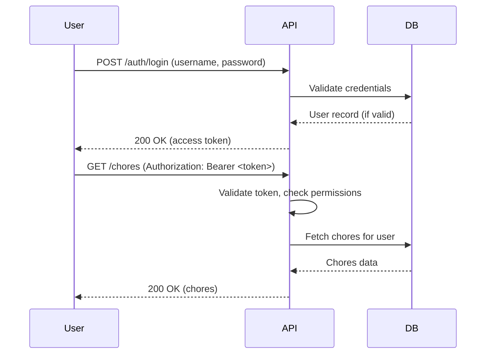

# Authentication Model

| Repo     | Doc Type            | Date                | Branch |
|----------|---------------------|---------------------|--------|
| Tapestry | Authentication (701) | 2025-08-04 19:08    | main   |

---

## Overview

Tapestry employs a token-based authentication model for its backend API, implemented in FastAPI. The authentication logic is primarily handled in `[backend/app/routers/auth.py](https://github.com/sergiomasellis/Tapestry/blob/main/backend/app/routers/auth.py)` (Last modified: 2025-08-04 19:08). The system supports user login, admin login (with a master password), and issues access tokens for authenticated API access. Permissions are role-based, with distinctions between regular users and admin users.

---

## Authentication Mechanisms

### 1. Token-Based Authentication

- **Access Tokens:**  
  Upon successful login, users receive an access token (likely a JWT or similar), which must be included in the `Authorization` header for subsequent API requests.
- **Token Expiry:**  
  Token expiry is configurable via the `ACCESS_TOKEN_EXPIRE_MINUTES` environment variable (see [backend/README.md](https://github.com/sergiomasellis/Tapestry/blob/main/backend/README.md), Last modified: 2025-08-04 19:08).
- **Token Secret:**  
  Tokens are signed using a secret key defined in the `SECRET_KEY` environment variable.

### 2. Login Flows

- **Standard Login:**  
  Users provide credentials (username/email and password) to the `/auth/login` endpoint. On success, an access token is returned.
- **Admin Login:**  
  An admin can log in using a master password via a dedicated endpoint (`/auth/admin-login`), granting elevated privileges.

### 3. Permissions & Roles

- **User Roles:**  
  - **Regular User:** Can access and modify their own data (calendar events, chores, points, etc.).
  - **Admin User:** Has elevated privileges, such as managing families, inviting users, and potentially accessing all user data within a family group.
- **Role Assignment:**  
  Roles are likely assigned at user creation or via admin action.

### 4. Protected Endpoints

- Most API endpoints require a valid access token.
- Endpoints check the token's validity and extract user identity and role.
- Unauthorized or expired tokens result in a 401 Unauthorized response.

### 5. Environment Configuration

Authentication relies on the following environment variables (see [backend/README.md](https://github.com/sergiomasellis/Tapestry/blob/main/backend/README.md), Last modified: 2025-08-04 19:08):

- `SECRET_KEY`: Secret for signing tokens.
- `ACCESS_TOKEN_EXPIRE_MINUTES`: Token lifetime.
- `.env` file is used for local development configuration.

---

## Authentication Flow

1. **User submits credentials** to `/auth/login` (or `/auth/admin-login`).
2. **Credentials are validated** against the database.
3. **If valid:**
    - An access token is generated and returned.
    - The token encodes user identity and role.
4. **Client includes token** in the `Authorization: Bearer <token>` header for all subsequent requests.
5. **API endpoints validate** the token and enforce permissions based on the user's role.

---

## Security Considerations

- **Password Storage:**  
  Passwords should be hashed and salted in the database (see [backend/app/models/models.py](https://github.com/sergiomasellis/Tapestry/blob/main/backend/app/models/models.py), Last modified: 2025-08-04 19:08).
- **Token Security:**  
  Tokens should be stored securely on the client (e.g., HTTP-only cookies or secure storage).
- **Master Password:**  
  The admin login endpoint uses a master password; this should be protected and rotated as needed.

---

## Example: Authentication Sequence

---

## Primary Sources

- [backend/app/routers/auth.py](https://github.com/sergiomasellis/Tapestry/blob/main/backend/app/routers/auth.py) (Last modified: 2025-08-04 19:08)
- [backend/README.md](https://github.com/sergiomasellis/Tapestry/blob/main/backend/README.md) (Last modified: 2025-08-04 19:08)
- [backend/app/models/models.py](https://github.com/sergiomasellis/Tapestry/blob/main/backend/app/models/models.py) (Last modified: 2025-08-04 19:08)
- [backend/app/schemas/schemas.py](https://github.com/sergiomasellis/Tapestry/blob/main/backend/app/schemas/schemas.py) (Last modified: 2025-08-04 19:08)
- .env.example (not shown, but referenced in [backend/README.md](https://github.com/sergiomasellis/Tapestry/blob/main/backend/README.md))