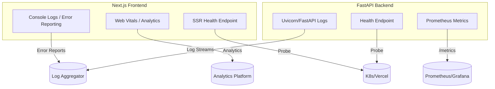

# Tapestry Observability Overview

| Repo    | Doc Type           | Date                | Branch |
|---------|--------------------|---------------------|--------|
| Tapestry | Observability (800) | 2025-08-04 19:08    | main   |

---

## Introduction

Observability in Tapestry is designed to provide actionable insights into the health, performance, and behavior of both the frontend and backend systems. This document outlines the logging, metrics, and health check strategies implemented (or recommended) for the Tapestry application, supporting production debugging, uptime monitoring, and proactive maintenance.

---

## Observability Components

### 1. Logging

#### Backend (FastAPI)
- **Purpose:** Capture API requests, errors, authentication events, and background task outcomes.
- **Implementation:**  
  - FastAPI leverages Python's standard logging module.
  - Uvicorn (ASGI server) provides request logs, error traces, and startup/shutdown events.
  - Custom loggers can be configured in `[backend/app/main.py](https://github.com/sergiomasellis/Tapestry/blob/main/backend/app/main.py)` to capture domain-specific events (e.g., chore generation, user actions).
- **Log Levels:** DEBUG, INFO, WARNING, ERROR, CRITICAL.
- **Log Sinks:** By default, logs are output to stdout/stderr (suitable for containerized/cloud deployments). For production, configure log aggregation (e.g., ELK, Loki, CloudWatch).

#### Frontend (Next.js)
- **Purpose:** Track client-side errors, performance bottlenecks, and user interaction anomalies.
- **Implementation:**  
  - Use browser `console` for development.
  - Integrate with a client-side error reporting service (e.g., Sentry, LogRocket) for production.
  - Capture unhandled exceptions and failed API calls in `[frontend/src/lib/utils.ts](https://github.com/sergiomasellis/Tapestry/blob/main/frontend/src/lib/utils.ts)` or via React error boundaries.

---

### 2. Metrics

#### Backend
- **Purpose:** Quantify API usage, latency, error rates, and resource utilization.
- **Implementation:**  
  - Integrate [Prometheus](https://prometheus.io/) compatible metrics via FastAPI middleware (e.g., `prometheus_fastapi_instrumentator`).
  - Expose `/metrics` endpoint for scraping.
  - Key metrics:
    - Request count and latency per endpoint.
    - Error rate (HTTP 4xx/5xx).
    - Background task durations (e.g., AI chore generation).
    - DB connection pool stats.
- **Example Integration:**  
  Add to `[backend/app/main.py](https://github.com/sergiomasellis/Tapestry/blob/main/backend/app/main.py)`:
  ```python
  from prometheus_fastapi_instrumentator import Instrumentator
  Instrumentator().instrument(app).expose(app)
  ```

#### Frontend
- **Purpose:** Monitor page load times, API call durations, and user engagement.
- **Implementation:**  
  - Use [Web Vitals](https://web.dev/vitals/) reporting (Next.js supports this natively).
  - Send metrics to analytics platforms (e.g., Vercel Analytics, Google Analytics).
  - Track custom events (e.g., failed chore submissions, calendar syncs).

---

### 3. Health Checks

#### Backend
- **Purpose:** Enable liveness/readiness probes for orchestrators (Docker, Kubernetes).
- **Implementation:**  
  - Add `/health` endpoint in FastAPI (`[backend/app/main.py](https://github.com/sergiomasellis/Tapestry/blob/main/backend/app/main.py)`) that checks:
    - DB connectivity (`[backend/app/db/session.py](https://github.com/sergiomasellis/Tapestry/blob/main/backend/app/db/session.py)`)
    - External service reachability (if configured)
    - Application startup status
  - Example:
    ```python
    @app.get("/health")
    def health():
        try:
            # Simple DB check
            db = SessionLocal()
            db.execute("SELECT 1")
            return {"status": "ok"}
        except Exception:
            return {"status": "error"}, 500
    ```
- **Usage:** Configure orchestrator to poll `/health` for container health.

#### Frontend
- **Purpose:** Ensure static assets and SSR endpoints are available.
- **Implementation:**  
  - Use Vercel/Next.js built-in health checks.
  - Optionally, expose a `/health` route in `frontend/app/page.tsx` for custom probes.

---

## Observability Data Flow



---

## Best Practices & Recommendations

- **Log Structure:** Use structured (JSON) logs for backend to enable parsing and search.
- **PII:** Avoid logging sensitive user data (e.g., tokens, passwords).
- **Alerting:** Set up alerts on error rates, health check failures, and latency spikes.
- **Retention:** Configure log and metric retention policies per compliance needs.
- **Local Development:** Use verbose logging and mock metrics for easier debugging.

---

## Primary Sources

- [README.md](https://github.com/sergiomasellis/Tapestry/blob/main/README.md) (Last modified: 2025-08-04 19:08)
- [backend/README.md](https://github.com/sergiomasellis/Tapestry/blob/main/backend/README.md) (Last modified: 2025-08-04 19:08)
- backend/pyproject.toml (Last modified: 2025-08-04 19:08)
- [frontend/README.md](https://github.com/sergiomasellis/Tapestry/blob/main/frontend/README.md) (Last modified: 2025-08-04 19:08)
- [frontend/package.json](https://github.com/sergiomasellis/Tapestry/blob/main/frontend/package.json) (Last modified: 2025-08-04 19:08)
- [frontend/tsconfig.json](https://github.com/sergiomasellis/Tapestry/blob/main/frontend/tsconfig.json) (Last modified: 2025-08-04 19:08)