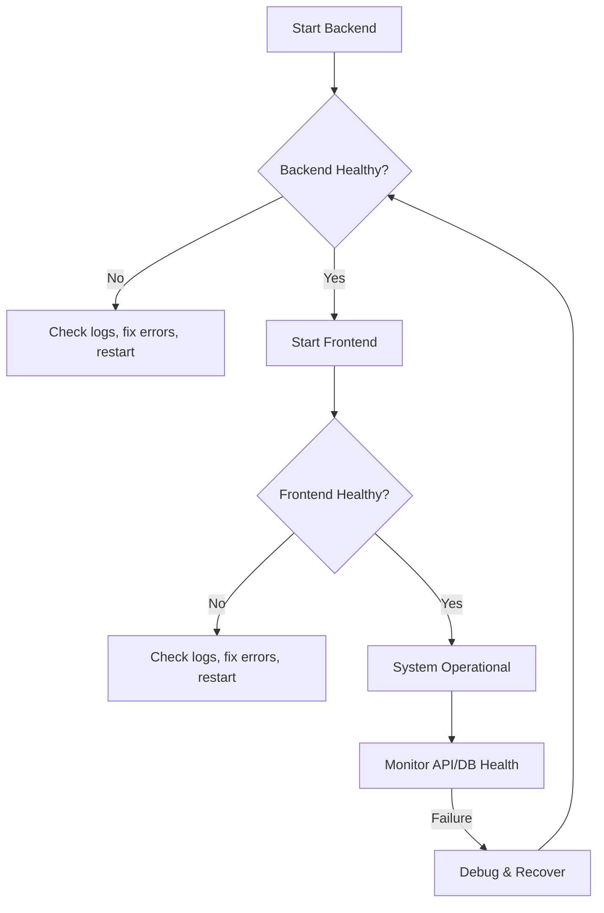

# Tapestry Runbook: Operations, Failure Modes, and Debugging

| Repo     | Doc Type       | Date                | Branch  |
|----------|----------------|---------------------|---------|
| Tapestry | Runbook/Operations | 2025-08-04  | main    |

---

## Overview

This runbook provides operational guidance for the Tapestry family calendar application. It covers procedures for starting, stopping, and debugging the system, as well as handling common failure scenarios across the multi-component stack (frontend, backend, and database). Tapestry consists of a Next.js frontend, a FastAPI backend, and a SQLite database (development mode).

---

## System Components

- **Frontend:** Next.js (TypeScript, Tailwind CSS)
- **Backend:** FastAPI (Python 3.12+, SQLAlchemy, LangGraph)
- **Database:** SQLite (file-based, `backend/data.db`)

---

## Starting and Stopping the System

### Backend

**Start:**
- From `backend/`:
  ```
  uv run uvicorn app.main:app --reload --host 0.0.0.0 --port 8000
  ```
  (See [backend/README.md](https://github.com/sergiomasellis/Tapestry/blob/main/backend/README.md), Last modified: 2025-08-04 19:08)

**Stop:**
- Use `Ctrl+C` in the terminal running the backend server.

**Restart:**
- Stop the process and re-run the start command above.

### Frontend

**Start:**
- From `frontend/`:
  ```
  npm run dev
  ```
  (See [frontend/README.md](https://github.com/sergiomasellis/Tapestry/blob/main/frontend/README.md), Last modified: 2025-08-04 19:08)

**Stop:**
- Use `Ctrl+C` in the terminal running the frontend dev server.

**Restart:**
- Stop the process and re-run the start command above.

### Database

- SQLite is file-based (`backend/data.db`). It is started/stopped with the backend process.
- No separate service to manage.

---

## Health Checks

- **Backend:** Visit `http://localhost:8000/docs` to confirm FastAPI is running.
- **Frontend:** Visit `http://localhost:3000` to confirm Next.js is serving the app.
- **Database:** If backend starts without error and endpoints work, SQLite is operational.

---

## Common Failure Modes & Remedies

### 1. Backend Fails to Start

**Symptoms:**
- Error: "Address already in use"
- Error: "ModuleNotFoundError"
- Error: "Database file not found" or "OperationalError"

**Remedies:**
- Ensure no other process is using port 8000.
- Confirm Python dependencies are installed (`uv sync`).
- Check `backend/data.db` exists; if not, backend will auto-create on first run.
- Review `.env` file for correct `DATABASE_URL` (see [backend/README.md](https://github.com/sergiomasellis/Tapestry/blob/main/backend/README.md)).

### 2. Frontend Fails to Start

**Symptoms:**
- Error: "Module not found"
- Error: "Port 3000 in use"
- Build errors

**Remedies:**
- Run `npm install` to ensure dependencies.
- Ensure no other process is using port 3000.
- Check `[frontend/package.json](https://github.com/sergiomasellis/Tapestry/blob/main/frontend/package.json)` and `[frontend/tsconfig.json](https://github.com/sergiomasellis/Tapestry/blob/main/frontend/tsconfig.json)` for misconfigurations.
- Delete `.next/` and retry (`npm run dev`).

### 3. API Calls Fail (Frontend ↔ Backend)

**Symptoms:**
- 404/500 errors in browser console
- "Network Error" or CORS errors

**Remedies:**
- Ensure backend is running and accessible at `http://localhost:8000`.
- Check browser network tab for failed requests.
- Confirm frontend is configured to use correct backend URL.
- Check backend logs for stack traces.

### 4. Database Corruption or Lock

**Symptoms:**
- Backend logs: "SQLite database is locked" or "OperationalError"
- API endpoints return 500 errors

**Remedies:**
- Ensure only one backend process is accessing `data.db`.
- Stop all backend processes, then restart.
- If corruption persists, move or delete `data.db` (data loss!) and restart backend to re-initialize.

### 5. AI Chore Generation Fails

**Symptoms:**
- Chore generation endpoints return 500 errors
- Backend logs mention LangGraph or AI pipeline errors

**Remedies:**
- Check `[backend/app/ai/chore_graph.py](https://github.com/sergiomasellis/Tapestry/blob/main/backend/app/ai/chore_graph.py)` for stack traces.
- Ensure `langgraph` is installed (`uv sync`).
- Review recent changes to AI pipeline.

---

## Debugging Procedures

### Backend

- Logs are output to the terminal by default.
- Enable more verbose logging by editing FastAPI/Uvicorn config in `[backend/app/main.py](https://github.com/sergiomasellis/Tapestry/blob/main/backend/app/main.py)`.
- For database issues, inspect `backend/data.db` using a SQLite browser.

### Frontend

- Use browser dev tools (Console, Network tabs).
- Check terminal output for build/runtime errors.
- Hot reload is enabled; changes in `frontend/src/` auto-reload.

### Database

- Inspect `backend/data.db` with tools like `sqlite3` CLI or DB Browser for SQLite.
- For schema issues, check `[backend/app/models/models.py](https://github.com/sergiomasellis/Tapestry/blob/main/backend/app/models/models.py)` and `[backend/app/schemas/schemas.py](https://github.com/sergiomasellis/Tapestry/blob/main/backend/app/schemas/schemas.py)`.

---

## Recovery & Data Restoration

- **Database backup:** Copy `backend/data.db` to a safe location.
- **Restore:** Replace `data.db` with a backup copy and restart backend.
- **Note:** No built-in migration or backup tooling; manual file copy is required.

---

## Configuration Reference

- **Backend environment:** `.env` file in `backend/`
  - `DATABASE_URL=sqlite:///./data.db`
  - `SECRET_KEY=dev-secret-change`
  - `ACCESS_TOKEN_EXPIRE_MINUTES=60`
- **Frontend environment:** Usually not required for local dev; API URLs may be set in `.env.local` if needed.

---

## Escalation

- If issues persist after above steps, review recent code changes.
- Check open issues and documentation.
- For dependency issues, ensure all versions match those in `[frontend/package.json](https://github.com/sergiomasellis/Tapestry/blob/main/frontend/package.json)` and `backend/pyproject.toml`.

---

## System Operations Flow (Mermaid Diagram)



---

## Primary Sources

- [README.md](https://github.com/sergiomasellis/Tapestry/blob/main/README.md) (Last modified: 2025-08-04 19:08)
- [backend/README.md](https://github.com/sergiomasellis/Tapestry/blob/main/backend/README.md) (Last modified: 2025-08-04 19:08)
- [frontend/README.md](https://github.com/sergiomasellis/Tapestry/blob/main/frontend/README.md) (Last modified: 2025-08-04 19:08)
- backend/pyproject.toml (Last modified: 2025-08-04 19:08)
- [frontend/package.json](https://github.com/sergiomasellis/Tapestry/blob/main/frontend/package.json) (Last modified: 2025-08-04 19:08)
- [frontend/tsconfig.json](https://github.com/sergiomasellis/Tapestry/blob/main/frontend/tsconfig.json) (Last modified: 2025-08-04 19:08)
