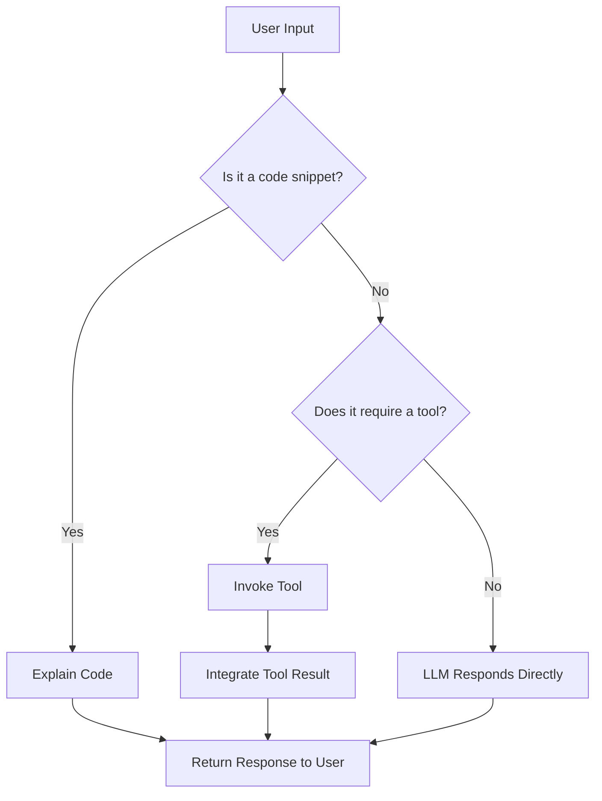

# Gambit Coding Agent: Agent Logic, Tool Usage, and Message Handling

| Repo   | Doc Type        | Date       | Branch |
|--------|----------------|------------|--------|
| gambit | Code Reference  | 2025-09-23 | main   |

---

This document explains the business logic, tool usage, message handling, and core flows of the Gambit Coding Agent. It is intended to clarify how the agent processes user input, invokes tools, and manages responses across its CLI, TUI, and API interfaces.

## Overview

Gambit is a lightweight coding agent built atop LangChain, OpenAI-compatible APIs (via OpenRouter), and FastAPI. It can:

- Explain code snippets and answer coding questions.
- Use tools to interact with the file system and shell in a controlled way.
- Run as a CLI, TUI, or FastAPI server.

The agent's logic is primarily implemented in `[gambit_coding_agent/agent.py](https://github.com/sergiomasellis/gambit/blob/main/gambit_coding_agent/agent.py)`, with tool definitions in `[gambit_coding_agent/tools.py](https://github.com/sergiomasellis/gambit/blob/main/gambit_coding_agent/tools.py)`, and message routing in `[gambit_coding_agent/server.py](https://github.com/sergiomasellis/gambit/blob/main/gambit_coding_agent/server.py)`, `cli.py`, and `tui.py`.

---

## Agent Business Logic

### Initialization

The agent is initialized with a system prompt and a set of tools. It uses LangChain's agent framework to manage tool invocation and message routing.

**Key snippet (`[gambit_coding_agent/agent.py](https://github.com/sergiomasellis/gambit/blob/main/gambit_coding_agent/agent.py)`):**
```python
from langchain.agents import initialize_agent, Tool

def get_agent(tools, llm, system_prompt):
    agent = initialize_agent(
        tools=tools,
        llm=llm,
        agent="chat-zero-shot-react-description",
        verbose=True,
        system_prompt=system_prompt,
    )
    return agent
```
*Last modified: See file header for `[gambit_coding_agent/agent.py](https://github.com/sergiomasellis/gambit/blob/main/gambit_coding_agent/agent.py)`.*

- **Tools**: The agent is provided with a list of tool objects (see below).
- **LLM**: The language model (OpenAI-compatible, via OpenRouter).
- **System Prompt**: Loaded from `prompts/system.prompt.md`.

### Message Handling Flow

The agent receives a message (either a code snippet or a free-form question) and determines:

1. **Is this a code explanation request?**
   - If yes, it uses the system prompt for code explanation.
2. **Is this a general coding question or command?**
   - If yes, it routes to the agent for reasoning and possible tool usage.

**API Example (`[gambit_coding_agent/server.py](https://github.com/sergiomasellis/gambit/blob/main/gambit_coding_agent/server.py)`):**
```python
@app.post("/explain")
async def explain_code(request: ExplainRequest):
    explanation = await agent.explain_code(request.code)
    return {"explanation": explanation}

@app.post("/message")
async def message(request: MessageRequest):
    response = await agent.handle_message(request.message)
    return {"response": response}
```
*Last modified: See file header for `[gambit_coding_agent/server.py](https://github.com/sergiomasellis/gambit/blob/main/gambit_coding_agent/server.py)`.*

### Tool Usage

The agent can invoke tools to perform file and shell operations. Tools are defined as LangChain `Tool` objects, each with a name, description, and a Python function.

**Tool Registration (`[gambit_coding_agent/tools.py](https://github.com/sergiomasellis/gambit/blob/main/gambit_coding_agent/tools.py)`):**
```python
def get_tools():
    return [
        Tool(
            name="execute_command_tool",
            func=execute_command,
            description="Execute a shell command and return its output."
        ),
        Tool(
            name="read_file_tool",
            func=read_file,
            description="Read the contents of a file."
        ),
        # ... other tools ...
    ]
```
*Last modified: See file header for `[gambit_coding_agent/tools.py](https://github.com/sergiomasellis/gambit/blob/main/gambit_coding_agent/tools.py)`.*

#### Available Tools

- **execute_command_tool**: Runs a shell command, returns output.
- **read_file_tool**: Reads file contents.
- **write_file_tool**: Writes content to a file.
- **list_directory_tool**: Lists files/directories at a path.
- **search_files_tool**: Searches for a pattern in files.

**Example tool function:**
```python
def execute_command(command: str) -> str:
    result = subprocess.run(command, shell=True, capture_output=True, text=True)
    return result.stdout or result.stderr
```

### Message Routing and Flow

The agent's main flow is as follows:

1. **Receive Input**: From CLI, TUI, or API.
2. **Determine Intent**: Code explanation, tool invocation, or general question.
3. **Invoke LLM**: With system prompt and context.
4. **If Tool Needed**: Agent issues a tool call, executes, and integrates result.
5. **Respond**: Returns answer or explanation to user.

#### Mermaid Diagram: Agent Message Handling and Tool Flow



---

## Tool Invocation Example

When the agent decides to use a tool, it calls the relevant function and integrates the result into its response.

**Example (`[gambit_coding_agent/agent.py](https://github.com/sergiomasellis/gambit/blob/main/gambit_coding_agent/agent.py)`):**
```python
if tool_needed:
    tool_result = tool_func(tool_input)
    response = f"Tool result: {tool_result}"
else:
    response = llm_response
```

---

## API and CLI Integration

- **CLI**: Entrypoint via `gambit_coding_agent.cli:main` (see `[setup.py](https://github.com/sergiomasellis/gambit/blob/main/setup.py)` and `pyproject.toml`).
- **TUI**: Uses `[gambit_coding_agent/tui.py](https://github.com/sergiomasellis/gambit/blob/main/gambit_coding_agent/tui.py)` for interactive chat.
- **API**: FastAPI server in `[gambit_coding_agent/server.py](https://github.com/sergiomasellis/gambit/blob/main/gambit_coding_agent/server.py)`.

**Entrypoint Example (`[setup.py](https://github.com/sergiomasellis/gambit/blob/main/setup.py)`):**
```python
entry_points={
    "console_scripts": [
        "gambit=gambit_coding_agent.cli:main",
    ]
}
```
*Last modified: 2025-09-23 08:59*

---

## Primary Sources

- [gambit_coding_agent/agent.py](https://github.com/sergiomasellis/gambit/blob/main/gambit_coding_agent/agent.py) (Last modified: see file header)
- [gambit_coding_agent/tools.py](https://github.com/sergiomasellis/gambit/blob/main/gambit_coding_agent/tools.py) (Last modified: see file header)
- [gambit_coding_agent/server.py](https://github.com/sergiomasellis/gambit/blob/main/gambit_coding_agent/server.py) (Last modified: see file header)
- [gambit_coding_agent/cli.py](https://github.com/sergiomasellis/gambit/blob/main/gambit_coding_agent/cli.py) (Last modified: see file header)
- [gambit_coding_agent/tui.py](https://github.com/sergiomasellis/gambit/blob/main/gambit_coding_agent/tui.py) (Last modified: see file header)
- [README.md](https://github.com/sergiomasellis/gambit/blob/main/README.md) (Last modified: 2025-09-23 08:59)
- [setup.py](https://github.com/sergiomasellis/gambit/blob/main/setup.py) (Last modified: 2025-09-23 08:59)
- pyproject.toml (Last modified: 2025-09-23 08:59)