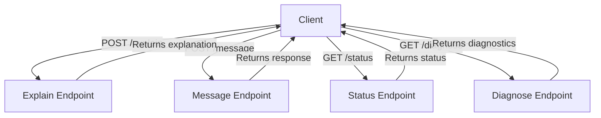

# Gambit REST API Endpoint Reference

| Repo   | Doc Type      | Date       | Branch |
|--------|--------------|------------|--------|
| gambit | API Reference | 2025-09-23 | main   |

This document provides a concise overview of the REST API endpoints exposed by the Gambit Coding Agent, as described in the project README (Last modified: 2025-09-23 08:59). Each endpoint is summarized with its HTTP method, path, purpose, and example request/response payloads.

---

## API Endpoints

| Method | Path        | Purpose                                                      | Request Body Example                | Response Example                    |
|--------|-------------|--------------------------------------------------------------|-------------------------------------|-------------------------------------|
| POST   | /explain    | Explain a provided code snippet.                             | `{ "code": "def foo(): pass" }`     | `{ "explanation": "..." }`          |
| POST   | /message    | Send a free-form message to the agent (e.g., coding queries) | `{ "message": "What is a closure?"}`| `{ "response": "..." }`             |
| GET    | /status     | Check server status (API key, agent initialization)          | _None_                              | `{ "has_env_api_key": true, "agent_initialized": true }` |
| GET    | /diagnose   | Retrieve diagnostic information for troubleshooting          | _None_                              | `{ ...diagnostic info... }`         |

---

### Endpoint Details

#### **POST /explain**

- **Purpose:** Get an explanation for a provided code snippet.
- **Request Body:**
    ```json
    {
      "code": "def hello(): print('Hello, World!')",
      "api_key": "optional_override_key"
    }
    ```
- **Response:**
    ```json
    {
      "explanation": "This function defines a simple procedure that prints 'Hello, World!' to the console."
    }
    ```

#### **POST /message**

- **Purpose:** Send a free-form message to the agent (e.g., coding questions).
- **Request Body:**
    ```json
    {
      "message": "What is a Python decorator?"
    }
    ```
- **Response:**
    ```json
    {
      "response": "A Python decorator is a design pattern..."
    }
    ```

#### **GET /status**

- **Purpose:** Check server status regarding API key and agent initialization.
- **Response:**
    ```json
    {
      "has_env_api_key": true,
      "agent_initialized": true
    }
    ```

#### **GET /diagnose**

- **Purpose:** Retrieve diagnostic information for troubleshooting.
- **Response:**  
  _Diagnostic information structure is implementation-dependent._

---

## Mermaid Diagram: API Endpoint Overview



---

## Example Code Snippets

Below are representative code snippets illustrating endpoint semantics and usage, based on the README (Last modified: 2025-09-23 08:59):

**Starting the FastAPI Server:**
```bash
python [main.py](https://github.com/sergiomasellis/gambit/blob/main/main.py) uv
```

**/explain Request Example:**
```json
{
  "code": "def hello(): print('Hello, World!')",
  "api_key": "optional_override_key"
}
```

**/message Request Example:**
```json
{
  "message": "What is a Python decorator?"
}
```

**/status Response Example:**
```json
{
  "has_env_api_key": true,
  "agent_initialized": true
}
```

---

## Primary Sources

- [README.md](https://github.com/sergiomasellis/gambit/blob/main/README.md) (Last modified: 2025-09-23 08:59)
- pyproject.toml (Last modified: 2025-09-23 08:59)
- [setup.py](https://github.com/sergiomasellis/gambit/blob/main/setup.py) (Last modified: 2025-09-23 08:59)
- .github/workflows/python-app.yml (Last modified: 2025-09-23 08:59)