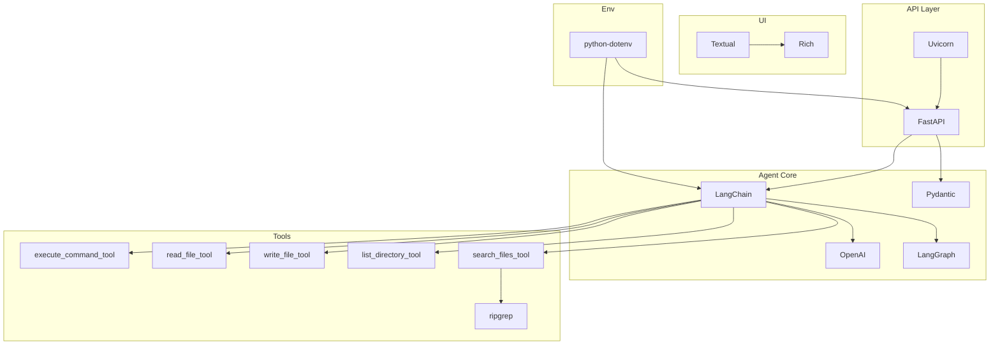

# Gambit Dependencies and Project Structure

| Repo   | Doc Type         | Date                | Branch |
|--------|------------------|---------------------|--------|
| gambit | Technical Manual | 2025-09-23 08:59    | main   |

## Overview

The Gambit project is a "tiny coding agent" that leverages modern AI and Python tooling to provide code explanations, answer coding questions, and interact with the file system and shell in a controlled environment. This document details the project's key dependencies, their roles, and how they integrate into the overall architecture.

## Key Dependencies (from pyproject.toml, Last modified: 2025-09-23 08:59)

The main dependencies are specified in `pyproject.toml` under the `[project]` section:

```toml
[project]
dependencies = [
     "fastapi>=0.117.1",
     "langchain[openai]>=0.3.27",
     "langgraph>=0.6.7",
     "openai>=1.108.1",
     "pydantic>=2.11.9",
     "python-dotenv>=1.1.1",
     "rich>=14.1.0",
     "setuptools>=80.9.0",
     "textual>=6.1.0",
     "uvicorn[standard]>=0.36.0",
     "pytest>=8.0.0",
     "ripgrep>=14.1.0",
]
```

### Core AI and Agent Dependencies

- **LangChain (`langchain[openai]`)**: Provides the agent framework and OpenAI integration for LLM-powered reasoning and tool use.
- **OpenAI**: Direct API access for LLMs, used by LangChain and for custom calls.
- **LangGraph**: Enables graph-based agent workflows and tool orchestration.

### API and Web Server

- **FastAPI**: The main web framework for serving HTTP endpoints.
- **Uvicorn**: ASGI server for running FastAPI applications.

### Data Validation and Environment

- **Pydantic**: Used for request/response models and data validation.
- **python-dotenv**: Loads environment variables (e.g., API keys) from `.env` files.

### UI and CLI

- **Textual**: For building the terminal-based TUI (Textual User Interface).
- **Rich**: For rich text and formatting in the terminal.

### Utilities and Testing

- **Setuptools**: Packaging and installation.
- **Pytest**: Testing framework.
- **Ripgrep**: Fast file searching, used by the agent's tools.

### Development Tools

- **Coverage, pytest-cov** (in `[dependency-groups].dev`): For code coverage in development.

## How Dependencies Are Used

### Entry Points

- The `[setup.py](https://github.com/sergiomasellis/gambit/blob/main/setup.py)` (Last modified: 2025-09-23 08:59) and `pyproject.toml` define a `gambit` CLI entry point:
  ```python
  # [setup.py](https://github.com/sergiomasellis/gambit/blob/main/setup.py)
  entry_points={
      "console_scripts": [
          "gambit=gambit_coding_agent.cli:main",
      ]
  }
  ```
  ```toml
  [project.scripts]
  gambit = "gambit_coding_agent.cli:main"
  ```

### FastAPI Server

- The agent exposes HTTP endpoints for code explanation and messaging via FastAPI, as described in `[README.md](https://github.com/sergiomasellis/gambit/blob/main/README.md)` (Last modified: 2025-09-23 08:59):

  ```markdown
  - **POST /explain**
  - **POST /message**
  - **GET /status**
  - **GET /diagnose**
  ```

- Example request/response model (from [README.md](https://github.com/sergiomasellis/gambit/blob/main/README.md)):
  ```json
  {
    "code": "def hello(): print('Hello, World!')",
    "api_key": "optional_override_key"
  }
  ```

### Agent Tools

The agent can use several tools, each likely implemented in `[gambit_coding_agent/tools.py](https://github.com/sergiomasellis/gambit/blob/main/gambit_coding_agent/tools.py)`:

- `execute_command_tool`
- `read_file_tool`
- `write_file_tool`
- `list_directory_tool`
- `search_files_tool`

These tools rely on dependencies such as `ripgrep` (for searching), and standard Python libraries.

### TUI

- The TUI is launched via:
  ```bash
  python [main.py](https://github.com/sergiomasellis/gambit/blob/main/main.py) tui
  ```
  and is implemented using `textual` and `rich`.

### Environment Management

- API keys are loaded from `.env` using `python-dotenv`:
  ```
  OPENROUTER_API_KEY=your_api_key_here
  ```

### Testing

- Tests are run with `pytest`:
  ```bash
  pytest
  ```

## Dependency Integration Diagram



## Example Code Snippets

**Defining the CLI entry point** (`[setup.py](https://github.com/sergiomasellis/gambit/blob/main/setup.py)`, Last modified: 2025-09-23 08:59):

```python
setup(
    name="gambit-coding-agent",
    version="0.1.0",
    ...
    entry_points={
        "console_scripts": [
            "gambit=gambit_coding_agent.cli:main",
        ]
    },
)
```

**Specifying dependencies** (`pyproject.toml`, Last modified: 2025-09-23 08:59):

```toml
dependencies = [
     "fastapi>=0.117.1",
     "langchain[openai]>=0.3.27",
     "langgraph>=0.6.7",
     "openai>=1.108.1",
     ...
]
```

**Launching the TUI** (`[README.md](https://github.com/sergiomasellis/gambit/blob/main/README.md)`, Last modified: 2025-09-23 08:59):

```bash
python [main.py](https://github.com/sergiomasellis/gambit/blob/main/main.py) tui
```

**API usage example** (`[README.md](https://github.com/sergiomasellis/gambit/blob/main/README.md)`):

```json
{
  "message": "What is a Python decorator?"
}
```

## Primary Sources

- pyproject.toml (Last modified: 2025-09-23 08:59)
- [setup.py](https://github.com/sergiomasellis/gambit/blob/main/setup.py) (Last modified: 2025-09-23 08:59)
- [README.md](https://github.com/sergiomasellis/gambit/blob/main/README.md) (Last modified: 2025-09-23 08:59)
- .github/workflows/python-app.yml (Last modified: 2025-09-23 08:59)