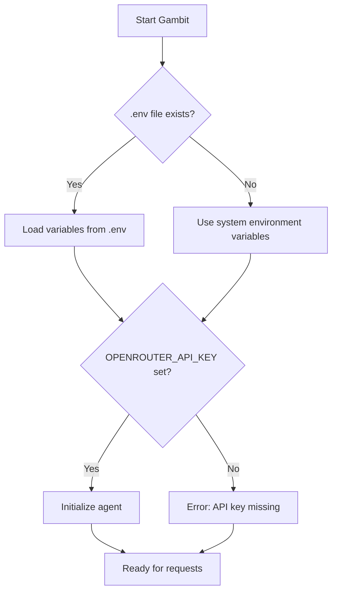

# Gambit Configuration & Secrets Management

| Repo   | Doc Type         | Date       | Branch |
|--------|------------------|------------|--------|
| gambit | Configuration Guide | 2025-09-23 | main   |

This document details how the Gambit Coding Agent manages configuration and secrets, focusing on environment variables, `.env` files, and secure API key handling. It is intended for developers and operators deploying or extending Gambit.

---

## Overview

Gambit relies on OpenAI-compatible APIs (via OpenRouter) and requires an API key for operation. Configuration is primarily managed through environment variables, with support for a `.env` file in the project root. This approach ensures sensitive information (like API keys) is not hard-coded and can be managed securely across environments.

---

## Environment Variables

### Required Variables

- **OPENROUTER_API_KEY**:  
  The API key for authenticating with OpenRouter (or compatible) services.

### Setting Environment Variables

The recommended method is to create a `.env` file in the project root:

```
OPENROUTER_API_KEY=your_api_key_here
```

This is referenced in the [[README.md](https://github.com/sergiomasellis/gambit/blob/main/README.md)] (Last modified: 2025-09-23 08:59):

```
24 | 3. Set up your API key: Create a `.env` file in the project root with:
25 | 
26 |    ```
27 |    OPENROUTER_API_KEY=your_api_key_here
28 |    ```
```

Gambit uses the `python-dotenv` package (see [pyproject.toml], Last modified: 2025-09-23 08:59) to automatically load variables from `.env` at startup:

```toml
13 |      "python-dotenv>=1.1.1",
```

This means you can set or override environment variables in your shell as well:

```bash
export OPENROUTER_API_KEY=your_api_key_here
python [main.py](https://github.com/sergiomasellis/gambit/blob/main/main.py) tui
```

---

## How Gambit Loads Secrets

At startup, Gambit loads environment variables using `python-dotenv`. This ensures that any variable defined in `.env` is available to the application code. If the variable is not set, certain features (like API calls) will not work, and the server may report missing configuration.

**Example (from FastAPI server usage in [README.md](https://github.com/sergiomasellis/gambit/blob/main/README.md)):**

```
99 |   Check server status regarding API key and agent initialization.
100 | 
101 |   **Response:**
102 | 
103 |   ```json
104 |   {
105 |     "has_env_api_key": true,
106 |     "agent_initialized": true
107 |   }
```

This endpoint allows you to verify whether the API key is loaded and the agent is ready.

---

## API Key Override

Some endpoints allow you to override the API key per request, as shown in the `/explain` endpoint:

```
64 |     "code": "def hello(): print('Hello, World!')",
65 |     "api_key": "optional_override_key"
```

If `api_key` is provided in the request body, it will be used for that request instead of the environment variable. This is useful for multi-user or testing scenarios.

---

## Security Best Practices

- **Never commit your `.env` file or API keys to version control.**  
  Add `.env` to your `.gitignore` file.
- **Use environment variables for secrets in production.**  
  Set them via your deployment platform or CI/CD system.
- **Rotate API keys regularly** and update your `.env` or environment accordingly.
- **Restrict API key permissions** to only what is necessary for Gambit to function.

---

## Example: Loading the API Key in Code

While the actual code for loading the API key is not shown in the provided snippets, a typical pattern (using `python-dotenv` and `os.environ`) would look like:

```python
from dotenv import load_dotenv
import os

load_dotenv()  # Loads variables from .env into environment

OPENROUTER_API_KEY = os.environ.get("OPENROUTER_API_KEY")
if not OPENROUTER_API_KEY:
    raise RuntimeError("OPENROUTER_API_KEY is not set")
```

---

## Configuration in CI/CD

The GitHub Actions workflow ([.github/workflows/python-app.yml], Last modified: 2025-09-23 08:59) does not set secrets by default. To run integration tests or deploy, set the `OPENROUTER_API_KEY` as a secret in your repository settings and reference it in the workflow as needed.

---

## Configuration Flow Diagram



---

## Troubleshooting

- **Agent reports missing API key:**  
  Ensure `.env` exists and contains `OPENROUTER_API_KEY`, or that the variable is set in your environment.
- **API calls fail with authentication errors:**  
  Double-check the API key value and its validity on OpenRouter.
- **CI/CD pipeline fails:**  
  Make sure the secret is configured in your CI/CD environment.

---

## Primary Sources

- [README.md](https://github.com/sergiomasellis/gambit/blob/main/README.md) (Last modified: 2025-09-23 08:59)
- pyproject.toml (Last modified: 2025-09-23 08:59)
- .github/workflows/python-app.yml (Last modified: 2025-09-23 08:59)