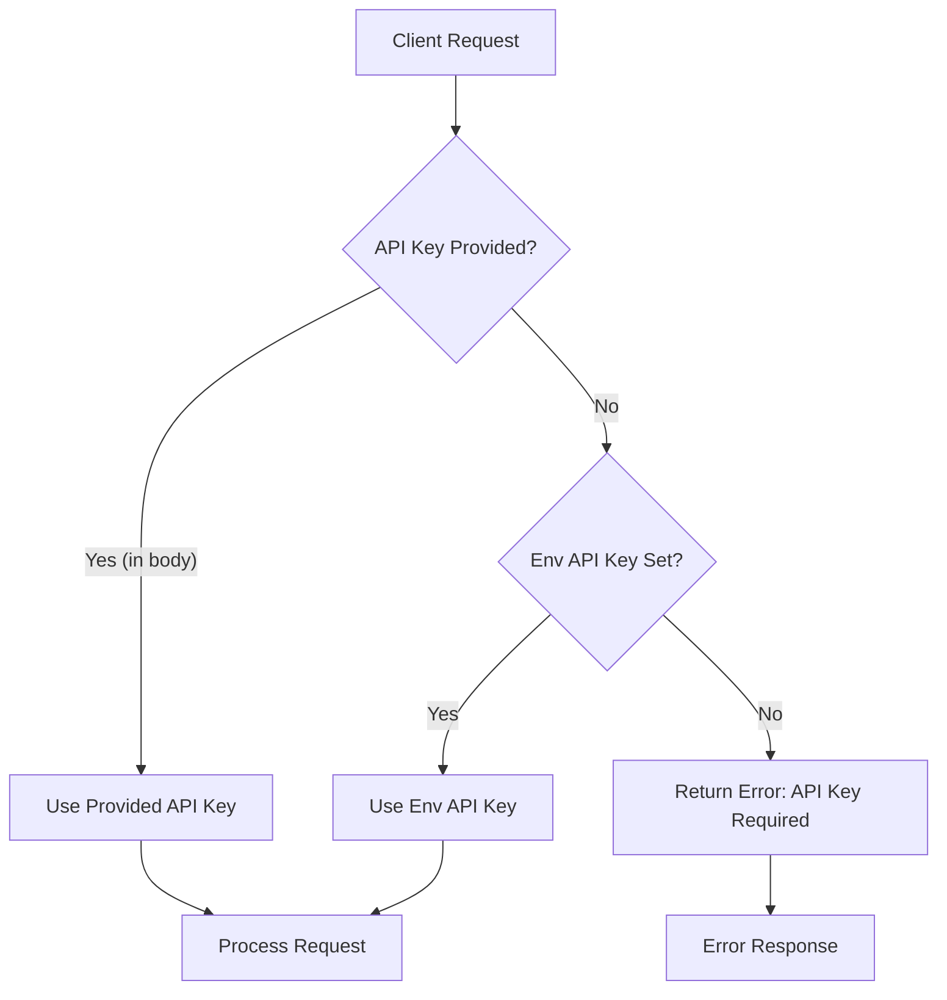

# Gambit API Authentication & Permissions

| Repo     | Doc Type      | Date                | Branch |
|----------|---------------|---------------------|--------|
| gambit   | Technical Doc | 2025-09-23 08:59    | main   |

## Overview

Gambit relies on OpenRouter (and compatible OpenAI APIs) for its core AI functionality. To ensure secure and authorized access, API keys are required for both agent operations and endpoint access. This document details the authentication mechanisms, environment variable usage, endpoint-level permissions, and best practices for managing API keys in Gambit.

---

## API Key Management

### Environment Variable

Gambit expects the OpenRouter API key to be provided via an environment variable, typically set in a `.env` file at the project root:

```
OPENROUTER_API_KEY=your_api_key_here
```

**Reference:**  
[README.md](https://github.com/sergiomasellis/gambit/blob/main/README.md) (Last modified: 2025-09-23 08:59), lines 24–30

### Obtaining an API Key

You can obtain a free API key from [OpenRouter](https://openrouter.ai). This key is required for all agent operations that interact with language models.

---

## Authentication Flow

The authentication mechanism is designed to be flexible and secure:

- **Default:** The agent loads the API key from the environment variable (`OPENROUTER_API_KEY`).
- **Override:** For API endpoints, clients may optionally supply an `api_key` field in the request body to override the environment key for that request.

**Example Request:**

```json
{
  "code": "def hello(): print('Hello, World!')",
  "api_key": "optional_override_key"
}
```

**Reference:**  
[README.md](https://github.com/sergiomasellis/gambit/blob/main/README.md) (Last modified: 2025-09-23 08:59), lines 62–66

---

## Endpoint Permissions & Behavior

### /explain (POST)

- **Requires:** API key (from environment or request body)
- **Behavior:** If no valid API key is found, the endpoint will return an error.

### /message (POST)

- **Requires:** API key (from environment or request body)
- **Behavior:** Same as `/explain`.

### /status (GET)

- **Purpose:** Diagnostic endpoint to check if the API key is set and if the agent is initialized.
- **Response Example:**

```json
{
  "has_env_api_key": true,
  "agent_initialized": true
}
```

**Reference:**  
[README.md](https://github.com/sergiomasellis/gambit/blob/main/README.md) (Last modified: 2025-09-23 08:59), lines 103–107

### /diagnose (GET)

- **Purpose:** Returns diagnostic information for troubleshooting, including API key presence.

---

## Code Example: Loading the API Key

A typical pattern for loading the API key in Gambit is as follows:

```python
import os
from dotenv import load_dotenv

load_dotenv()
api_key = os.getenv("OPENROUTER_API_KEY")
if not api_key:
    raise RuntimeError("OPENROUTER_API_KEY is not set")
```

---

## Security Considerations

- **Never commit your API key** to version control.
- Use `.env` files for local development and set environment variables securely in production.
- If using the override mechanism, ensure clients are trusted or implement additional authentication (e.g., IP whitelisting, tokens) at the API gateway level.

---

## Permissions in CI/CD

The GitHub Actions workflow in `.github/workflows/python-app.yml` (Last modified: 2025-09-23 08:59) does not expose or require the OpenRouter API key for linting and testing, but you may need to securely provide it for integration tests or deployment.

---

## Authentication Flow Diagram



---

## Primary Sources

- [README.md](https://github.com/sergiomasellis/gambit/blob/main/README.md) (Last modified: 2025-09-23 08:59)
- .github/workflows/python-app.yml (Last modified: 2025-09-23 08:59)
- pyproject.toml (Last modified: 2025-09-23 08:59)
- [setup.py](https://github.com/sergiomasellis/gambit/blob/main/setup.py) (Last modified: 2025-09-23 08:59)