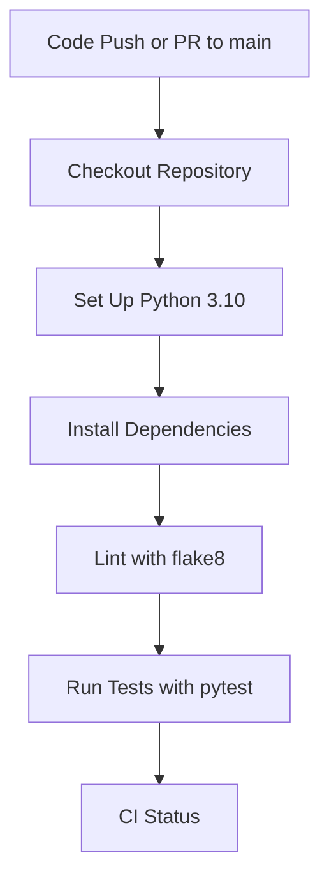

# Gambit CI/CD Pipeline Documentation

| Repo   | Doc Type         | Date       | Branch |
|--------|------------------|------------|--------|
| gambit | CI/CD Reference  | 2025-09-23 | main   |

---

## Overview

This document describes the Continuous Integration (CI) and Continuous Deployment (CD) pipeline for the **gambit** project, as implemented via GitHub Actions. The pipeline ensures code quality, correctness, and reproducibility by automating linting, testing, and dependency management on every push or pull request to the `main` branch.

---

## Pipeline Workflow

The CI/CD pipeline is defined in `.github/workflows/python-app.yml` (Last modified: 2025-09-23 08:59). It is triggered on:

- Pushes to the `main` branch
- Pull requests targeting the `main` branch

### Key Steps

1. **Checkout Code**
2. **Set Up Python Environment**
3. **Install Dependencies**
4. **Lint with flake8**
5. **Run Tests with pytest**

---

### 1. Checkout Code

The workflow uses the official GitHub Action to check out the repository:

```yaml
- uses: actions/checkout@v4
```

---

### 2. Set Up Python Environment

The workflow sets up Python 3.10 for consistency across builds:

```yaml
- name: Set up Python 3.10
  uses: actions/setup-python@v3
  with:
    python-version: "3.10"
```

---

### 3. Install Dependencies

Dependencies are installed using pip. The workflow upgrades pip, installs `flake8` and `pytest`, and, if present, installs from `requirements.txt`:

```yaml
- name: Install dependencies
  run: |
    python -m pip install --upgrade pip
    pip install flake8 pytest
    if [ -f requirements.txt ]; then pip install -r requirements.txt; fi
```

> **Note:** The main dependencies for the project are specified in `pyproject.toml` (Last modified: 2025-09-23 08:59), but the workflow also supports legacy `requirements.txt` for compatibility.

---

### 4. Lint with flake8

Linting is performed in two passes:

- **Strict mode:** Fails the build on syntax errors or undefined names.
- **Lenient mode:** Reports all issues as warnings, with complexity and line length limits.

```yaml
- name: Lint with flake8
  run: |
    # stop the build if there are Python syntax errors or undefined names
    flake8 . --count --select=E9,F63,F7,F82 --show-source --statistics
    # exit-zero treats all errors as warnings. The GitHub editor is 127 chars wide
    flake8 . --count --exit-zero --max-complexity=10 --max-line-length=127 --statistics
```

---

### 5. Run Tests with pytest

All tests in the `tests/` directory are executed using pytest:

```yaml
- name: Test with pytest
  run: |
    pytest
```

Test files include:

- `[tests/test_todos.py](https://github.com/sergiomasellis/gambit/blob/main/tests/test_todos.py)`
- `[tests/test_agent.py](https://github.com/sergiomasellis/gambit/blob/main/tests/test_agent.py)`

Example test invocation from the [README.md](https://github.com/sergiomasellis/gambit/blob/main/README.md) (Last modified: 2025-09-23 08:59):

```bash
pytest
```

Or for a specific test:

```bash
pytest [tests/test_agent.py](https://github.com/sergiomasellis/gambit/blob/main/tests/test_agent.py)::test_some_function
```

---

## Pipeline Flow Diagram



---

## Dependency Management

- **Primary:** `pyproject.toml` and `[setup.py](https://github.com/sergiomasellis/gambit/blob/main/setup.py)` define project dependencies and entry points.
- **Development dependencies:** Managed under `[dependency-groups]` in `pyproject.toml` (e.g., `coverage`, `pytest-cov`).
- **Editable install:** Supported for local development via `pip install -e .`.

Example from `pyproject.toml`:

```toml
[project]
name = "gambit"
version = "0.1.0"
requires-python = ">=3.12"
dependencies = [
     "fastapi>=0.117.1",
     "langchain[openai]>=0.3.27",
     "pytest>=8.0.0",
     # ...
]
```

---

## Local Testing and Development

Developers can run the same tests and linting locally:

```bash
pip install -e .
flake8 .
pytest
```

Or, using the recommended `uv` tool:

```bash
uv sync
pytest
```

---

## Best Practices

- Always run `flake8` and `pytest` locally before pushing changes.
- Ensure all dependencies are up to date in `pyproject.toml`.
- Use the provided scripts and commands in the README for consistent development workflows.

---

## Primary Sources

- .github/workflows/python-app.yml (Last modified: 2025-09-23 08:59)
- pyproject.toml (Last modified: 2025-09-23 08:59)
- [setup.py](https://github.com/sergiomasellis/gambit/blob/main/setup.py) (Last modified: 2025-09-23 08:59)
- [README.md](https://github.com/sergiomasellis/gambit/blob/main/README.md) (Last modified: 2025-09-23 08:59)
- [tests/test_todos.py](https://github.com/sergiomasellis/gambit/blob/main/tests/test_todos.py)
- [tests/test_agent.py](https://github.com/sergiomasellis/gambit/blob/main/tests/test_agent.py)