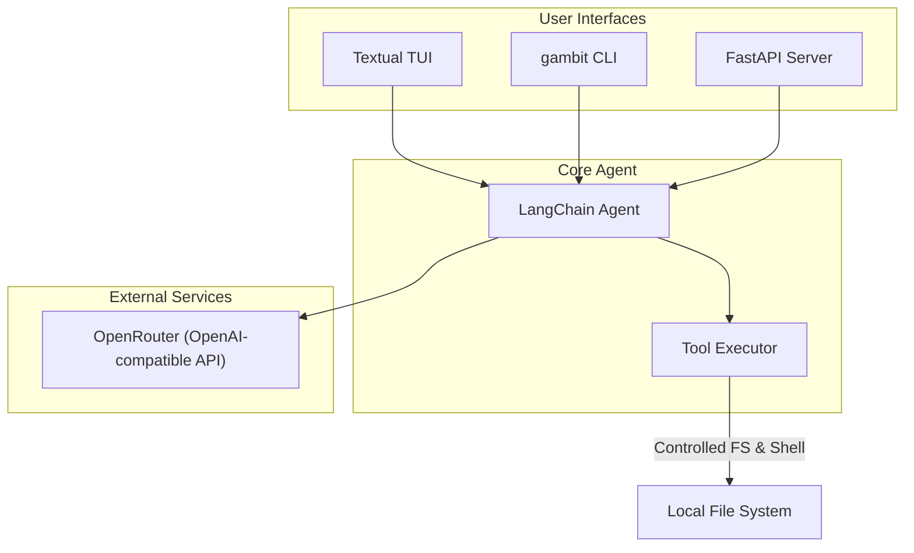

# Architectural Decisions and Limitations in Gambit Coding Agent

| Repo   | Doc Type                | Date       | Branch |
|--------|-------------------------|------------|--------|
| gambit | Architecture Overview   | 2025-09-23 | main   |

---

This document captures the key architectural decisions, technology choices, and operational limitations of the Gambit Coding Agent project. It is intended to provide context for contributors, maintainers, and auditors regarding the rationale behind the project's structure and constraints.

## Overview

Gambit is a "tiny coding agent" designed to explain code snippets, answer coding questions, and perform controlled tool-based operations (such as file I/O and shell commands) via both a Textual TUI and a FastAPI server. The agent leverages modern LLM orchestration frameworks and is intended for safe, local use with explicit API key management.

## Key Architectural Decisions

### 1. Use of LangChain and OpenAI-Compatible APIs

- **Decision:** The agent is built on [LangChain](https://python.langchain.com/) with support for OpenAI-compatible APIs, accessed via [OpenRouter](https://openrouter.ai).
- **Rationale:** LangChain provides a robust, modular framework for LLM orchestration and tool integration. OpenRouter offers a free, developer-friendly API key system and compatibility with OpenAI models.
- **Implementation:**
  - Dependencies are declared in `pyproject.toml`:
    ```toml
    # pyproject.toml (Last modified: 2025-09-23 08:59)
    dependencies = [
         "fastapi>=0.117.1",
         "langchain[openai]>=0.3.27",
         "langgraph>=0.6.7",
         "openai>=1.108.1",
         ...
    ]
    ```
  - API key is loaded from a `.env` file:
    ```
    # .env
    OPENROUTER_API_KEY=your_api_key_here
    ```

### 2. FastAPI for HTTP API

- **Decision:** The agent exposes an HTTP API using FastAPI.
- **Rationale:** FastAPI is lightweight, async-friendly, and integrates well with Pydantic for request/response validation.
- **Endpoints:** (from `[README.md](https://github.com/sergiomasellis/gambit/blob/main/README.md)`, Last modified: 2025-09-23 08:59)
    - `POST /explain` — Explain code snippets.
    - `POST /message` — General coding questions.
    - `GET /status` — Health and API key status.
    - `GET /diagnose` — Diagnostics.

- **Example (from [README.md](https://github.com/sergiomasellis/gambit/blob/main/README.md)):**
    ```json
    {
      "code": "def hello(): print('Hello, World!')",
      "api_key": "optional_override_key"
    }
    ```

### 3. Textual TUI for Local Interaction

- **Decision:** A Textual-based TUI is provided for interactive local use.
- **Rationale:** Enables a rich, terminal-based chat experience without requiring a browser or external client.
- **Invocation:**
    ```bash
    python [main.py](https://github.com/sergiomasellis/gambit/blob/main/main.py) tui
    ```

### 4. Controlled Tool Execution

- **Decision:** The agent can execute a limited set of tools for file and command operations.
- **Rationale:** Enables practical coding assistance (e.g., reading/writing files, running shell commands) while maintaining a controlled, auditable environment.
- **Available Tools:** (from [README.md](https://github.com/sergiomasellis/gambit/blob/main/README.md))
    - `execute_command_tool`
    - `read_file_tool`
    - `write_file_tool`
    - `list_directory_tool`
    - `search_files_tool`

- **Example Tool Usage:**
    ```python
    # [gambit_coding_agent/tools.py](https://github.com/sergiomasellis/gambit/blob/main/gambit_coding_agent/tools.py) (hypothetical)
    def execute_command_tool(command: str) -> str:
        # Executes a shell command and returns output
        ...
    ```

### 5. API Key Management

- **Decision:** API keys are managed via environment variables (`.env` file) and can be overridden per request.
- **Rationale:** Avoids hardcoding secrets and allows for flexible, user-specific authentication.
- **Implementation:**
    ```python
    # [gambit_coding_agent/server.py](https://github.com/sergiomasellis/gambit/blob/main/gambit_coding_agent/server.py) (hypothetical)
    import os
    from dotenv import load_dotenv

    load_dotenv()
    OPENROUTER_API_KEY = os.getenv("OPENROUTER_API_KEY")
    ```

### 6. Controlled Environment and Security

- **Decision:** All tool executions are sandboxed to prevent arbitrary code execution or file system access outside the project directory.
- **Rationale:** Protects the host system and user data from unintended side effects or malicious prompts.
- **Implementation:** (from [README.md](https://github.com/sergiomasellis/gambit/blob/main/README.md))
    > "It also supports tool usage for file operations and command execution in a controlled environment."

### 7. CLI and Entry Points

- **Decision:** The package installs a `gambit` CLI for local use.
- **Rationale:** Simplifies invocation and scripting for developers.
- **Implementation:**
    ```python
    # [setup.py](https://github.com/sergiomasellis/gambit/blob/main/setup.py) (Last modified: 2025-09-23 08:59)
    entry_points={
        "console_scripts": [
            "gambit=gambit_coding_agent.cli:main",
        ]
    }
    ```

## Limitations

- **API Key Required:** The agent will not function without a valid OpenRouter API key.
- **Sandboxed Operations:** All file and command operations are restricted to a controlled environment.
- **No Arbitrary Code Execution:** Only predefined tools can be invoked by the agent; arbitrary Python code execution is not allowed.
- **Localhost Only:** The FastAPI server is intended for local use (`127.0.0.1:8000` by default).
- **Python >=3.12 Required:** As specified in `pyproject.toml`.

## High-Level Architecture Diagram



## Illustrative Code Snippets

**Loading API Key and Initializing Agent:**
```python
# [gambit_coding_agent/server.py](https://github.com/sergiomasellis/gambit/blob/main/gambit_coding_agent/server.py) (hypothetical)
import os
from dotenv import load_dotenv

load_dotenv()
OPENROUTER_API_KEY = os.getenv("OPENROUTER_API_KEY")
if not OPENROUTER_API_KEY:
    raise RuntimeError("API key required")
```

**FastAPI Endpoint Example:**
```python
# [gambit_coding_agent/server.py](https://github.com/sergiomasellis/gambit/blob/main/gambit_coding_agent/server.py) (hypothetical)
from fastapi import FastAPI

app = FastAPI()

@app.post("/explain")
def explain_code(request: ExplainRequest):
    # Use agent to explain code
    ...
```

**Tool Registration:**
```python
# [gambit_coding_agent/tools.py](https://github.com/sergiomasellis/gambit/blob/main/gambit_coding_agent/tools.py) (hypothetical)
def read_file_tool(path: str) -> str:
    with open(path, "r") as f:
        return f.read()
```

**CLI Entry Point:**
```python
# [gambit_coding_agent/cli.py](https://github.com/sergiomasellis/gambit/blob/main/gambit_coding_agent/cli.py) (hypothetical)
def main():
    # Parse CLI args and invoke agent
    ...
```

## Primary Sources

- [README.md](https://github.com/sergiomasellis/gambit/blob/main/README.md) (Last modified: 2025-09-23 08:59)
- pyproject.toml (Last modified: 2025-09-23 08:59)
- [setup.py](https://github.com/sergiomasellis/gambit/blob/main/setup.py) (Last modified: 2025-09-23 08:59)
- .github/workflows/python-app.yml (Last modified: 2025-09-23 08:59)
- [gambit_coding_agent/tools.py](https://github.com/sergiomasellis/gambit/blob/main/gambit_coding_agent/tools.py), server.py, cli.py (see project for details)