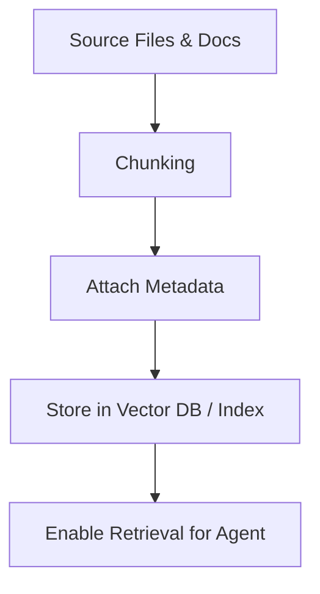

# Gambit RAG Indexing Guidelines

| Repo   | Doc Type         | Date       | Branch |
|--------|------------------|------------|--------|
| gambit | RAG Guidelines   | 2025-09-23 | main   |

## Overview

This document provides guidelines for Retrieval-Augmented Generation (RAG) indexing in the `gambit` repository. RAG indexing is essential for enabling the coding agent to efficiently retrieve, contextualize, and explain code, documentation, and tool usage. These guidelines ensure that all relevant project files are indexed in a way that maximizes the agent's ability to answer developer queries accurately and securely.

## What to Index

### 1. Source Code

- **All Python source files** under `gambit_coding_agent/` and its subdirectories.
- **Entry points** such as `[main.py](https://github.com/sergiomasellis/gambit/blob/main/main.py)`, `[setup.py](https://github.com/sergiomasellis/gambit/blob/main/setup.py)`, and `pyproject.toml`.
- **Test files** under `tests/` for examples and usage patterns.

### 2. Documentation

- `[README.md](https://github.com/sergiomasellis/gambit/blob/main/README.md)` (Last modified: 2025-09-23 08:59): Contains installation, usage, API endpoints, tool descriptions, and development workflow.
- `[AGENTS.md](https://github.com/sergiomasellis/gambit/blob/main/AGENTS.md)`: Contains agent-specific guidelines and code style conventions.
- Prompt templates under `gambit_coding_agent/prompts/` for system and task-specific instructions.

### 3. Configuration and Workflow

- `pyproject.toml` (Last modified: 2025-09-23 08:59): Project metadata, dependencies, and script entry points.
- `.github/workflows/python-app.yml` (Last modified: 2025-09-23 08:59): CI/CD pipeline for linting and testing.

## How to Index

### 1. Chunking Strategy

- **Code files**: Chunk by function, class, or logical block (3–30 lines). Ensure each chunk is self-contained and includes docstrings or comments.
- **Markdown/Documentation**: Chunk by section (e.g., headings in [README.md](https://github.com/sergiomasellis/gambit/blob/main/README.md)).
- **Configuration files**: Chunk by logical section (e.g., `[project]`, `[dependencies]` in TOML).

### 2. Metadata Attachment

For each indexed chunk, attach:
- **File path** (project-relative, e.g., `[gambit_coding_agent/agent.py](https://github.com/sergiomasellis/gambit/blob/main/gambit_coding_agent/agent.py)`)
- **Last modified date** (from file headers)
- **Line numbers** (start–end)
- **Section or symbol name** (if applicable)
- **File type** (code, doc, config, test)

### 3. Sensitive Data Exclusion

- **Never index** `.env` files or any secrets.
- Exclude user-specific or machine-generated files (e.g., `.venv/`, `__pycache__/`).

### 4. Tool and API Awareness

Ensure that tool definitions and API endpoints are indexed with:
- **Descriptions** (from [README.md](https://github.com/sergiomasellis/gambit/blob/main/README.md) or code comments)
- **Example usage** (from tests or documentation)

#### Example: Tool Definition Chunk

```python
# [gambit_coding_agent/tools.py](https://github.com/sergiomasellis/gambit/blob/main/gambit_coding_agent/tools.py) (lines 10-17)
def execute_command_tool(command: str) -> str:
    """
    Execute a shell command and return its output.
    """
    # implementation...
```

#### Example: API Endpoint Chunk

```markdown
# [README.md](https://github.com/sergiomasellis/gambit/blob/main/README.md) (lines 56-75)
- **POST /explain**

  Get an explanation for a provided code snippet.

  **Request Body:**
  {
    "code": "def hello(): print('Hello, World!')",
    "api_key": "optional_override_key"
  }

  **Response:**
  {
    "explanation": "This function defines a simple procedure that prints 'Hello, World!' to the console."
  }
```

## RAG Indexing Workflow



## Best Practices

- **Keep chunks small and meaningful**: Avoid splitting in the middle of logical units.
- **Update index on file changes**: Use the "Last modified" date to trigger re-indexing.
- **Prioritize core logic and documentation**: Index files most relevant to agent reasoning and user queries first.
- **Document exclusions**: Clearly state in your indexing config which files or patterns are ignored.

## Example: Metadata for a Chunk

```json
{
  "file": "[gambit_coding_agent/agent.py](https://github.com/sergiomasellis/gambit/blob/main/gambit_coding_agent/agent.py)",
  "last_modified": "2025-09-23 08:59",
  "lines": "10-25",
  "symbol": "CodingAgent",
  "type": "code"
}
```

## Primary Sources

- [README.md](https://github.com/sergiomasellis/gambit/blob/main/README.md) (Last modified: 2025-09-23 08:59)
- pyproject.toml (Last modified: 2025-09-23 08:59)
- [setup.py](https://github.com/sergiomasellis/gambit/blob/main/setup.py) (Last modified: 2025-09-23 08:59)
- .github/workflows/python-app.yml (Last modified: 2025-09-23 08:59)
- [gambit_coding_agent/tools.py](https://github.com/sergiomasellis/gambit/blob/main/gambit_coding_agent/tools.py)
- [gambit_coding_agent/agent.py](https://github.com/sergiomasellis/gambit/blob/main/gambit_coding_agent/agent.py)
- gambit_coding_agent/prompts/system.prompt.md
- [AGENTS.md](https://github.com/sergiomasellis/gambit/blob/main/AGENTS.md)
- [tests/test_agent.py](https://github.com/sergiomasellis/gambit/blob/main/tests/test_agent.py)
- [tests/test_todos.py](https://github.com/sergiomasellis/gambit/blob/main/tests/test_todos.py)