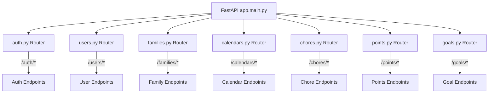

# Tapestry System Router 101

| Repo    | Doc Type         | Date                | Branch |
|---------|------------------|---------------------|--------|
| Tapestry | System Router 101 | 2025-08-04 19:08    | None   |

---

## Overview

The Tapestry backend uses FastAPI to expose a RESTful API for its family calendar and chore-tracking application. The routing logic is organized in the `backend/app/routers/` directory, with each domain (users, points, goals, families, chores, calendars, auth) having its own route file. The main entrypoint for the backend is `backend/app/main.py`, which initializes the FastAPI app and includes all routers.

This document describes the system router structure, entrypoints, and how routing is composed in Tapestry.

---

## Entrypoints

- **Primary Entrypoint:**  
  - `backend/app/main.py` (Last modified: 2025-08-04 19:08)  
    - Instantiates the FastAPI app.
    - Includes routers from all modules in `app/routers/`.
    - Sets up middleware and CORS (if any).
    - Exposes the OpenAPI docs at `/docs`.

- **ASGI Entrypoint for Deployment:**  
  - The app is served via Uvicorn using the command:  
    ```
    uv run uvicorn app.main:app --reload --host 0.0.0.0 --port 8000
    ```
    (See `backend/README.md`, Last modified: 2025-08-04 19:08)

---

## Router Structure

- **Directory:** `backend/app/routers/` (Last modified: 2025-08-04 19:08)
- **Files:**
  - `users.py` – User CRUD endpoints
  - `points.py` – Points tracking endpoints
  - `goals.py` – Goal management endpoints
  - `families.py` – Family group endpoints
  - `chores.py` – Chore management endpoints
  - `calendars.py` – Calendar integration endpoints
  - `auth.py` – Authentication endpoints
  - `__init__.py` – (may be empty or used for router aggregation)

Each file defines a FastAPI `APIRouter` instance with endpoints for its domain. These routers are then included in the main FastAPI app in `app/main.py`.

---

## Routing Logic

- **Inclusion Pattern:**  
  In `app/main.py`, routers are included as follows (pseudocode):

  ```python
  from fastapi import FastAPI
  from app.routers import users, points, goals, families, chores, calendars, auth

  app = FastAPI()

  app.include_router(auth.router)
  app.include_router(users.router)
  app.include_router(families.router)
  app.include_router(calendars.router)
  app.include_router(chores.router)
  app.include_router(points.router)
  app.include_router(goals.router)
  ```

- **URL Prefixes:**  
  Each router typically defines a prefix, e.g.:
  - `/auth`
  - `/users`
  - `/families`
  - `/calendars`
  - `/chores`
  - `/points`
  - `/goals`

- **Endpoint Registration:**  
  Each router file registers endpoints (e.g., `@router.get("/me")`, `@router.post("/")`) for its resource.

- **OpenAPI Documentation:**  
  All endpoints are automatically documented and available at `/docs` (Swagger UI).

---

## Router Topology Diagram



---

## Routing Style

- **Modular:** Each domain's endpoints are isolated in their own router module.
- **Explicit:** All routers are explicitly included in the main app.
- **RESTful:** Endpoints follow REST conventions (CRUD, resource-based URLs).
- **Extensible:** New routers can be added by creating a new file in `routers/` and including it in `main.py`.

---

## Example: Adding a New Router

1. Create `backend/app/routers/example.py`:
    ```python
    from fastapi import APIRouter

    router = APIRouter(prefix="/example", tags=["example"])

    @router.get("/")
    async def list_examples():
        return [{"id": 1, "name": "Sample"}]
    ```

2. In `backend/app/main.py`, add:
    ```python
    from app.routers import example
    app.include_router(example.router)
    ```

---

## Primary Sources

- [backend/app/main.py](backend/app/main.py) (Last modified: 2025-08-04 19:08)
- [backend/app/routers/](backend/app/routers/) (Last modified: 2025-08-04 19:08)
- [backend/README.md](backend/README.md) (Last modified: 2025-08-04 19:08)