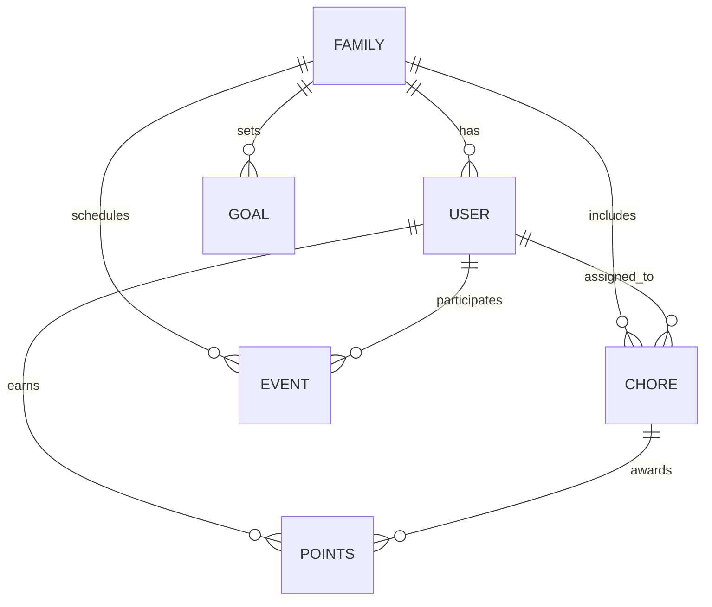

# Domain & Business Rules

| Repo    | Doc Type                | Date                | Branch |
|---------|-------------------------|---------------------|--------|
| Tapestry | Domain & Business Rules | 2025-08-04 19:08    | None   |

## Overview

Tapestry is a family-oriented calendar and chore management application. Its domain model centers on families, users, chores, points, goals, and events. The business logic is designed to foster collaboration, accountability, and engagement among family members, especially children, through gamification (points, leaderboards, and rewards).

This document details the core business entities, their relationships, and the main business rules that govern their interactions.

---

## Core Domain Entities

### 1. User

- **Description:** Represents an individual with access to the system (parent or child).
- **Key Attributes:**
  - `id`
  - `name`
  - `email`
  - `role` (parent/child)
  - `family_id` (foreign key)
- **Business Rules:**
  - A user must belong to exactly one family.
  - User roles determine permissions (e.g., only parents can assign chores or set goals).

### 2. Family

- **Description:** A group of users (typically a household).
- **Key Attributes:**
  - `id`
  - `name`
  - `invite_code`
- **Business Rules:**
  - Families can invite new users via an invite code.
  - All core data (chores, points, goals) is scoped to a family.

### 3. Chore

- **Description:** A task assigned to a user, typically a child.
- **Key Attributes:**
  - `id`
  - `title`
  - `description`
  - `assigned_to` (user id)
  - `family_id`
  - `due_date`
  - `status` (pending/completed)
  - `point_value`
- **Business Rules:**
  - Only parents can create or assign chores.
  - Completing a chore awards points to the assigned user.
  - Chores can be generated manually or via AI (LangGraph pipeline).

### 4. Points

- **Description:** A gamification mechanism to reward chore completion.
- **Key Attributes:**
  - `id`
  - `user_id`
  - `chore_id`
  - `amount`
  - `timestamp`
- **Business Rules:**
  - Points are only awarded upon successful completion of a chore.
  - Points contribute to the family leaderboard.

### 5. Goal

- **Description:** A target or reward that users can work toward (e.g., "Movie Night for 100 points").
- **Key Attributes:**
  - `id`
  - `family_id`
  - `title`
  - `description`
  - `point_target`
  - `status` (active/completed)
- **Business Rules:**
  - Only parents can create or update goals.
  - When a user or the family reaches a goal's point target, the goal is marked as completed.

### 6. Event

- **Description:** Calendar events (appointments, reminders, etc.).
- **Key Attributes:**
  - `id`
  - `family_id`
  - `title`
  - `description`
  - `start_time`
  - `end_time`
  - `participants` (list of user ids)
- **Business Rules:**
  - Events are visible to all family members.
  - Events can be imported from external calendars (iCal, Google, Alexa).

---

## Main Business Flows

### Chore Assignment & Completion

1. **Parent assigns a chore** to a child, specifying details and point value.
2. **Child completes the chore** and marks it as done.
3. **System awards points** to the child and updates the leaderboard.
4. **AI pipeline** (LangGraph) can suggest or auto-generate chores based on family patterns.

### Points & Leaderboard

- Points are accumulated per user.
- The leaderboard ranks users within a family by total points.
- Points can be redeemed or counted toward family goals.

### Goal Setting & Tracking

- Parents set goals with point targets.
- As users earn points, progress toward goals is tracked.
- Upon reaching the target, the goal is marked as achieved, and a reward can be claimed.

### Family & User Management

- Families are created by a parent user.
- New users join via invite codes.
- User roles (parent/child) determine access and permissions.

---

## Domain Model Diagram

---

## Business Rules Summary

- **Chore creation/assignment:** Only parents; must specify assignee and point value.
- **Chore completion:** Only by assigned user; triggers point award.
- **Points:** Immutable after award; only earned via chores.
- **Goals:** Only parents can create/update; progress is automatic.
- **Family scoping:** All data is isolated per family.
- **User roles:** Enforced throughout for permissions.

---

## Primary Sources

- [README.md](./README.md) (Last modified: 2025-08-04 19:08)
- [backend/README.md](./backend/README.md) (Last modified: 2025-08-04 19:08)
- [backend/app/models/models.py] (see project structure in backend/README.md)
- [backend/app/schemas/schemas.py] (see project structure in backend/README.md)