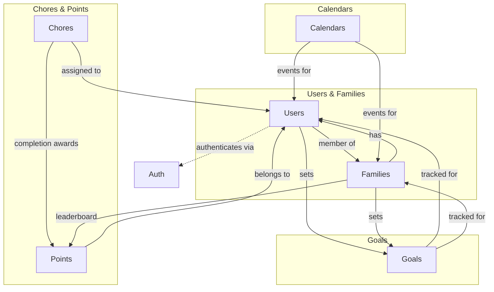

# Tapestry REST API Endpoints

| Repo      | Doc Type           | Date                | Branch |
|-----------|--------------------|---------------------|--------|
| Tapestry  | REST API Endpoints | 2025-08-04 19:08    | None   |

---

This document provides an overview of the REST API endpoints exposed by the Tapestry backend. The API is implemented using FastAPI and provides CRUD and workflow operations for users, families, events, chores, points, and goals, as described in the [README.md](./README.md) (Last modified: 2025-08-04 19:08) and [backend/README.md](./backend/README.md) (Last modified: 2025-08-04 19:08).

## API Endpoint Summary

| Resource   | Endpoint Prefix      | Methods (Typical)         | Purpose / Notes                                  |
|------------|---------------------|---------------------------|--------------------------------------------------|
| Users      | `/users`            | GET, POST, PUT, DELETE    | User CRUD: list, create, update, delete          |
| Families   | `/families`         | GET, POST, PUT, DELETE    | Family group CRUD, invite, membership            |
| Auth       | `/auth`             | POST                      | Login, admin-login (master password)             |
| Calendars  | `/calendars`        | GET, POST, PUT, DELETE    | List/add iCal, connect Google/Alexa, sync        |
| Chores     | `/chores`           | GET, POST, PUT, DELETE    | List, create, update, delete, complete, generate |
| Points     | `/points`           | GET, POST                 | List, add points                                 |
| Goals      | `/goals`            | GET, POST, PUT, DELETE    | List, create, update, delete                     |

> **Note:** All endpoints are prefixed under `/api` in production deployments (e.g., `/api/users`).

---

## Endpoint Details

### Users

| Method | Endpoint         | Description                |
|--------|------------------|----------------------------|
| GET    | `/users`         | List all users             |
| POST   | `/users`         | Create a new user          |
| GET    | `/users/{id}`    | Get user by ID             |
| PUT    | `/users/{id}`    | Update user by ID          |
| DELETE | `/users/{id}`    | Delete user by ID          |

### Families

| Method | Endpoint               | Description                           |
|--------|------------------------|---------------------------------------|
| GET    | `/families`            | List all families                     |
| POST   | `/families`            | Create a new family                   |
| GET    | `/families/{id}`       | Get family by ID                      |
| PUT    | `/families/{id}`       | Update family by ID                   |
| DELETE | `/families/{id}`       | Delete family by ID                   |
| POST   | `/families/{id}/invite`| Invite user to family                 |

### Auth

| Method | Endpoint            | Description                       |
|--------|---------------------|-----------------------------------|
| POST   | `/auth/login`       | User login                        |
| POST   | `/auth/admin-login` | Admin login (master password)     |

### Calendars

| Method | Endpoint                      | Description                                   |
|--------|-------------------------------|-----------------------------------------------|
| GET    | `/calendars`                  | List calendars (iCal, Google, Alexa, etc.)    |
| POST   | `/calendars`                  | Add new calendar integration                  |
| POST   | `/calendars/{id}/sync`        | Sync calendar                                 |
| DELETE | `/calendars/{id}`             | Remove calendar integration                   |

### Chores

| Method | Endpoint                  | Description                                  |
|--------|---------------------------|----------------------------------------------|
| GET    | `/chores`                 | List all chores                              |
| POST   | `/chores`                 | Create a new chore                           |
| GET    | `/chores/{id}`            | Get chore by ID                              |
| PUT    | `/chores/{id}`            | Update chore by ID                           |
| DELETE | `/chores/{id}`            | Delete chore by ID                           |
| POST   | `/chores/{id}/complete`   | Mark chore as complete                       |
| POST   | `/chores/generate`        | Generate chores (AI via LangGraph pipeline)  |

### Points

| Method | Endpoint          | Description                    |
|--------|-------------------|-------------------------------|
| GET    | `/points`         | List points for user/family   |
| POST   | `/points`         | Add points to user/family     |

### Goals

| Method | Endpoint         | Description                |
|--------|------------------|----------------------------|
| GET    | `/goals`         | List all goals             |
| POST   | `/goals`         | Create a new goal          |
| GET    | `/goals/{id}`    | Get goal by ID             |
| PUT    | `/goals/{id}`    | Update goal by ID          |
| DELETE | `/goals/{id}`    | Delete goal by ID          |

---

## Endpoint Relationships (Mermaid Diagram)

---

## Notes

- All endpoints use JSON request/response bodies.
- Authentication is required for most endpoints (see `/auth`).
- Some endpoints (e.g., `/chores/generate`) invoke AI-powered workflows via LangGraph.
- The actual endpoint URLs and schemas are defined in [backend/app/routers/](./backend/app/routers/) (see file list in [backend/README.md](./backend/README.md), Last modified: 2025-08-04 19:08).

---

## Primary Sources

- [README.md](./README.md) (Last modified: 2025-08-04 19:08)
- [backend/README.md](./backend/README.md) (Last modified: 2025-08-04 19:08)
- [backend/app/routers/](./backend/app/routers/) (see: users.py, families.py, chores.py, points.py, goals.py, calendars.py, auth.py)
- [backend/pyproject.toml](./backend/pyproject.toml) (Last modified: 2025-08-04 19:08)