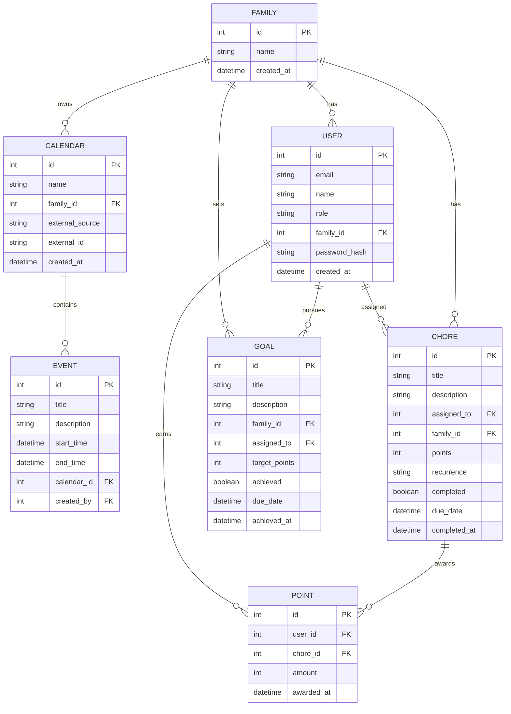

# Tapestry Main Entity Schema

| Repo     | Doc Type         | Date                | Branch |
|----------|------------------|---------------------|--------|
| Tapestry | Main Entity Schema (421) | 2025-08-04 19:08 | None   |

This document describes the main entity schema for the Tapestry application, focusing on the backend data models and their relationships. Tapestry is a family-oriented calendar and chore management system, featuring user accounts, family groups, events, chores, points, and goals. The backend is implemented with FastAPI, SQLAlchemy, and Pydantic.

## Overview

The core entities in Tapestry are:

- **User**: Represents an individual account (adult or child).
- **Family**: A group of users (typically a household).
- **Calendar**: A collection of events, can be native or synced from external sources.
- **Event**: A calendar event (appointment, activity, etc).
- **Chore**: A task assigned to a user, often recurring.
- **Point**: Tracks points earned by users for completing chores.
- **Goal**: A reward or milestone users can work toward.

These entities are defined in the backend under:

- `backend/app/models/models.py` (SQLAlchemy models, Last modified: 2025-08-04 19:08)
- `backend/app/schemas/schemas.py` (Pydantic schemas, Last modified: 2025-08-04 19:08)

## Entity-Relationship Diagram

## Entity Descriptions

### Family

- **id**: Primary key
- **name**: Family/group name
- **created_at**: Timestamp

### User

- **id**: Primary key
- **email**: Unique email address
- **name**: Display name
- **role**: 'parent', 'child', or 'admin'
- **family_id**: Foreign key to Family
- **password_hash**: Hashed password
- **created_at**: Timestamp

### Calendar

- **id**: Primary key
- **name**: Calendar name
- **family_id**: Foreign key to Family
- **external_source**: (Optional) 'google', 'ical', 'alexa', etc.
- **external_id**: (Optional) ID in external system
- **created_at**: Timestamp

### Event

- **id**: Primary key
- **title**: Event title
- **description**: Details
- **start_time**: Start datetime
- **end_time**: End datetime
- **calendar_id**: Foreign key to Calendar
- **created_by**: User who created the event

### Chore

- **id**: Primary key
- **title**: Chore name
- **description**: Details
- **assigned_to**: User assigned
- **family_id**: Foreign key to Family
- **points**: Points awarded on completion
- **recurrence**: e.g., 'daily', 'weekly'
- **completed**: Boolean
- **due_date**: When it's due
- **completed_at**: When it was completed

### Point

- **id**: Primary key
- **user_id**: User who earned the point(s)
- **chore_id**: Chore completed
- **amount**: Number of points
- **awarded_at**: Timestamp

### Goal

- **id**: Primary key
- **title**: Goal name
- **description**: Details
- **family_id**: Foreign key to Family
- **assigned_to**: User (optional, for personal goals)
- **target_points**: Points required to achieve
- **achieved**: Boolean
- **due_date**: Deadline
- **achieved_at**: When achieved

## Notes

- All relationships are enforced via foreign keys.
- Families are the top-level grouping; all users, calendars, chores, and goals are scoped to a family.
- Points are awarded for chore completion and tracked per user.
- Goals can be family-wide or assigned to individuals.

## Primary Sources

- [`backend/app/models/models.py`](backend/app/models/models.py) (Last modified: 2025-08-04 19:08)
- [`backend/app/schemas/schemas.py`](backend/app/schemas/schemas.py) (Last modified: 2025-08-04 19:08)
- [`backend/README.md`](backend/README.md) (Last modified: 2025-08-04 19:08)
- [`README.md`](README.md) (Last modified: 2025-08-04 19:08)