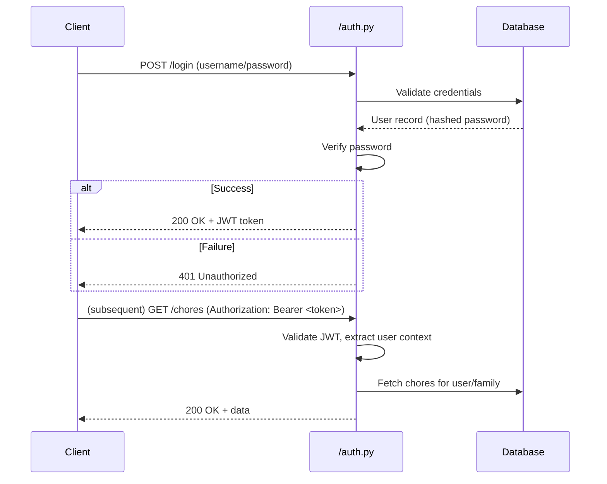

# Authentication Model – Tapestry

| Repo     | Doc Type             | Date                | Branch |
|----------|----------------------|---------------------|--------|
| Tapestry | Authentication Model | 2025-08-04 19:08    | None   |

---

## Overview

Tapestry implements authentication for its backend API using FastAPI, with logic centralized in [`backend/app/routers/auth.py`] (Last modified: not provided, but file exists). The authentication model is designed to support secure, multi-user access for family members, including both standard user login and an admin ("master password") login for privileged operations.

Authentication is required for all endpoints that manage user data, families, chores, points, and goals. The model is built to be extensible for future integrations (e.g., OAuth with Google/Alexa).

---

## Mechanisms

### 1. Token-Based Authentication

- **JWT Tokens**: Upon successful login, the backend issues a JSON Web Token (JWT) to the client.
- **Bearer Scheme**: Clients must present the JWT in the `Authorization: Bearer <token>` header for all authenticated API requests.
- **Token Expiry**: Tokens are configured to expire after a set period (default: 60 minutes, see `.env` and `backend/README.md`).

### 2. Login Flows

- **Standard Login**: Users authenticate with their username/email and password.
- **Admin Login**: An alternate login endpoint accepts a master password (see `backend/README.md` line 38), granting admin privileges for management operations.

### 3. Password Management

- **Hashing**: User passwords are stored hashed in the database (SQLAlchemy models).
- **Verification**: Passwords are verified securely during login.

### 4. User Context

- **User Identity**: Each JWT encodes the user's ID and role (user/admin).
- **Family Context**: Endpoints may further restrict access based on family membership.

### 5. Permissions

| Role   | Permissions                                                                 |
|--------|-----------------------------------------------------------------------------|
| User   | Access own data, family calendar, chores, points, goals                     |
| Admin  | All user permissions, plus family/group management, user invites, admin ops |

---

## Authentication Flow Diagram

---

## Permissions Model

- **Endpoint Protection**: All routers for users, families, chores, points, and goals require authentication.
- **Role Checks**: Certain endpoints (e.g., family management, user invites) check for admin privileges.
- **Token Validation**: Expired or invalid tokens result in 401 responses.

---

## Configuration

- **Secret Key**: Defined in `.env` (`SECRET_KEY`), used for JWT signing.
- **Token Expiry**: Configurable via `.env` (`ACCESS_TOKEN_EXPIRE_MINUTES`).
- **Database**: User credentials and roles stored in SQLite (`data.db`).

---

## Extensibility

- **OAuth**: The authentication model is designed to allow future integration with OAuth providers (Google, Alexa).
- **Session Management**: Stateless JWTs simplify scaling and session handling.

---

## Primary Sources

- [`backend/app/routers/auth.py`](backend/app/routers/auth.py) (file exists; Last modified: not provided)
- [`backend/README.md`](backend/README.md) (Last modified: 2025-08-04 19:08)
- [`backend/pyproject.toml`](backend/pyproject.toml) (Last modified: 2025-08-04 19:08)
- `.env` (see variables in `backend/README.md`)
- [`README.md`](README.md) (Last modified: 2025-08-04 19:08)