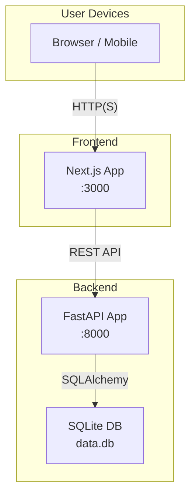

# Tapestry Runbook Operations

| Repo     | Doc Type           | Date                | Branch |
|----------|--------------------|---------------------|--------|
| Tapestry | Runbook Operations | 2025-08-04 19:08    | None   |

---

## Overview

This document provides operational guidance for running, monitoring, and troubleshooting the Tapestry application. Tapestry is a family calendar and chore management platform with a Next.js frontend and a FastAPI backend, using SQLite for development. While there is no evidence of advanced operational runbooks or detailed failure mode documentation, this guide covers the essential steps for setup, basic recovery, and debugging based on the available project documentation.

---

## 1. System Startup & Shutdown

### Backend

- **Startup**:
  - Navigate to the backend directory:
    ```sh
    cd backend
    ```
  - (Recommended) Create and activate a Python virtual environment.
  - Install dependencies:
    ```sh
    pip install -r requirements.txt
    ```
  - Start the FastAPI server:
    ```sh
    python main.py
    ```
    or (preferred for development, per backend/README.md):
    ```sh
    uv run uvicorn app.main:app --reload --host 0.0.0.0 --port 8000
    ```

- **Shutdown**:
  - Stop the server process with `Ctrl+C` or by terminating the process.

### Frontend

- **Startup**:
  - Navigate to the frontend directory:
    ```sh
    cd frontend
    ```
  - Install dependencies:
    ```sh
    npm install
    ```
  - Start the development server:
    ```sh
    npm run dev
    ```

- **Shutdown**:
  - Stop the server process with `Ctrl+C`.

---

## 2. Environment & Configuration

- **Backend**:
  - Uses a `.env` file for configuration (see backend/README.md, last modified: 2025-08-04 19:08):
    ```
    DATABASE_URL=sqlite:///./data.db
    SECRET_KEY=dev-secret-change
    ACCESS_TOKEN_EXPIRE_MINUTES=60
    ```
  - Ensure `.env` exists and is correctly configured before startup.

- **Frontend**:
  - No special environment variables are documented for development.

---

## 3. Database Management

- **SQLite** is used for development.
- The database file (`data.db`) is auto-created on first backend run.
- To reset the database, delete `backend/data.db` and restart the backend (will lose all data).
- No migrations or backup/restore procedures are documented.

---

## 4. Health Checks & Monitoring

- **API Docs**: Visit `http://localhost:8000/docs` to verify backend is running.
- **Frontend**: Visit `http://localhost:3000` to verify frontend is running.
- No explicit health endpoints or monitoring integrations are documented.

---

## 5. Debugging & Troubleshooting

### Common Issues

| Symptom                                 | Possible Cause                | Resolution Steps                                   |
|------------------------------------------|-------------------------------|----------------------------------------------------|
| Backend fails to start                   | Missing deps, bad config      | Check `.env`, run `pip install -r requirements.txt`|
| Frontend fails to start                  | Missing deps                  | Run `npm install`                                  |
| 404/500 errors on API endpoints          | Backend not running           | Ensure backend server is running                    |
| Database errors (unable to connect)      | Missing/corrupt `data.db`     | Delete `data.db` and restart backend                |
| CORS errors in frontend                  | Backend CORS misconfig        | Update FastAPI CORS settings (not documented)       |
| Changes not reflected in frontend        | Dev server cache              | Restart frontend dev server                         |

### Logs

- **Backend**: Logs are output to the console by default.
- **Frontend**: Console output in terminal and browser dev tools.

---

## 6. Restart Procedures

- **Backend**: Stop the process and restart using the commands above.
- **Frontend**: Stop the process and restart using the commands above.
- No zero-downtime or advanced restart procedures are documented.

---

## 7. Failure Modes

- **Database Corruption**: Delete `backend/data.db` and restart (data loss).
- **Dependency Issues**: Reinstall dependencies (`pip install -r requirements.txt`, `npm install`).
- **Configuration Errors**: Review and correct `.env` file.
- **Unhandled Exceptions**: Check console logs for stack traces.

---

## 8. Upgrades & Maintenance

- **Dependencies**: Upgrade via `pip install -U ...` or `npm update`.
- **Database Schema**: No documented migration process; schema is auto-created on backend start.

---

## 9. Recovery Scenarios

- **Lost Admin Password**: No documented recovery; may require DB reset.
- **Broken Environment**: Remove and recreate virtual environment or `node_modules`.

---

## 10. Operational Topology



---

## 11. Limitations

- No production-grade runbooks, monitoring, or alerting.
- No backup/restore or migration scripts.
- No documented disaster recovery or high-availability setup.

---

## Primary Sources

- [README.md](./README.md) (Last modified: 2025-08-04 19:08)
- [backend/README.md](./backend/README.md) (Last modified: 2025-08-04 19:08)
- [frontend/README.md](./frontend/README.md) (Last modified: 2025-08-04 19:08)
- [backend/pyproject.toml](./backend/pyproject.toml) (Last modified: 2025-08-04 19:08)
- [frontend/package.json](./frontend/package.json) (Last modified: 2025-08-04 19:08)
- [frontend/tsconfig.json](./frontend/tsconfig.json) (Last modified: 2025-08-04 19:08)