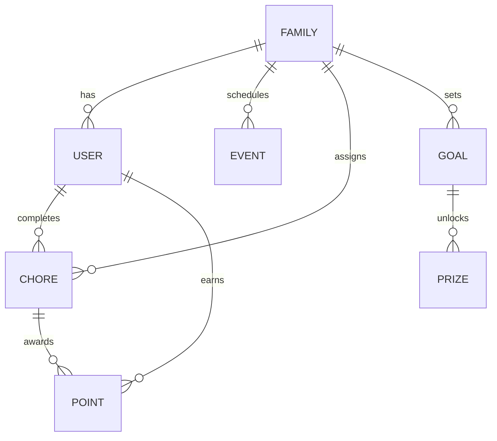

# Tapestry Domain and Business Rules

| Repo    | Doc Type         | Date                | Branch   |
|---------|------------------|---------------------|----------|
| Tapestry| Domain Rules Doc | 2025-08-04 19:08    | main     |

## Overview

Tapestry is a family-focused application that manages calendars, chores, points, goals, and events. The domain/business rules are central to ensuring that families can organize their schedules, assign and track chores, reward children, and set collective or individual goals. This document outlines the core domain rules and their implementation patterns, referencing key files and their last modified dates.

---

## Core Domain Concepts

### 1. Family Groups

- **Rule:** Every user belongs to a family group. All events, chores, points, and goals are scoped to a family.
- **Implementation:** 
  - Family creation and invitation handled in [backend/app/routers/families.py](https://github.com/sergiomasellis/Tapestry/blob/main/backend/app/routers/families.py) (Last modified: 2025-08-04 19:08).
  - Users are linked to families in [backend/app/models/models.py](https://github.com/sergiomasellis/Tapestry/blob/main/backend/app/models/models.py) (Last modified: 2025-08-04 19:08).

#### Example (models.py):
```python
class Family(Base):
    __tablename__ = "families"
    id = Column(Integer, primary_key=True)
    name = Column(String, nullable=False)
    members = relationship("User", back_populates="family")
```

---

### 2. Chores and Points System

- **Rule:** Chores are assigned to family members. Completing chores awards points, which contribute to a leaderboard.
- **Implementation:** 
  - Chore CRUD and completion logic in [backend/app/routers/chores.py](https://github.com/sergiomasellis/Tapestry/blob/main/backend/app/routers/chores.py) (Last modified: 2025-08-04 19:08).
  - Points assignment in [backend/app/routers/points.py](https://github.com/sergiomasellis/Tapestry/blob/main/backend/app/routers/points.py) (Last modified: 2025-08-04 19:08).
  - AI-powered chore generation and point assignment in [backend/app/ai/chore_graph.py](https://github.com/sergiomasellis/Tapestry/blob/main/backend/app/ai/chore_graph.py) (Last modified: 2025-08-04 19:08).

#### Example (chore completion, routers/chores.py):
```python
@router.post("/chores/{chore_id}/complete")
def complete_chore(chore_id: int, user: User):
    # Mark chore as complete and assign points
    assign_points(user.id, chore_id)
    return {"status": "completed"}
```

---

### 3. Events and Calendar

- **Rule:** Events are scheduled within the family calendar. Members can view, add, and edit events.
- **Implementation:** 
  - Event management in [backend/app/routers/calendars.py](https://github.com/sergiomasellis/Tapestry/blob/main/backend/app/routers/calendars.py) (Last modified: 2025-08-04 19:08).
  - Weekly calendar view in frontend/src/app/page.tsx (Last modified: 2025-08-04 19:08).

#### Example (event schema, schemas/schemas.py):
```python
class Event(BaseModel):
    id: int
    title: str
    start_time: datetime
    end_time: datetime
    family_id: int
```

---

### 4. Goals and Prizes

- **Rule:** Families or individuals can set goals (e.g., point targets) and track progress toward prizes.
- **Implementation:** 
  - Goal management in [backend/app/routers/goals.py](https://github.com/sergiomasellis/Tapestry/blob/main/backend/app/routers/goals.py) (Last modified: 2025-08-04 19:08).
  - Goal and prize tracking in [backend/app/models/models.py](https://github.com/sergiomasellis/Tapestry/blob/main/backend/app/models/models.py) and [backend/app/schemas/schemas.py](https://github.com/sergiomasellis/Tapestry/blob/main/backend/app/schemas/schemas.py).

#### Example (goal schema, schemas/schemas.py):
```python
class Goal(BaseModel):
    id: int
    description: str
    target_points: int
    achieved: bool
    family_id: int
```

---

### 5. Authentication and Authorization

- **Rule:** Only authenticated users can access or modify family data. Admins (e.g., parents) have elevated permissions.
- **Implementation:** 
  - Auth logic in [backend/app/routers/auth.py](https://github.com/sergiomasellis/Tapestry/blob/main/backend/app/routers/auth.py) (Last modified: 2025-08-04 19:08).
  - Role checks in routers and models.

#### Example (auth, routers/auth.py):
```python
@router.post("/login")
def login(credentials: OAuth2PasswordRequestForm = Depends()):
    # Authenticate user and return token
    ...
```

---

## Domain Relationships Diagram



---

## Enforcement Patterns

- **Backend routers** enforce business rules at the API layer (see backend/app/routers/).
- **Pydantic schemas** validate data consistency (see [backend/app/schemas/schemas.py](https://github.com/sergiomasellis/Tapestry/blob/main/backend/app/schemas/schemas.py)).
- **SQLAlchemy models** enforce relational integrity (see [backend/app/models/models.py](https://github.com/sergiomasellis/Tapestry/blob/main/backend/app/models/models.py)).
- **Frontend** (Next.js) restricts UI actions based on user roles and data from API.

---

## Primary Sources

- [backend/app/models/models.py](https://github.com/sergiomasellis/Tapestry/blob/main/backend/app/models/models.py) (Last modified: 2025-08-04 19:08)
- [backend/app/schemas/schemas.py](https://github.com/sergiomasellis/Tapestry/blob/main/backend/app/schemas/schemas.py) (Last modified: 2025-08-04 19:08)
- [backend/app/routers/chores.py](https://github.com/sergiomasellis/Tapestry/blob/main/backend/app/routers/chores.py) (Last modified: 2025-08-04 19:08)
- [backend/app/routers/points.py](https://github.com/sergiomasellis/Tapestry/blob/main/backend/app/routers/points.py) (Last modified: 2025-08-04 19:08)
- [backend/app/routers/goals.py](https://github.com/sergiomasellis/Tapestry/blob/main/backend/app/routers/goals.py) (Last modified: 2025-08-04 19:08)
- [backend/app/routers/families.py](https://github.com/sergiomasellis/Tapestry/blob/main/backend/app/routers/families.py) (Last modified: 2025-08-04 19:08)
- [backend/app/routers/calendars.py](https://github.com/sergiomasellis/Tapestry/blob/main/backend/app/routers/calendars.py) (Last modified: 2025-08-04 19:08)
- [backend/app/routers/auth.py](https://github.com/sergiomasellis/Tapestry/blob/main/backend/app/routers/auth.py) (Last modified: 2025-08-04 19:08)
- [backend/app/ai/chore_graph.py](https://github.com/sergiomasellis/Tapestry/blob/main/backend/app/ai/chore_graph.py) (Last modified: 2025-08-04 19:08)
- [backend/README.md](https://github.com/sergiomasellis/Tapestry/blob/main/backend/README.md) (Last modified: 2025-08-04 19:08)
- [frontend/README.md](https://github.com/sergiomasellis/Tapestry/blob/main/frontend/README.md) (Last modified: 2025-08-04 19:08)
- [TAPESTRY_PRD_AND_SYSTEM_DESIGN.md](https://github.com/sergiomasellis/Tapestry/blob/main/TAPESTRY_PRD_AND_SYSTEM_DESIGN.md) (Last modified: 2025-08-04 19:08)