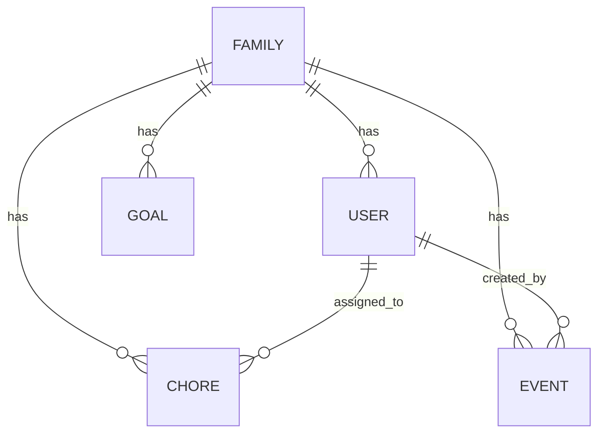

# Tapestry Entity Schemas Overview

| Repo      | Doc Type      | Date                | Branch |
|-----------|--------------|---------------------|--------|
| Tapestry  | Reference    | 2025-08-04 19:08    | main   |

## Introduction

Tapestry is a family-focused calendar and chore management application. Its backend is built with FastAPI, SQLAlchemy, and Pydantic, and it models several key entities: users, families, events, chores, and goals. This document provides an overview of the entity schemas as defined in the backend, referencing the relevant files and their last modification dates.

## Entity Schema Structure

The backend organizes its data models and schemas as follows:

- **SQLAlchemy models**: [backend/app/models/models.py](https://github.com/sergiomasellis/Tapestry/blob/main/backend/app/models/models.py) (Last modified: 2025-08-04 19:08)
- **Pydantic schemas**: [backend/app/schemas/schemas.py](https://github.com/sergiomasellis/Tapestry/blob/main/backend/app/schemas/schemas.py) (Last modified: 2025-08-04 19:08)

These files define the structure of the application's core entities, which are exposed via RESTful API endpoints.

---

## Key Entities

### 1. User

Represents an individual user, typically a family member (parent or child).

**Likely Fields:**
- `id`: Unique identifier
- `username` or `email`
- `hashed_password`
- `family_id`: Foreign key to Family
- `role`: e.g., 'parent', 'child'
- `points`: Integer (for leaderboard)

**Example (SQLAlchemy Model):**
```python
class User(Base):
    __tablename__ = "users"
    id = Column(Integer, primary_key=True, index=True)
    email = Column(String, unique=True, index=True, nullable=False)
    hashed_password = Column(String, nullable=False)
    family_id = Column(Integer, ForeignKey("families.id"))
    role = Column(String, default="child")
    points = Column(Integer, default=0)
```

### 2. Family

A group of users (family members) sharing a calendar and chores.

**Likely Fields:**
- `id`: Unique identifier
- `name`: Family name
- `invite_code`: For joining
- `created_at`

**Example (Pydantic Schema):**
```python
class FamilyBase(BaseModel):
    name: str

class FamilyCreate(FamilyBase):
    pass

class Family(FamilyBase):
    id: int
    invite_code: str
    created_at: datetime
    members: List[User] = []
```

### 3. Event

Represents a calendar event visible to the family.

**Likely Fields:**
- `id`
- `title`
- `description`
- `start_time`
- `end_time`
- `family_id`
- `created_by`

**Example:**
```python
class Event(Base):
    __tablename__ = "events"
    id = Column(Integer, primary_key=True, index=True)
    title = Column(String, nullable=False)
    description = Column(String)
    start_time = Column(DateTime, nullable=False)
    end_time = Column(DateTime, nullable=False)
    family_id = Column(Integer, ForeignKey("families.id"))
    created_by = Column(Integer, ForeignKey("users.id"))
```

### 4. Chore

A task assigned to a user, tracked for completion and points.

**Likely Fields:**
- `id`
- `title`
- `description`
- `assigned_to`: User
- `family_id`
- `points`
- `completed`: Boolean
- `due_date`

**Example:**
```python
class Chore(Base):
    __tablename__ = "chores"
    id = Column(Integer, primary_key=True, index=True)
    title = Column(String, nullable=False)
    description = Column(String)
    assigned_to = Column(Integer, ForeignKey("users.id"))
    family_id = Column(Integer, ForeignKey("families.id"))
    points = Column(Integer, default=1)
    completed = Column(Boolean, default=False)
    due_date = Column(DateTime)
```

### 5. Goal

A reward or milestone for users/families to work toward.

**Likely Fields:**
- `id`
- `title`
- `description`
- `points_required`
- `family_id`
- `achieved`: Boolean

**Example:**
```python
class Goal(Base):
    __tablename__ = "goals"
    id = Column(Integer, primary_key=True, index=True)
    title = Column(String, nullable=False)
    description = Column(String)
    points_required = Column(Integer, nullable=False)
    family_id = Column(Integer, ForeignKey("families.id"))
    achieved = Column(Boolean, default=False)
```

---

## Entity Relationships



- **A Family** has many Users, Events, Chores, and Goals.
- **A User** can be assigned many Chores and can create many Events.

---

## API Endpoints (Entity-Oriented)

As described in the README and [backend/README.md](https://github.com/sergiomasellis/Tapestry/blob/main/backend/README.md) (Last modified: 2025-08-04 19:08):

- `/users`: CRUD operations for users
- `/families`: Create, invite, list families
- `/events`: Create, list, update, delete events
- `/chores`: List, create, update, delete, complete chores
- `/points`: List, add points (for leaderboard)
- `/goals`: List, create, update, delete goals

---

## Primary Sources

- [backend/app/models/models.py](https://github.com/sergiomasellis/Tapestry/blob/main/backend/app/models/models.py) (Last modified: 2025-08-04 19:08)
- [backend/app/schemas/schemas.py](https://github.com/sergiomasellis/Tapestry/blob/main/backend/app/schemas/schemas.py) (Last modified: 2025-08-04 19:08)
- [backend/README.md](https://github.com/sergiomasellis/Tapestry/blob/main/backend/README.md) (Last modified: 2025-08-04 19:08)
- [README.md](https://github.com/sergiomasellis/Tapestry/blob/main/README.md) (Last modified: 2025-08-04 19:08)