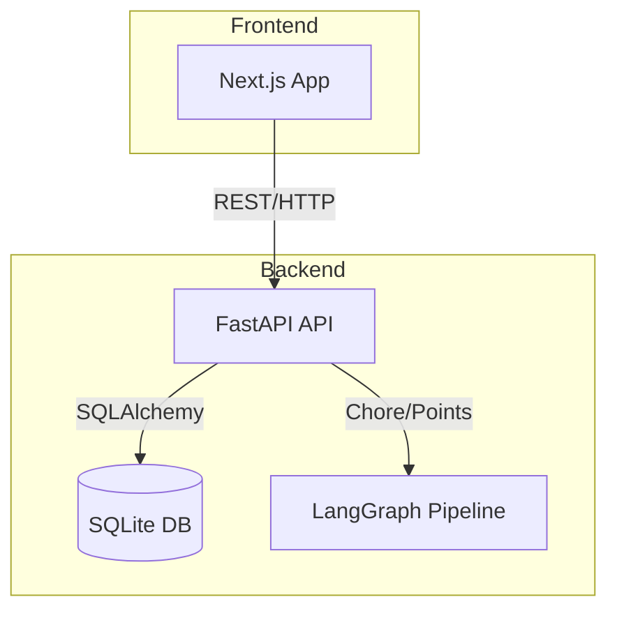

# Tapestry Runbook: Debugging and Recovery Operations

| Repo      | Doc Type   | Date                | Branch |
|-----------|------------|---------------------|--------|
| Tapestry  | Runbook    | 2025-08-04 19:08    | main   |

---

This runbook provides step-by-step operational guidance for debugging and recovering both backend and frontend servers in the Tapestry family calendar application. It is intended for developers and operators responsible for maintaining uptime, diagnosing issues, and restoring service.

---

## 1. System Overview

Tapestry is a modern, touch-friendly multi-user calendar application for families, featuring:

- Weekly calendar view and event management
- Chore tracking with points and leaderboard
- Goal setting and prize tracking

**Tech Stack:**
- **Frontend:** Next.js (TypeScript, Tailwind CSS)
- **Backend:** FastAPI (Python), SQLAlchemy ORM
- **Database:** SQLite (development)
- **AI:** LangGraph for chore/point automation

(See: [README.md](https://github.com/sergiomasellis/Tapestry/blob/main/README.md), Last modified: 2025-08-04 19:08)

---

## 2. Service Topology



---

## 3. Backend Operations

### 3.1. Starting the Backend

**Quick Start ([backend/README.md](https://github.com/sergiomasellis/Tapestry/blob/main/backend/README.md), 2025-08-04 19:08):**
```bash
cd backend
uv sync
cp .env.example .env  # Edit as needed
uv run uvicorn app.main:app --reload --host 0.0.0.0 --port 8000
```

- The backend will auto-create the SQLite database (`data.db`) and tables on first run.

### 3.2. Common Debugging Steps

#### a. Check Service Status

- Ensure `uvicorn` is running and listening on port 8000.
- Check logs for errors:
  ```bash
  tail -f [backend/app/main.py](https://github.com/sergiomasellis/Tapestry/blob/main/backend/app/main.py)
  ```

#### b. Database Issues

- If the database is missing or corrupted, delete `data.db` and restart the backend to auto-recreate.
- Confirm `DATABASE_URL` in `.env`:
  ```
  DATABASE_URL=sqlite:///./data.db
  ```

#### c. API Health

- Open [http://localhost:8000/docs](http://localhost:8000/docs) to verify API endpoints are live.

#### d. Dependency Problems

- Reinstall dependencies:
  ```bash
  uv sync
  ```

#### e. Environment Variables

- Ensure `.env` contains all required keys:
  ```
  DATABASE_URL=sqlite:///./data.db
  SECRET_KEY=dev-secret-change
  ACCESS_TOKEN_EXPIRE_MINUTES=60
  ```

#### f. Example: FastAPI App Entry ([backend/app/main.py](https://github.com/sergiomasellis/Tapestry/blob/main/backend/app/main.py))
```python
from fastapi import FastAPI
from app.routers import users, chores, points

app = FastAPI()
app.include_router(users.router)
app.include_router(chores.router)
app.include_router(points.router)
```

---

## 4. Frontend Operations

### 4.1. Starting the Frontend

**Quick Start ([frontend/README.md](https://github.com/sergiomasellis/Tapestry/blob/main/frontend/README.md), 2025-08-04 19:08):**
```bash
cd frontend
npm install
npm run dev
```
- The app runs at [http://localhost:3000](http://localhost:3000).

### 4.2. Debugging Steps

#### a. Build/Startup Issues

- Delete `node_modules` and reinstall:
  ```bash
  rm -rf node_modules
  npm install
  ```

- Check for TypeScript errors:
  ```bash
  npm run lint
  ```

#### b. Configuration

- Ensure `tsconfig.json` includes correct paths:
  ```json
  "paths": {
    "@/*": ["./src/*"]
  }
  ```

#### c. Example: Next.js Page Entry (frontend/src/app/page.tsx)
```typescript
export default function HomePage() {
  return (
    <main>
      <h1>Welcome to Tapestry</h1>
    </main>
  );
}
```

#### d. Hot Reload Not Working

- Restart the dev server.
- Clear browser cache.

---

## 5. Recovery Procedures

### 5.1. Backend

- **Crash Loop:** Check logs for stack traces. If related to DB, delete `data.db` and restart.
- **API 500 Errors:** Validate `.env` and dependencies. Rebuild venv if needed.
- **Chore/AI Failures:** Check `app/ai/chore_graph.py` for errors; restart backend.

### 5.2. Frontend

- **Blank Page:** Check browser console for JS errors.
- **API Errors:** Ensure backend is running and accessible at expected URL.
- **Build Failures:** Clear `.next/` and rebuild:
  ```bash
  rm -rf .next
  npm run build
  npm run dev
  ```

---

## 6. Useful Code Snippets

### Backend: Including Routers ([backend/app/main.py](https://github.com/sergiomasellis/Tapestry/blob/main/backend/app/main.py))
```python
from fastapi import FastAPI
from app.routers import users, chores, points

app = FastAPI()
app.include_router(users.router)
app.include_router(chores.router)
app.include_router(points.router)
```

### Frontend: Next.js Script Commands ([frontend/package.json](https://github.com/sergiomasellis/Tapestry/blob/main/frontend/package.json))
```json
"scripts": {
  "dev": "next dev --turbopack",
  "build": "next build",
  "start": "next start",
  "lint": "next lint"
}
```

### TypeScript Path Aliases ([frontend/tsconfig.json](https://github.com/sergiomasellis/Tapestry/blob/main/frontend/tsconfig.json))
```json
"paths": {
  "@/*": ["./src/*"]
}
```

---

## 7. Primary Sources

- [README.md](https://github.com/sergiomasellis/Tapestry/blob/main/README.md) (Last modified: 2025-08-04 19:08)
- [backend/README.md](https://github.com/sergiomasellis/Tapestry/blob/main/backend/README.md) (Last modified: 2025-08-04 19:08)
- [frontend/README.md](https://github.com/sergiomasellis/Tapestry/blob/main/frontend/README.md) (Last modified: 2025-08-04 19:08)
- [frontend/package.json](https://github.com/sergiomasellis/Tapestry/blob/main/frontend/package.json) (Last modified: 2025-08-04 19:08)
- [frontend/tsconfig.json](https://github.com/sergiomasellis/Tapestry/blob/main/frontend/tsconfig.json) (Last modified: 2025-08-04 19:08)
- backend/pyproject.toml (Last modified: 2025-08-04 19:08)