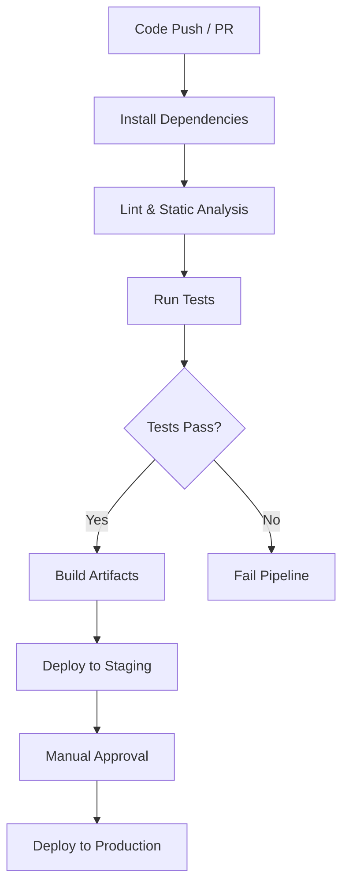

# Tapestry CI/CD Pipeline Documentation

| Repo      | Doc Type           | Date                | Branch   |
|-----------|--------------------|---------------------|----------|
| Tapestry  | CI/CD Pipeline Doc | 2025-08-04 19:08    | main     |

---

This document describes the recommended Continuous Integration and Continuous Deployment (CI/CD) pipeline for the Tapestry project. It covers the build, test, and deployment processes for both the frontend (Next.js/TypeScript) and backend (FastAPI/SQLAlchemy) components.

## Overview

Tapestry is a modern, multi-user family calendar application with a Next.js frontend and a FastAPI backend. To ensure code quality and rapid delivery, a robust CI/CD pipeline is essential. The pipeline should automate:

- Code linting and static analysis
- Dependency installation and build
- Automated testing
- Deployment to development/staging/production environments

## Pipeline Stages

Below is a high-level overview of the recommended CI/CD pipeline for Tapestry:



### 1. Trigger

- **On every push** to the `main` branch and on **pull requests**.

### 2. Install Dependencies

#### Frontend

- Uses `npm install` (or `pnpm install` as per developer preference).
- Installs dependencies as defined in `[frontend/package.json](https://github.com/sergiomasellis/Tapestry/blob/main/frontend/package.json)` (Last modified: 2025-08-04 19:08).

#### Backend

- Uses `uv sync` or `pip install -r requirements.txt` for Python dependencies.
- Installs dependencies as defined in `backend/pyproject.toml` (Last modified: 2025-08-04 19:08).

#### Example (GitHub Actions Step)

```yaml
- name: Install Frontend Dependencies
  run: |
    cd frontend
    npm install

- name: Install Backend Dependencies
  run: |
    cd backend
    uv sync
```

### 3. Lint & Static Analysis

#### Frontend

- Runs ESLint as defined in `[frontend/package.json](https://github.com/sergiomasellis/Tapestry/blob/main/frontend/package.json)`:

```json
"scripts": {
  "lint": "next lint"
}
```

#### Backend

- Runs Ruff for Python linting (see `backend/pyproject.toml`):

```toml
[dependency-groups]
dev = [
    "ruff>=0.12.7",
]
```

#### Example

```yaml
- name: Lint Frontend
  run: |
    cd frontend
    npm run lint

- name: Lint Backend
  run: |
    cd backend
    uv run ruff .
```

### 4. Run Tests

- **Frontend:** Add tests using your preferred framework (e.g., Jest, React Testing Library).
- **Backend:** Add tests using `pytest` or similar.

*Note: As of the last update, test scripts are not present in the provided files. It is recommended to add them for full CI coverage.*

### 5. Build Artifacts

#### Frontend

- Build the Next.js app:

```json
"scripts": {
  "build": "next build"
}
```

#### Backend

- No explicit build step for FastAPI, but ensure all migrations and static checks pass.

#### Example

```yaml
- name: Build Frontend
  run: |
    cd frontend
    npm run build
```

### 6. Deploy

- **Staging:** Deploy automatically after successful build and tests.
- **Production:** Deploy after manual approval.

#### Frontend

- Deploy to Vercel or similar platform (see `[frontend/README.md](https://github.com/sergiomasellis/Tapestry/blob/main/frontend/README.md)` for Vercel recommendation).

#### Backend

- Deploy to a cloud VM, container service, or PaaS (e.g., Render, Heroku, AWS, etc.).
- Run with Uvicorn as per `[backend/README.md](https://github.com/sergiomasellis/Tapestry/blob/main/backend/README.md)`:

```bash
uv run uvicorn app.main:app --reload --host 0.0.0.0 --port 8000
```

### 7. Environment Variables

- Use `.env` files for secrets and configuration (see `[backend/README.md](https://github.com/sergiomasellis/Tapestry/blob/main/backend/README.md)`):

```
DATABASE_URL=sqlite:///./data.db
SECRET_KEY=dev-secret-change
ACCESS_TOKEN_EXPIRE_MINUTES=60
```

### 8. Example Directory Structure

From `[README.md](https://github.com/sergiomasellis/Tapestry/blob/main/README.md)` (Last modified: 2025-08-04 19:08):

```
.
├── frontend/
│   ├── app/
│   │   ├── layout.tsx
│   │   ├── page.tsx
│   │   └── globals.css
│   ├── package.json
│   ├── next.config.mjs
│   ├── tailwind.config.js
│   └── postcss.config.js
└── backend/
    ├── main.py
    ├── models.py
    ├── schemas.py
    ├── crud.py
    ├── database.py
    └── requirements.txt
```

## Example CI/CD Configuration (GitHub Actions)

Below is a simplified example of a `.github/workflows/ci.yml` file:

```yaml
name: Tapestry CI

on:
  push:
    branches: [main]
  pull_request:

jobs:
  build-test-deploy:
    runs-on: ubuntu-latest
    steps:
      - uses: actions/checkout@v4

      - name: Set up Node.js
        uses: actions/setup-node@v4
        with:
          node-version: '20'

      - name: Set up Python
        uses: actions/setup-python@v5
        with:
          python-version: '3.12'

      - name: Install Frontend Dependencies
        run: |
          cd frontend
          npm install

      - name: Lint Frontend
        run: |
          cd frontend
          npm run lint

      - name: Build Frontend
        run: |
          cd frontend
          npm run build

      - name: Install Backend Dependencies
        run: |
          cd backend
          pip install uv
          uv sync

      - name: Lint Backend
        run: |
          cd backend
          uv run ruff .

      # Add test and deploy steps as needed
```

## Key Code Snippets

### Frontend: Build and Lint Scripts (`[frontend/package.json](https://github.com/sergiomasellis/Tapestry/blob/main/frontend/package.json)`)

```json
"scripts": {
  "dev": "next dev --turbopack",
  "build": "next build",
  "start": "next start",
  "lint": "next lint"
}
```

### Backend: Running the Server (`[backend/README.md](https://github.com/sergiomasellis/Tapestry/blob/main/backend/README.md)`)

```bash
uv run uvicorn app.main:app --reload --host 0.0.0.0 --port 8000
```

### Backend: Dependencies (`backend/pyproject.toml`)

```toml
[project]
dependencies = [
    "fastapi>=0.116.1",
    "langgraph>=0.6.3",
    "pydantic[email]>=2.11.7",
    "python-dotenv>=1.1.1",
    "sqlalchemy>=2.0.42",
    "typing-extensions>=4.14.1",
    "uvicorn>=0.35.0",
]
```

## Recommendations

- **Add automated tests** for both frontend and backend to ensure quality.
- **Configure deployment secrets** securely in your CI/CD provider.
- **Monitor deployments** and set up rollback strategies for production.

---

## Primary Sources

- [README.md](https://github.com/sergiomasellis/Tapestry/blob/main/README.md) (Last modified: 2025-08-04 19:08)
- [frontend/package.json](https://github.com/sergiomasellis/Tapestry/blob/main/frontend/package.json) (Last modified: 2025-08-04 19:08)
- [frontend/README.md](https://github.com/sergiomasellis/Tapestry/blob/main/frontend/README.md) (Last modified: 2025-08-04 19:08)
- [frontend/tsconfig.json](https://github.com/sergiomasellis/Tapestry/blob/main/frontend/tsconfig.json) (Last modified: 2025-08-04 19:08)
- [backend/README.md](https://github.com/sergiomasellis/Tapestry/blob/main/backend/README.md) (Last modified: 2025-08-04 19:08)
- backend/pyproject.toml (Last modified: 2025-08-04 19:08)