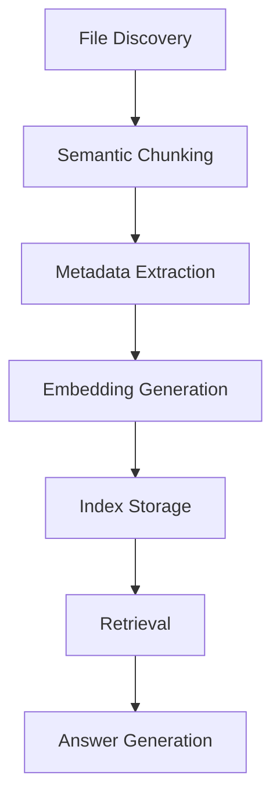

# Tapestry RAG Indexing Guidelines

| Repo      | Doc Type         | Date                | Branch   |
|-----------|------------------|---------------------|----------|
| Tapestry  | RAG Guidelines   | 2025-08-04 19:08    | main     |

## Introduction

This document provides guidelines for Retrieval-Augmented Generation (RAG) indexing within the Tapestry repository. RAG indexing is essential for robust documentation strategy and future knowledge management, ensuring that both human and AI agents can efficiently retrieve, update, and reason over project knowledge.

## RAG Indexing Principles

- **Comprehensive Coverage:** Index all key architectural, API, and workflow documents, including both frontend and backend.
- **Granular Referencing:** Use project-relative paths and, where possible, reference file sections or line numbers.
- **Timestamp Tracking:** Always cite the "Last modified" date for each indexed file or section.
- **Semantic Chunking:** Break down large files into logical, retrievable sections (e.g., per API endpoint, per feature, per config block).
- **Metadata Enrichment:** Store metadata such as file path, last modified date, and section heading for each chunk.
- **Update Awareness:** Regularly re-index files when their "Last modified" timestamp changes.

## Recommended RAG Indexing Workflow

1. **File Discovery:** Traverse the repository structure to enumerate all relevant files.
2. **Chunking:** For each file, split content into semantically meaningful sections (e.g., per API endpoint in backend/routers, per component in frontend/src/components).
3. **Metadata Extraction:** For each chunk, record:
   - File path (relative to repo root)
   - Section heading or identifier
   - Last modified date
   - Line number range (if available)
4. **Embedding/Vectorization:** Generate embeddings for each chunk for semantic retrieval.
5. **Index Storage:** Store chunks and metadata in a retrievable index (e.g., SQLite, vector DB).
6. **Retrieval:** At query time, use metadata and embeddings to fetch the most relevant chunks.

## Example: Indexing the Backend API

Suppose you are indexing the backend API routers in `backend/app/routers/` (Last modified: 2025-08-04 19:08):

```python
# [backend/app/routers/chores.py](https://github.com/sergiomasellis/Tapestry/blob/main/backend/app/routers/chores.py)
@router.post("/chores/", response_model=Chore)
def create_chore(chore: ChoreCreate, db: Session = Depends(get_db)):
    """
    Create a new chore for a family member.
    """
    # Implementation...
```

**Index Chunk Example:**
- File: [backend/app/routers/chores.py](https://github.com/sergiomasellis/Tapestry/blob/main/backend/app/routers/chores.py)
- Section: create_chore endpoint
- Last modified: 2025-08-04 19:08
- Lines: (e.g., 10-20)

## Example: Indexing Frontend Components

For frontend components in `frontend/src/components/` (Last modified: 2025-08-04 19:08):

```typescript
// frontend/src/components/Leaderboard.tsx
export function Leaderboard({ members }) {
  return (
    <div>
      {members.map(m => (
        <div key={m.id}>{m.name}: {m.points}</div>
      ))}
    </div>
  );
}
```

**Index Chunk Example:**
- File: frontend/src/components/Leaderboard.tsx
- Section: Leaderboard component
- Last modified: 2025-08-04 19:08
- Lines: (e.g., 1-10)

## RAG Index Metadata Example

```json
{
  "file": "[backend/app/routers/chores.py](https://github.com/sergiomasellis/Tapestry/blob/main/backend/app/routers/chores.py)",
  "section": "create_chore endpoint",
  "last_modified": "2025-08-04 19:08",
  "lines": "10-20",
  "embedding": "[...vector...]"
}
```

## RAG Indexing in Practice

- **Automate Indexing:** Use scripts to traverse the file tree and extract/refresh index chunks.
- **Monitor for Changes:** Integrate with git hooks or CI to trigger re-indexing on file changes.
- **Respect Privacy & Licensing:** Do not index files like LICENSE or .env.

## RAG Indexing Flow (Mermaid Diagram)



## Code Snippet: Example Indexing Script (Python)

```python
import os
from datetime import datetime

def index_file(path):
    with open(path) as f:
        content = f.read()
    last_modified = datetime.fromtimestamp(os.path.getmtime(path))
    # Split content into chunks (e.g., by function or class)
    # Generate embeddings, store metadata...
    return {
        "file": path,
        "last_modified": last_modified,
        # ...
    }
```

## Best Practices

- **Chunk at Logical Boundaries:** Functions, classes, API endpoints, or markdown sections.
- **Store Rich Metadata:** Always include file path and last modified date.
- **Keep Index Fresh:** Re-index on every relevant commit to main.
- **Enable Traceability:** Make it easy to map answers back to source files and lines.

---

## Primary Sources

- [README.md](https://github.com/sergiomasellis/Tapestry/blob/main/README.md) (Last modified: 2025-08-04 19:08)
- [frontend/tsconfig.json](https://github.com/sergiomasellis/Tapestry/blob/main/frontend/tsconfig.json) (Last modified: 2025-08-04 19:08)
- [frontend/package.json](https://github.com/sergiomasellis/Tapestry/blob/main/frontend/package.json) (Last modified: 2025-08-04 19:08)
- [frontend/README.md](https://github.com/sergiomasellis/Tapestry/blob/main/frontend/README.md) (Last modified: 2025-08-04 19:08)
- backend/pyproject.toml (Last modified: 2025-08-04 19:08)
- [backend/README.md](https://github.com/sergiomasellis/Tapestry/blob/main/backend/README.md) (Last modified: 2025-08-04 19:08)